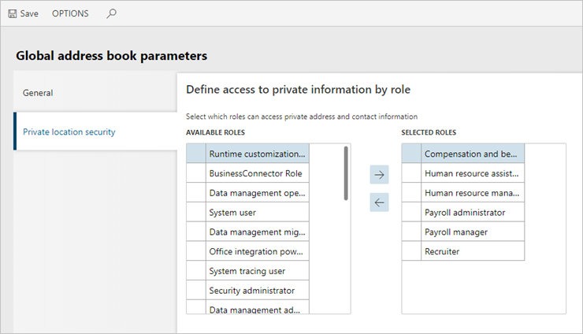

---
# required metadata

title: Access to private addresses by security role
description: This article explains how to resolve when a customer can't access private addresses.
author: twheeloc
ms.date: 09/13/2022
ms.topic: article
# optional metadata

# ms.search.form: HCMOrganizationAdministrationWorkspace
# ROBOTS: 
audience: Application User
# ms.devlang: 

# ms.tgt_pltfrm: 
ms.custom: 
ms.assetid: 
ms.search.region: Global
# ms.search.industry: 
ms.author: twheeloc
ms.search.validFrom: 2018-11-02
ms.dyn365.ops.version: Human Resources

---

# Access to private addresses by security role

[!include [Applies to Human Resources](../includes/applies-to-hr.md)]

**Issue**

After a customer duplicates a security role and signs in as that new role, the customer can't see addresses that were marked as private.

**Resolution**

To resolve the issue, the customer must follow these steps for the duplicated security role.

1. Go to **Organization administration \> Global address book \> Global address book parameters**.
2. On the **Private location security** tab, move the new security role from the **Available roles** list to the **Selected roles** list.
3. Select **Save**.

[!INCLUDE[footer-include](../includes/footer-banner.md)]
