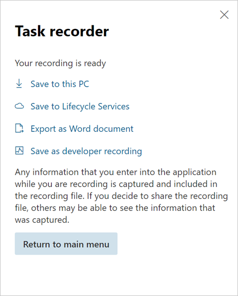

---
# required metadata

title: Save task guides to LCS and replay them
description: This topic explains how to save task guides to Microsoft Dynamics Lifecycle Services (LCS) and then replay them.
author: twheeloc
ms.date: 08/23/2021
ms.topic: article
ms.prod: 
ms.technology: 

# optional metadata

# ms.search.form: 
# ROBOTS: 
audience: Application User
# ms.devlang: 
ms.search.scope: Human Resources
# ms.tgt_pltfrm: 
ms.custom: 
ms.assetid: 
ms.search.region: Global
# ms.search.industry: 
ms.author: twheeloc
ms.search.validFrom: 2020-02-03
ms.dyn365.ops.version: Human Resources

---

# Save task guides to LCS and replay them

[!INCLUDE [PEAP](../includes/peap-2.md)]

[!include [Applies to Human Resources](../includes/applies-to-hr.md)]

**Environment details** 

Microsoft Dynamics 365 Human Resources, which was deployed via Microsoft Dynamics Lifecycle Services (LCS)

**Issue**

The customer wants to save new task recordings to the LCS project, and then replay the saved task guides.

**Resolution**

Follow these steps to save a task recording to LCS.

1. Sign in to LCS, and select the project.
2. Select the **Business process modeler** tile.
3. View the page in the "Updated BPM experience."
4. Select a library, and then select **Copy**.
5. Enter a name for the Business process modeler (BPM) model.
6. Sign in to Human Resources from LCS.
7. In the **Search** field, enter **help**. Lifecycle Services Help is opened.
8. Select the **Refresh** button for Lifecycle Services Help configuration.

    Your new BPM library should appear, and it should be active.

9. Close the page.
10. Create a task recording.
11. When you've finished, select **Save to Lifecycle Services**.

    

12. Select the BPM library and node to save the task recording to.

Follow these steps to replay a task guide from LCS.

1. Start Task recorder.
2. Select **Open from LCS**.
3. Select the library and the BPM node that have the saved task guide.
4. Open the task guide.

[!INCLUDE[footer-include](../includes/footer-banner.md)]
