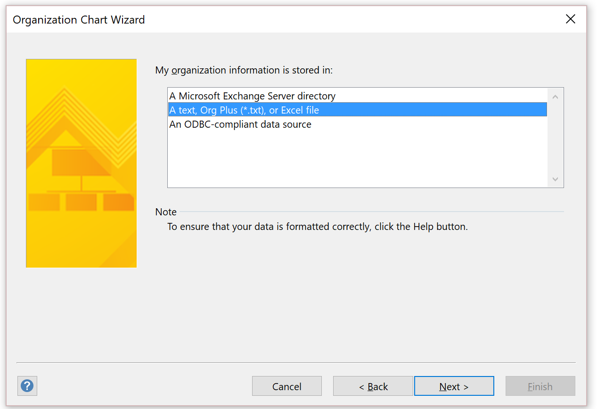

---

# required metadata

title: Avoid text truncation on the position hierarchy and export to Visio
description: This topic explains how to fix the issue of truncated names of individuals and positions in the position hierarchy in Microsoft Dynamics 365 Human Resources. 
author: twheeloc
ms.date: 08/19/2021
ms.topic: article
ms.prod: 
ms.technology: 

# optional metadata

# ms.search.form: HcmPositionHierarchyView, HcmPosition
# ROBOTS: 
audience: Application User
# ms.devlang: 
ms.search.scope: Human Resources
# ms.tgt_pltfrm: 
ms.custom: 
ms.assetid: 
ms.search.region: Global
# ms.search.industry: 
ms.author: twheeloc
ms.search.validFrom: 2020-02-03
ms.dyn365.ops.version: Human Resources

---

# Avoid text truncation on the position hierarchy and export to Visio

[!INCLUDE [PEAP](../includes/peap-2.md)]

[!include [Applies to Human Resources](../includes/applies-to-hr.md)]

**Issue**

When a customer views the position hierarchy in Microsoft Dynamics 365 Human Resources, the names of individuals and positions are truncated. Therefore, it can be difficult to take a screenshot, or to print and distribute the hierarchy.

**Cause**

This behavior is by design.

**Resolution**

Unfortunately, users can't easily change the size of the text. However, you can export the position hierarchy out of Human Resources and then import it into Microsoft Visio. Although the following article was written for Microsoft Dynamics AX 2012, the process still applies to Human Resources: [Export a position hierarchy to Microsoft Visio](/dynamicsax-2012/appuser-itpro/export-a-position-hierarchy-to-microsoft-visio).

Follow these steps to export to Visio.

1. In Human Resources, open the **Positions** list page.

    To include more information in the organization structure diagram, add fields to the **Positions** list, so that they are available when you use the **Organization chart wizard** later in this procedure.

2. On the Action Pane, select the **Open in Microsoft Office** button, and then, under **Export to Excel**, select **Positions**. Alternatively, press Ctrl+T.

    

3. Save the Excel file that is exported.

    

4. In Visio, select **Visio - Create New**, and select the **Business** template category.

    

5. Select **Organization Chart Wizard**, and then select **Create**.

    

6. Select **Information that's already stored in a file or database**, and then select **Next**.

    

7. Choose **A text, Org Plus (\*.txt), or Excel file**, and then select **Next**.

    

8. Browse to select the exported Excel file that contains the position hierarchy, and then select **Next**.

    

9. Set the **Name** field to **Position**, set the **Reports to** field to **Reports to position**, and then select **Next**.

    

10. Select the fields that should be shown on each node, and then select **Next**.

    

11. Add the **Position** column to the **Shape Data fields** list, and then select **Next**.

    

12. Pictures aren't currently available. Therefore, on the next page, select **Next**.
13. Select **I want the wizard to automatically break my organization chart across pages**.

    

14. Select **Finish**.

    If there are any positions that aren't in the structure, you're asked to include them in the diagram.

The diagram that is generated in Visio shows each manager on a separate worksheet.

Based on the fields that you selected to include in the diagram, each node shows the appropriate information when the Visio file is generated.

**Additional option**

In Human Resources, you might also be able to use the **People** workspace to view some hierarchy-related information.

[!INCLUDE[footer-include](../includes/footer-banner.md)]
