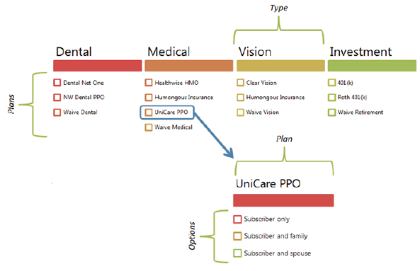

---
# required metadata

title: Define and manage a benefits program
description: Human resources provides a set of tools that can be used to set up and maintain benefits, deductions, and workers' compensation plans that an organization offers or processes for its workers. This article provides information about how to set up and manage benefits.
author: twheeloc
ms.date: 08/23/2021
ms.topic: article
ms.prod: 
ms.technology: 

# optional metadata

ms.search.form: HcmBenefitEligibilityDetail, HcmBenefitSelection, SysPolicyListPage, SysPolicySourceDocumentRuleType, BenefitWorkspace, HcmBenefitSummaryPart
# ROBOTS: 
audience: Application User
# ms.devlang: 

# ms.tgt_pltfrm: 
ms.assetid: 6aee97ac-29f7-4b3c-8aa1-c65810de3090
ms.search.region: Global
# ms.search.industry: 
ms.author: twheeloc
ms.search.validFrom: 2020-02-03
ms.dyn365.ops.version: AX 7.0.0, Human Resources

---

# Define and manage a benefits program

[!INCLUDE [PEAP](../includes/peap-1.md)]

[!include [Applies to Human Resources](../includes/applies-to-hr.md)]

Human Resources provides a set of tools that can be used to set up and maintain benefits, deductions, and workers' compensation plans that an organization offers or processes for its workers. This article provides information about how to set up and manage benefits.

## Benefit setup

Before workers can be enrolled in benefits, you must create the elements of each benefit. These elements combine similar benefit plans and define default settings, such as deduction rates and accounting details. Many of these settings can be adjusted when workers are later enrolled in the benefit. For each benefit plan, an organization can offer several enrollment options, or a worker can waive enrollment in the plan. 

## Benefit elements

Before you begin to create benefits and enroll workers in them, you must define the elements that make up a benefit: the type, plan, and options.

-   **Type** – A collection of plans for a specific benefit, such as medical or parking.
-   **Plan** – A specific benefit that is contracted from a provider.
-   **Option** – The coverage level, such as employee only, or employee and spouse/partner.

For each type of benefit, such as vision or dental, an organization can offer one or more plans to its workers. For each plan, the organization can offer different options. For example, workers can buy additional term life insurance coverage at one, two, or three times their yearly salary. Each combination of a plan and options becomes a benefit that workers can enroll in. 

## Eligibility
Many factors determine worker eligibility for the various types of benefits that an employer offers. When you create a benefit in Dynamics 365 Human Resources, you can set the type of eligibility that applies to that benefit. 

You can make a benefit available to all workers. For example, some companies offer parking passes to all employees as a fringe benefit. When you create this benefit, you set the eligibility to **All workers are eligible**. 

For other benefits, such as garnishments and tax levies, eligibility doesn't apply. Whey you create these types of benefits, you set the eligibility to **Bypass eligibility process**. 

Finally, benefit eligibility can be rule-based. For example, a company offers two types of life insurance benefit to employees. Executive employees are eligible for one life insurance plan, whereas all other full-time employees are eligible for the other life insurance plan. In Human Resources, you can create a benefit eligibility rule to find all executive employees and another rule to find all other full-time employees, and then apply those rules to the appropriate benefit.

## Enrollment
After you've created the benefits that your organization offers and determined eligibility, you can enroll your workers in benefits. You can enroll a single worker in benefits, or you can enroll many workers in one or more benefits during a single process. 

Sometimes, an organization stops offering certain benefits. In this case, you must update the benefit and the workers who are enrolled in. Mass benefit expiration lets you change the expiration date of both a benefit and the worker enrollments for that benefit at the same time. You can also select multiple workers who are enrolled in a benefit and change the ending date of their coverage. 

Similarly, mass benefit extension lets you extend the expiration date of both a benefit and the worker enrollments for that benefit if you decide to offer a benefit longer than you originally planned.

[!INCLUDE[footer-include](../includes/footer-banner.md)]
