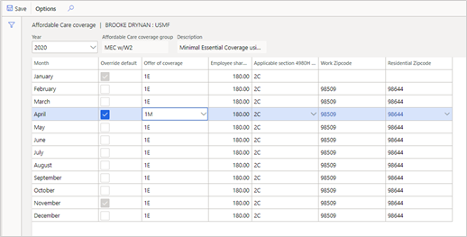

---
# required metadata

title: Generate Affordable Care Act reports in Benefits management
description: This article describes how Benefits management tracks information that is reported on Form 1095-B and Form 1095-C for the Affordable Care Act (ACA) employer mandate.
author: twheeloc
ms.date: 08/23/2021
ms.topic: article
# optional metadata

# ms.search.form: HcmACACoverageGroup, BenefitWorkspace, HcmBenefitSummaryPart
# ROBOTS: 
audience: Application User
# ms.devlang: 

# ms.tgt_pltfrm: 
ms.assetid: 3b953d5f-6325-4c9e-8b9b-6ab0458a73f8
ms.search.region: Global
# ms.search.industry: 
ms.author: twheeloc
ms.search.validFrom: 2020-12-28
ms.dyn365.ops.version: AX 7.0.0, Human Resources

---

# Generate ACA reports in Benefits management

[!include [Applies to Human Resources](../includes/applies-to-hr.md)]

Benefits management tracks information that is reported on Form 1095-B and Form 1095-C for the Affordable Care Act (ACA) employer mandate. Like the ACA reporting capability in the old **Benefits** workspace, this functionality applies only to legal entities in the United States.

To use this functionality, you must first turn on **Advanced Benefits Management**. For more information, including important caveats about Benefits management, see [Enable or disable Benefits management](hr-admin-manage-features.md#enable-or-disable-benefits-management).

> [!IMPORTANT]
> You can use ACA reporting only from either the **Benefits management** workspace or the old **Benefits** workspace, not from both. For example, if you switched to Benefits management, ACA reporting is available only from the **Benefits management** workspace, not from the old **Benefits** workspace.
>
> If you switch to Benefits management in the middle of an enrollment year, you must correctly configure employee data for the whole year in Benefits management. In this way, you ensure that you will receive accurate reporting information for the whole year.

## Getting started

To track information for 1095 forms, first create one or more Affordable Care coverage groups. These groups indicate the following information:

- The offer of coverage that was provided to an employee
- The employee's share of the lowest-cost monthly premium, if the cost is above the federal poverty line
- The safe harbor that is used by the employer, if applicable

Affordable Care coverage groups help you manage this information for multiple employee records that have the same conditions. You can easily assign groups to one or more employees.

### Create or edit an Affordable Care coverage group

1. In the **Benefits management** workspace, select **Affordable Care coverage group**.

    

2. Select **New** to create a new Affordable Care coverage group or **Edit** to change an existing group.

    

3. Set the following fields.

    | Field | Description |
    |---|---|
    | Name | Enter a name for the group. |
    | Description | Enter a description of the group. |
    | Offer of coverage | The coverage that is offered to employees, their spouse or partner, and their dependents. |
    | Employee share of cost | The amount that the employee is responsible for. |
    | Applicable section 4980H safe harbor | The 4980H safe harbor or transition relief code. |
    | Plan start month | Select the calendar month when your benefit plan year begins. |
    | Group valid from | The first date when this record is valid. |
    | Group valid through | The last date when this record is valid. If there is no expiration date, enter **Never**. |

    

4. Select **Save**.

### Assign multiple employees to an Affordable Care coverage group

1. In the **Benefits management** workspace, select **Affordable Care coverage group**.
2. Select the group to assign employees to.
3. Select **Mass assignment**.

    

4. Select employees in the list, and then select **Assign**.

    

## Maintain multiple versions of coverage options

You can maintain multiple versions of any coverage group. When something changes in your organization or the benefits that are offered, you can keep the group's information up to date without having to create a new group and reassign employees to it.

After you've created Affordable Care coverage groups, you can mass-assign employees to them. You can also individually assign employees to groups, and indicate whether ACA information is tracked and reported.

If you don't have to track and report ACA information for an employee, you can set the **Report coverage** option to **No**. For example, you might have part-time employees who don't require ACA reporting.

### Override default values for an employee

For employees who are assigned to an Affordable Care coverage group, you can change the following options for any months that require different values:

- Offer of coverage
- Employee share of cost
- Applicable section 4980H safe harbor

> [!NOTE]
> For 2020 ACA reports, you must report both work and home ZIP Codes on Form 1095-C. Values are automatically filled in, based on current active locations. If either location was different during any part of the year, you must override the value. The **ZIP Code** field (line 17) of the 1095-C report is filled in only if the **Offer of coverage** code contains **1L** through **1Q**, as follows:
>
> - **1L, 1M, or 1N:** The primary residence ZIP Code
> - **1O, 1P, 1Q:** The primary work ZIP Code

To enter exceptions for any values of an Affordable Care coverage group, follow these steps.

1. In the **Personnel management** workspace, select **Links**, and then select **Workers**.
2. Select the employee in the list.
3. On the **Employment** tab, in the **More information** section, select **Affordable Care coverage**.

    

4. Select **Edit**.
5. For each month that requires changes, select the **Override default** check box, and then change the other values as required.

    

6. Select **Save**.

## Report health care coverage

You must track any employer-sponsored, self-insured health care coverage for full-time and part-time employees. Include each employee, together with their dependents, on the 1095-C report for the months when they were covered.

To indicate whether a benefit plan must be reported, follow these steps.

1. In the **Benefits management** workspace, select **Benefit plans**.
2. Select the benefit plan to report.
3. Select **Edit**.
4. Set the **Reported under the Affordable Care Act** option to **Yes**.

    

5. Select **Save**.

If an employee chooses health care coverage for a dependent, the dependent's coverage period is determined by the date when the dependent was enrolled or removed. Coverage dates for dependents are automatically calculated based on the period when the dependent was eligible and active in a plan during the enrollment year.

## Generate 1095-B and 1095-C forms

You can generate ACA 1095-B and 1095-C forms, and then distribute them to each of your employees. You can also electronically generate Form 1095-C and the corresponding 1094-C transmittal files to send to the Internal Revenue Service (IRS).

1. In the **Benefits management** workspace, select **ACA 1095-B form** or **ACA 1095-C form**.
2. Change the parameters as required, and then select **OK**.

    > [!NOTE]
    > If you're printing 1095-C forms for more than 500 employees, you will receive more than one PDF file. We recommend that you increase the value of the **Maximum file size in megabytes** field on the **Document management parameters** page to **150**. (To quickly open that page, use the search field on the navigation bar.)
    >
    > 

3. To check the status of your reports and view them, use the search field on the navigation bar to open the **Electronic reporting jobs** page.

    

4. Select the report to view, and then select **Show files**.

    

5. Select **Open**.

    

6. From the notification bar that appears at the bottom of the browser window, open the zip file, and then select the report. You can view or print the PDF file.

    

## View ACA coverage information

The **Worker Affordable Care coverage** page shows the following information:

- Employees who are assigned to each coverage group
- Employees who don't have to be included on a report
- Unassigned employees

To view this information, follow these steps.

1. In the **Benefits management** workspace, select **Worker Affordable Care coverage**.
2. In the **Group name** field, select a group.

    

If any default values from the Affordable Care coverage group have been overridden, an asterisk appears next to the value that was changed. If the values for all 12 months are the same and haven't been overridden, the value appears in the **All 12 months** column.

You can view employees who are marked as not ACA-reportable, and who won't require a Form 1095-C. In the **Filter by** field, select **Not ACA reportable**.

You can view employees who aren't assigned to a group, or who are assigned to an expired group. In the **Filter by** field, select **Unassigned or expired group**.

### Export to Excel

To export any of the lists to Microsoft Excel, follow these steps.

1. Select the **Open in Microsoft Office** button.
2. Select **HCM Human Resources temporary table for internal use**.
3. Select **Download**.

### View ACA-reportable dependents

If you must report covered individuals because you provide self-insured coverage, you can view dependents who are covered under benefit plans that are marked as **ACA reportable**. On the Action Pane, select **View Dependent coverage**.

Coverage information for the employee's dependents is shown.

> [!NOTE]
> The page shows only benefits plans that are marked as **ACA reportable**.

[!INCLUDE[footer-include](../includes/footer-banner.md)]
