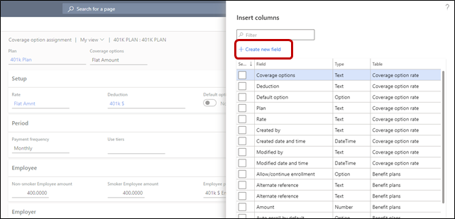

---
# required metadata

title: Benefits management overview
description: This topic provides an overview of the Benefits management feature in Dynamics 365 Human Resources. 
author: twheeloc  
ms.date: 12/06/2021
ms.topic: overview
ms.prod: 
ms.technology: 

# optional metadata

ms.search.form: BenefitWorkspace, HcmBenefitSummaryPart
# ROBOTS: 
audience: Application User
# ms.devlang: 
ms.search.scope: Human Resources
# ms.tgt_pltfrm: 

ms.assetid: 
ms.search.region: Global
# ms.search.industry: 
ms.author: twheeloc
ms.search.validFrom: 2020-02-03
ms.dyn365.ops.version: Human Resources

---

# Benefits management overview

[!INCLUDE [PEAP](../includes/peap-2.md)]

[!include [Applies to Human Resources](../includes/applies-to-hr.md)]

To remain competitive, you must offer a rich set of benefits to attract and retain your best employees. In addition to standard benefits like medical and dental coverage, you might also want to offer expanded services like adoption assistance, recreation programs, and clothing allowances. Benefits management in Microsoft Dynamics 365 Human Resources provides a flexible solution that supports a wide variety of benefit options. Human Resources also includes an easy-to-use employee experience that showcases your offerings.

- Enhanced benefits plans let you create and manage unique benefit plans and support complex benefit rate tables and nested tiers. You can easily create benefit programs, bundles, and auto-enrollment rules for an easier employee experience.
- Flex credit programs let you prorate to support retirement and other life events.
- Extensive eligibility rules ensure you make the right benefits available to the right employees.
- Online benefits enrollment provides an easy experience for your employees.
- Qualified life event processing supports future life events.

If you would like to access the demo data, you'll need to redeploy your sandbox environment.

> [!NOTE]
> You can now customize Benefits management pages. Custom fields related to coverage rates can be added to the **Coverage option** page for benefit plans. For more information about working with custom fields, see [Custom fields](hr-developer-custom-fields.md).
>
> 

## Enable Benefits management

This topic describes how to turn on features in Human Resources. It also explains which existing features in Human Resources are replaced by Benefits management and which features are disabled after you turn on Benefits management.

> [!IMPORTANT]
> After you enable Benefits management in a **Production** environment, you can't disable it. We recommend enabling and testing Benefits management in a **Sandbox** environment before enabling it in a **Production** environment. There are significant differences between the legacy Benefit functionality and new Benefits management functionality that require additional setup and should be tested prior to being placed into production.

For more information, see [Manage features](hr-admin-manage-features.md).

## Process overview

The process of configuring benefits involves the following tasks:

1.  Set up required benefit information.
2.  Set up optional benefit information.
3.  Set up benefit plans.
4.  Set up flex credit programs (optional).
5.  Configure required employee information.
6.  Configure optional employee information.
7.  Process employees to determine eligibility.
8.  Employees select plans via employee self-service (optional).
9.  Confirm employee plan selections.
10. Life event processing (optional).
11. Rate updates (optional).

## Set up required benefit information

Before employees can be enrolled in the plans, multiple components must be set up:

- **Benefit management parameters** – These settings are shared across companies. You can set default reason codes, enable the **Benefits annual salary** option, set a default payment frequency for new hires, and enable life events. For more information, see [Set benefits management parameters](hr-benefits-setup-parameters.md).
- **Personal contact eligibility options** – Personal contacts are the individuals who will be either dependents or beneficiaries of the plans that are set up. Typically, they are children, spouses, or trust organizations. For more information, see [Configure personal contact eligibility options](hr-benefits-setup-contact-eligibility-options.md).
- **Coverage options** – Set up the types of coverage that will be available for a plan. Specifically, define who should be covered, or how much coverage is available. For more information, see [Create coverage options](hr-benefits-setup-coverage-options.md).
- **Plan types** – Set up the types of plans that will be available when you create a benefit plan. Examples of plan types include **Dental**, **Vision**, and **Savings**. Some important settings on the plan type determine the settings that are available on the benefit plan. For more information, see [Create plan types](hr-benefits-setup-plan-types.md).
- **Eligibility rules** – Eligibility rules are used to determine whether an employee is eligible for a plan. At least one eligibility rule must be associated with every benefit plan. For more information, see [Configure eligibility rules and options](hr-benefits-setup-eligibility-rules.md).
- **Payment frequencies** – Payment frequencies are required when benefit rates are configured. The payment frequency that is used on a rate helps identify the amount that the employee and/or employer owes on a weekly, monthly, or annual basis. For more information, see [Set up payment frequencies](hr-benefits-setup-payment-frequencies.md).
- **Rates** – Rates define how much a benefit will cost either the employee or the employer. If money should be allocated back to an employee (for example, a credit toward a gym membership), a negative rate is entered. For more information, see [Configure rates](hr-benefits-setup-rates.md).
- **Tier rates** – Tier rates are used when a rate must change based on some criteria. The most common tier rate is a single tier that is based on age. However, double tier rates can also be set up, where the rate might change based on gender, age, or other criteria.
- **Deductions** – The deductions are basically the header information/codes that will be passed on to the payroll system to identify the deduction for the benefit. You must set up these deductions, because they will be required on the benefit plan. For more information, see [Configure deductions](hr-benefits-setup-deductions.md).
- **Benefit periods** – A benefit period is the period when employees will have benefit coverage. It's also known as a plan year. The open enrollment periods are also set up here.

## Set up optional benefit information

The following components don't have to be set up to create a benefit plan:

- **Programs** – A program is a set of benefits that are governed by the same eligibility rules. For example, everyone in the sales department might get a cell phone.
- **Bundles** – A bundle is a group of benefits, where one plan must be selected before the option to select additional plans is available. For example, a high-deductible medical plan might be bundled with a health savings account (HSA) plan.
- **Life event types** – Life events are events that allow for a change in an employee's coverage. Life event types are linked to a plan type. For example, a medical plan type might allow for changes to plans because of a birth or adoption, or because of a change in marital status. However, an insurance plan type might not allow for any changes because of life events. For more information, see [Configure life event types](hr-benefits-setup-life-event-types.md).
- **Waiting days and waiting periods** – A coverage waiting period can be set on a benefit plan. For example, a newly hired employee might be able to enroll in a 401(k) only after three months of employment. In this case, the waiting period is three months. Waiting days are used in the waiting period if new enrollments can be processed and submitted to the provider only on a specific day of the month. For example, if 401(k) enrollments can be processed only on the fifteenth of the month, after three months of employment, the waiting period that is set up is three months, and the waiting day is the fifteenth. For more information, see [Configure waiting days](hr-benefits-setup-waiting-days.md) and [Configure waiting periods](hr-benefits-setup-waiting-periods.md).
- **Reason codes** – Reason codes are used to explain why a benefit might be changing for an employee. For more information, see [Set up reason codes](hr-benefits-setup-reason-codes.md).

## Set up benefit plans

When you set up a benefit plan, you must complete the following steps before employees can be enrolled:

- Assign a benefit period.
- Attach coverage options.
- Set a valid-from and valid-to date on the **General** tab.
- Assign at least one eligibility rule.
- Set the **Allow/continue enrollment** field on the **Setup** tab.

For more information about how to set up benefit plans, see [Set up benefit plans](hr-benefits-plans-setup.md).

## Set up flex credit programs (optional)

You can use flex credit programs to enroll employees in benefits, based on a predetermined number of flex credits. Employees can choose how their flex credits are allocated. For example, if employees are already covered under their spouse's health insurance plan, they don't have to use their credits for health coverage. Therefore, they might want to use them for other benefits instead. For more information about flex credit programs, see [Set up flex credit programs](hr-benefits-plans-flex-credit-programs.md).

## Configure required employee information

Before you can enroll employees in benefits, you must provide required information for them. 

The employee must have a **Position** assigned to them. A **Position** can be assigned to the employee on the **Worker** or the **Position** pages by 
updating the **Worker assignment**. 

Next, employees must be enrolled in a fixed compensation plan on their start date, or have an **Annual benefits salary** amount. Prior to assigning **Fixed compensation** to an employee, a **Position** must be assigned. 

> [!NOTE] 
> The **Fixed compensation start date** cannot be before the **Position assignment date**.

Alternatively, if you have an employee who receives supplemental compensation like commissions, you can add a **Benefits annual salary** amount from the employee record. Human Resources will use the **Benefits annual salary** amount when determining coverage amounts, instead of the **Fixed compensation annual** amount. The **Benefits annual salary** must be valid as of the employee's start date or the beginning of the benefit period, whichever is latest. However, a position is not required to assign the **Benefits annual salary**. To enable the **Benefits annual salary** feature, go to the **Human resources shared parameters** page, on the **Benefits management** tab. This feature is turned off by default.

> [!IMPORTANT]
> If both a **Fixed compensation** and a **Benefits annual salary** amount is entered for an employee, the **Benefits annual salary** will be used in determining coverage amounts. In the **Employment details** section of the **Worker** page, you must select a value in the **Benefit pay frequency** field.

## Configure optional employee information
When you create a benefit plan that uses rates that are based on gender or age, you must enter a birth date and gender for the employee to calculate the benefit cost.

## Process employees to determine eligibility
Before employees can be enrolled in plans, eligibility processing is run to determine which plans they are eligible for. You can view the results of the eligibility process in the **Process results viewer**. For more information, see [Process enrollment eligibility](hr-benefits-process-enrollment-eligibility.md).

## Employees select plans using **Employee self service** (optional)

When open enrollment occurs, employees are newly hired, or a life event occurs, employees can select or update their benefits using **Employee self service**. For more information, see [Configure employee self-service](hr-benefits-setup-employee-self-service.md).

## Confirm employee plan selections

The benefits that employees select must be confirmed before the employees will be considered enrolled in them. Benefits can also be selected on an employee's behalf. To select or confirm benefits, on the **Employee** page, on the **Benefits** tab, select **Worker benefits plans**. To select or confirm benefits for multiple employees, use the **Worker benefit plans bulk update** page.

## Life event processing (optional)

During the employee lifecycle, each employee might experience various life events, such as marriage, changes in employment, or changes in dependents or beneficiaries. To use life events, you must enable them on the **Human resources shared parameters** page. Set up life event types and life event options for plan types.

Before you can process life events, you must have run open enrollment at least one time during a hiring time frame. In the United States, open enrollment typically occurs one time per year. Outside the United States, open enrollment might occur at the time of hire. Life event processing doesn't require that workers select a benefit plan. However, the workers must have been included in open enrollment processing. For more information, see the following topics:

- [Process life events](hr-benefits-process-life-events.md)
- [Process life event changes](hr-benefits-process-life-event-changes.md)
- [Process life event eligibility](hr-benefits-process-life-event-eligibility.md)

## Rate updates (optional)

Sometimes, the rate of a benefit changes during the plan period. To update the rates for employees who are already enrolled in the plan, you must process the rate changes. For more information, see [Process rate changes](hr-benefits-process-rate-changes.md).

[!INCLUDE[footer-include](../includes/footer-banner.md)]
