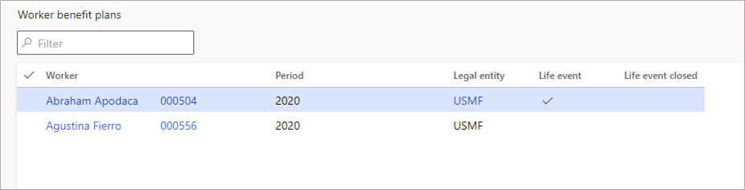
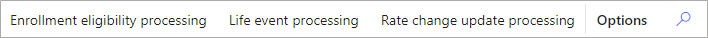

---
# required metadata

title: Benefits management workspace
description: This topic describes the Benefits management workspace in Dynamics 365 Human Resources.
author: twheeloc
ms.date: 01/03/2022
ms.topic: article
ms.prod: 
ms.technology: 

# optional metadata

ms.search.form: BenefitWorkspace, HcmBenefitSummaryPart
# ROBOTS: 
audience: Application User
# ms.devlang: 
ms.search.scope: Human Resources
# ms.tgt_pltfrm: 
ms.custom: 7521
ms.assetid: 
ms.search.region: Global
# ms.search.industry: 
ms.author: twheeloc
ms.search.validFrom: 2020-02-24
ms.dyn365.ops.version: Human Resources

---

# Benefits management workspace

[!INCLUDE [PEAP](../includes/peap-2.md)]

[!include [applies to](../includes/applies-to-hr.md)]

[!include [preview feature](./includes/preview-feature.md)]

This topic describes the **Benefits management** workspace in Dynamics 365 Human Resources.

> [!NOTE]
> To view the **Benefits management** workspace, you must first enable the **(Preview) Benefits management workspace** feature in Feature management. For more information about enabling preview features, see [Manage features](hr-admin-manage-features.md).  

The **Benefits management** workspace gives you a quick view of benefits items that require your attention. On this page, you can see:

- Totals for items awaiting action
- Workers with unconfirmed selections
- Workers who recently enrolled in benefits
- Workers with future life events
- New hires who aren't enrolled
- Workers with active life events
- Workers with open enrollments who haven't opted for any plans

## View action items

You can view your action items by either selecting a tile or a tab. If you select a tab, you can view and select workers from the workspace page.

If you select a tile, you go to the page for that area. For example, selecting any of these tiles displays the **Worker benefits plans** page, filtered for employees you need to take action on:

- **Unconfirmed selections**
- **Open enrollments with no checked out plans**
- **Enrolled in benefits**
- **New hire not enrolled**

Selecting **Active life events** or **Future life events** will take you to a list of active or future life events.

## Processing

To process enrollment eligibility, life events, or rate change updates, select the appropriate item on the navigation bar.

To view process results, select **Process results** on the page.

For more information about benefits processing, see:

- [Process enrollment eligibility](hr-benefits-process-enrollment-eligibility.md)
- [Process life event changes](hr-benefits-process-life-event-changes.md)
- [Process life event eligibility](hr-benefits-process-life-event-eligibility.md)
- [Process life events](hr-benefits-process-life-events.md)
- [Process rate changes](hr-benefits-process-rate-changes.md)

## Change period

To view a different benefits period, select it from the **Period** drop-down list.

## Open enrollment tab

You can view action items by selecting either a tile or a tab. If you select a tab, you can view and select workers on the workspace page.
The **Open enrollment** tab provides key metrics for the open enrollment process. 

Information regarding open enrollment will be displayed 30 days before the **Enrollment start date**. This is defined in the **Periods** setup in **Benefits management** > **Links** > **Periods**, in the **Enrollment start date** field.  To change this setting, go to **Human resources shared parameters** > **Benefits management** > **Open enrollment options** and update the **Number of** field.  

The following information is available on the **Open enrollment** tab:
 - Employees that have not started the open enrollment process
 - Employees that have elections in process
 - Employees that have completed the election process
 - Unconfirmed selections

**Summary tiles**

- **Not started** – The **Not started** tile shows a count of employees who have not started the enrollment process. The **Not started** tile is a filtered list that it shows only those employees that do not have any plans selected, waived, or checked out for the open enrollment plan period. Mandatory plans are ignored and not included because they are selected by default for the employee.  You can drill back on this tile to see a list of employees who have not started the open enrollment process on the **Worker benefits plan** page.

  > [!NOTE]
  > If you do not want to track the open enrollment progress for a **Plan type**, you can exclude it by going to **Benefits management** > **Links** > **Employee self service parameters** > **Benefit plans tile setup** and updating the **Track open enrollment progress** field.  For example, you may have plans created where **Plan type** = **Other**. These plans might be optional plans that you don’t want to track enrollment progress for. If you do not select this plan type, plans of these types will be ignored when tracking enrollment progress or completion on the **Open enrollment** tab. This setting applies to the plan type that is selected for all periods and legal entities.

- **In progress** – The **In progress** tile gives a count of employees that have elections in progress. The **In progress** tile is a filtered list that shows only employees that have at least one plan that is waived or selected. Mandatory plans are ignored and not included because they are selected by default for the employee. You can drill back from this tile to see the selected and waived plans on the **Worker benefit plans bulk update** page.

- **Enrolled in benefits** – The **Enrolled in benefits** tile gives a count of employees that are fully enrolled in benefits. The **Enrolled in benefits** tile is a filtered list that shows employees who have either selected or waived all plans. The query will exclude plans that are not being tracked for open enrollment on the **Employee self service parameters** page. You can drill back from this tile to see a list of employees on the **Worker benefit plans** page.

- **Unconfirmed selections** – The **Unconfirmed selections** tile shows a count of employees that have plans that are selected or waived and need to be confirmed. You can drill back from this tile to display the **Worker benefit plans bulk update** page.

**Activity**

- **Not started** - The **Not started** tab displays a list of employees that have not started the enrollment process. The **Not started** tile is a filtered list that shows  employees that do not have any plans selected, waived, or checked out for the open enrollment plan period. Mandatory plans are ignored and not included because they are selected by default for the employee. You can drill down on the worker to display the **Worker benefit plans detail** page.

- **Elections in progress** - The **Elections in progress** tab displays a list of employees that have elections in progress. The **Elections in progress** is a filtered list that shows employees that have at least one plan that is waived or selected. Mandatory plans are ignored and not included because they are selected by default for the employee. You can drill down on the worker to display the **Worker benefit plans detail** page.

## View more options

To view more information and or additional actions, select **Links**.

## See also

[Benefits management overview](hr-benefits-management-overview.md)
