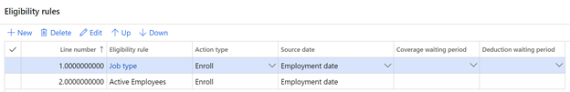
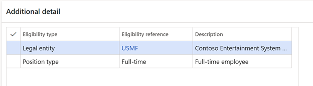
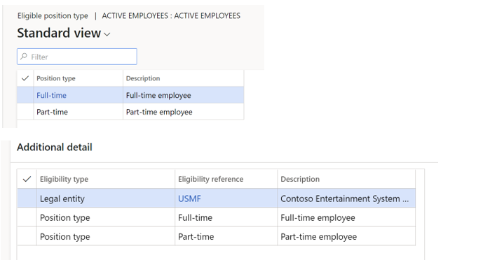
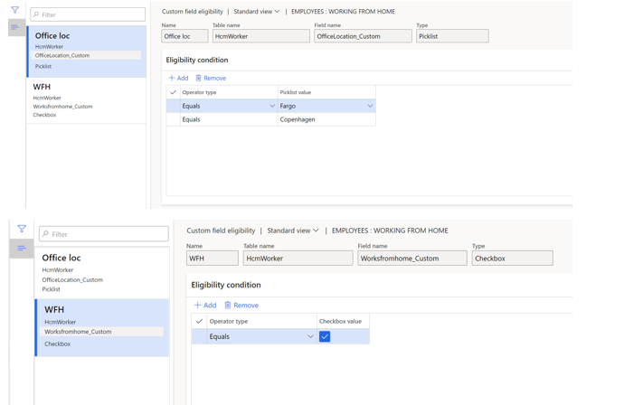

---
# required metadata

title: Configure eligibility rules and options
description: This article describes how to set eligibility rules and options in Benefits management in Microsoft Dynamics 365 Human Resources.
author: twheeloc
ms.date: 07/02/2024
ms.topic: article
# optional metadata

ms.search.form: BenefitWorkspace, HcmBenefitSummaryPart
# ROBOTS: 
audience: Application User
# ms.devlang: 

# ms.tgt_pltfrm: 
ms.assetid: 
ms.search.region: Global
# ms.search.industry: 
ms.author: anisagrawal
ms.search.validFrom: 2020-02-03
ms.dyn365.ops.version: Human Resources

---

# Configure eligibility rules and options 

After you've configured the required parameters for Benefits management, you can create the eligibility rules, bundles, periods, and programs that you will associate with your benefit plans.

Eligibility rules are used to determine whether employees are eligible for a plan. Employees must meet the condition of at least one rule to be considered eligible for the benefit. For example, you have two rules on a plan. The first rule (line 1) states that the employee type must be **Employee**. The second rule (line 2) states that the employee must be employed full-time. Therefore, employees who meet rule 1 are eligible even if they are employed only part-time.

However, you can set up a single rule that has multiple conditions. In this case, employees must meet all the conditions of the rule to be considered eligible for the benefit. For example, you have a rule that is named **Employee Full-time**. This rule states that the employee type must be **Employee** *and* the employee must be employed full-time. Therefore, employees must meet both conditions of the rule to be eligible.

> [!IMPORTANT]
> At least one eligibility rule must be associated with every benefit plan. You can associate multiple rules with a benefit.

## Create an eligibility rule

Eligibility rules define which employees can enroll in each benefit plan. After you define eligibility rules, you assign them to benefit plans. Then you can process enrollment eligibility to see which employees are eligible for each plan. 

During open enrollment, employees can select benefit plans. If they become ineligible for a benefit plan based on eligibility rules after they are already enrolled, they aren't automatically unenrolled. Typically, when a life event occurs that affects plan eligibility, an enrollment period is initiated for the employee to select plans that they are eligible for. 

1. In the **Benefits management** workspace, under **Setup**, select **Eligibility rules and options**.

2. On the **Eligibility rules** tab, select **New** to create an eligibility rule. To see plans that are associated with an eligibility rule, select **Attached plans**.

3. Specify values for the following fields.

   | Field | Description |
   | --- | --- |
   | **Eligibility rule** | A unique identifier for the eligibility rule. |
   | **Description** | A description of the eligibility rule. |
   | **Valid from date and time** | The start date of the eligibility rule. | 
   | **Valid to date and time** | The end date of the eligibility rule. |
   | **User employee type** | Specifies whether to use the employee's employee type in the benefit eligibility rule. |
   | **Worker type** | The worker type, if the **Use employee type** toggle is set to **Yes**. |
   | **Use employee status** | Specifies whether to use the employee's employment status in the benefit eligibility rule. |
   | **Status** | The employee status, if the **Use employee status** toggle is set to **Yes**. If the **Use employee status** toggle is set to **No**, the field isn't used. |
   | **Use employment category** | Specifies whether to use the employee's **Employment category** value as part of the benefit eligibility rule. | 
   | **Employment category** | The employee's employment category if the **Use employment category** toggle is set to **Yes**. |
   | **Use new hire rule** | Specifies whether to use a new hire's new hire period value as part of the benefits eligibility rule. |
   | **Enrollment period** | The time period when new hire enrollment is allowed. If you also set this in parameters, the parameters setting takes precedence over this one. |
   | **Use former employment status** | Specifies whether to use an employee's previous employment status as part of the benefits eligibility rule. For example, you can specify an eligibility rule that waives a coverage waiting period for all employees that have transitioned from a **Laid off** status to an **Employed** status within 90 days of their previous employment. |

4. Under **Additional criteria**, select the following options and add information as necessary.

   | Option | Description |
   | --- | --- |
   | **Eligible age** | Specifies the age range or ranges required to satisfy the eligibility rule. |
   | **Eligible department** | Specifies the department or departments an employee must be in to satisfy the eligibility rule. |
   | **Eligible employment type** | Specifies the employment type or types an employee must be categorized as to satisfy the eligibility rule. For example, full time or part time. |
   | **Eligible job** | Specifies the job or jobs that satisfy the eligibility rule. Jobs are associated with positions, and positions are filled by employees. |
   | **Eligible job function** | Specifies the job function or functions that satisfy an eligibility rule. For example, sales workers or technicians. |
   | **Eligible job type** | Specifies the job type or types that satisfy the eligibility rule. For example, clerical or executive. |
   | **Eligible legal entity** | Specifies the legal entity or legal entities that are valid for the eligibility rule. For example, Contoso Entertainment System USA. |
   | **Eligible compensation region** | Specifies the employee location that satisfies the eligibility rule. For example, central US. |
   | **Eligible position** | Specifies the position or positions that satisfy the eligibility rule. For example, HR Assistant or HR Manager. |
   | **Eligible position type** | Specifies the position type or types that satisfy the eligibility rule. For example, full time. |
   | **Eligible state** | Specifies the states or provinces that satisfy the eligibility rule. For example, North Dakota USA or British Columbia, Canada. |
   | **Eligible terms of employment** | Specifies the terms of employment that satisfy the eligibility rule. For example, at will or group contract. |
   | **Eligible union** | Specifies the labor union memberships that satisfy the eligibility rule. For example, Forklift Drivers of America.  When using a union-based eligibility rule, the worker's union record must have the end date populated. You can't leave it blank. |
   | **Eligible ZIP/postal code** | Specifies the ZIP/postal codes that satisfy the eligibility rule. For example, 58104. |

5. Under **Additional detail**, you can view the following additional details.

   | Field | Description |
   | --- | --- |
   | **Eligible user field** | Specifies additional eligibility rules based on customer-defined fields. |
   | **Eligibility type** | Specifies the criterion category you selected under **Additional criteria**. |
   | **Eligibility reference** | Specifies the values you selected under **Additional criteria**. |
   | **Description** | The description you selected under **Additional criteria**. |

6. Select **Save**.

## Using custom fields in eligibility rules

[Custom fields](hr-developer-custom-fields.md) can be created within Human Resources to track additional information. These fields can be added directly to the user interface, and a column is dynamically added to the underlying table.  

Custom fields can be used in the eligibility process. Eligibility rules can use one or more custom fields values to determine eligibility of an employee.  To add a custom field to an existing rule or to create a new rule, go to **Benefits management > Links > Setup > Eligibility rules > Custom field eligibility**. Within this page, you can create a rule that uses one or multiple custom fields, and you can define multiple values for each custom field to determine eligibility.

The following tables support custom fields that can be used in eligibility processing:

- Worker (HcmWorker)  
- Job (HcmJob)  
- Position (HcmPosition)  
- Position Detail (HcmPositionDetail)  
- Position Worker Assignment  
- Employment (HcmEmployment)  
- EmploymentDetails (HcmEmploymentDetails)  
- Job Details (HcmJobDetails)  

The following custom field types are supported in eligibility processing:

- Text  
- Picklist  
- Number  
- Decimal  
- Checkbox  

The following table shows custom field eligibility form field information.

| Field  | Description |
|--------|-------------|
| Name | Name of the criteria that is being created. |
| Table name | The table name that contains the custom field that is being used for the eligibility rule. |
| Field name | The field that will be used for the eligibility rule. |
| Operator type | Displays the operator used in the custom field eligibility configuration. |
| Value | Displays the value used in the custom field eligibility configuration. |

## Eligibility logic

The following sections describe how benefits eligibility is processed.

### Rules assigned to a plan 
When multiple eligibility rules are assigned to a benefit plan, an employee must meet at least one rule to be eligible to enroll in the benefit plan.  In the following example, the employee must either meet the requirements of the **Job type** rule or the **Active employees** rule.

 
### Criteria within an eligibility rule 
Within a rule you define the criteria that makes up the rule. In the example above, the criterion for the **Job type** rule is where Job Type = Directors. Therefore, the employee must be a director to be eligible. This is a rule where there is only one criterion within the rule.

You can define rules that have multiple criteria. When you define multiple criteria within an eligibility rule, an employee must meet every criterion within the rule to be eligible for the benefit plan. 

For example, the **Active employees** rule above is made up of the following criteria. In order for the employee to be eligible based on the **Active employees** rule, the employee must be employed in legal entity USMF *and* have a position type of full-time.  

 
 
### Multiple conditions within criteria

Rules can be further expanded to use multiple conditions within a single criterion. The employee must meet at least one condition to be eligible. To build on the example above, the **Active employees** rule can be further expanded to include employees that are also part-time employees. As a result, now the employee must be an employee in USMF *and* either a full-time or a part-time employee.  

 
 
### Eligibility conditions within a custom field criterion 
Similar to above, custom fields can be used when creating eligibility rules and work in the same manner. For example, you may want to offer internet reimbursement to the Fargo and Copenhagen employees who are working from home, as the internet costs are higher in those locations. To do this, create two custom fields: **Office location** (picklist) and **Working from home** (check box). Then create a rule called **WFH Employees**. The criterion for the rule is where **Office Location = Fargo** or **Copenhagen** *and*  where **Working from home = Yes**.

The custom eligibility rules would need to be set up as indicated in the following image. 

 
 
## Configure bundles

Bundles are a set of related benefit plans. You can use benefits bundles to group benefit plans that an employee must choose in order to enroll in certain benefit plans that may be dependent on other benefit plan enrollments. Examples of when you might want to use a bundle include:

- A health plan bundle that includes high-deductible health insurance with an associated health savings account (HSA).

- A life insurance plan with a mandatory employee life insurance plan bundled with a dependent life plan. This would ensure an employee can't select dependent life coverage without signing up for the employee coverage.

1. In the **Benefits management** workspace, under **Setup**, select **Eligibility rules and options**.

2. In the **Bundles** tab, select **New** to create a bundle. To see plans that are associated with a bundle, select **Attached plans**.

3. Specify values for the following fields.

   | Field | Description |
   | --- | --- |
   | **Bundle** | A unique identifier for the bundle. |
   | **Description** | A description of the bundle. |
   | **Master** | Indicates whether one of the plans in the bundle must be marked as the master plan. The master plan must be selected during open enrollment as part of the bundle before the benefits administrator can confirm the employee's benefits elections. |
   | **Required**| Indicates that the plan is required to be selected to check out any other plan in the bundle. More than one plans can be marked as **Required**. In that case, all the plans that are marked as **Required** will need to be selected to check out any of the plans in the bundle.|
   | **Valid from date and time** | The date and time the bundle becomes active. |
   | **Valid to** | The date the bundle expires. The default is 12/31/2154, which represents never. |

4. Select **Save**.

## Configure periods

Periods define when benefits are in effect and when employees are allowed to enroll. You can create as many periods as you want in order to maintain benefits open enrollment and benefit coverage periods. Benefit plan years may or may not follow a calendar year. 

1. In the **Benefits management** workspace, under **Setup**, select **Eligibility rules and options**.

2. In the **Periods** tab, select **New** to create a period. To run a process that attaches all valid active benefit plans to the benefit period, select **Attach plans**. To see plans that are associated with a bundle, select **Attached plans**. 

3. Specify values for the following fields.

   | Field | Description |
   | --- | --- |
   | **Period** | A unique identifier for the period. |
   | **Valid from date and time** | The start date and time when the benefits period is active. |
   | **Valid to date and time** | The date and time when the benefits period becomes inactive. |
   | **Enroll start** | The start date for open enrollment. Open enrollment is when an employee can make benefits elections in self-service benefits. |
   | **Enroll end** | The end date for open enrollment. |
   | **Open** | Indicates whether the period is open based on the system date and the valid from and to dates and times. | 
   | **Previous period** | Specifies the benefits period that precedes the selected benefits period. This information is used during benefit eligibility enrollment to assign plans, coverage options, and designees from a prior year. |
 
4. Select **Save**.

## Use a flex credit program

You can use flex credit programs to enroll employees in benefits according to a predetermined number of flex credits. Employees can choose how to allocate their flex credits. For example, if an employee is covered under their spouse's health insurance plan, they may want to use the credits they would have otherwise used on health coverage toward other benefits.

1. In the **Benefits management** workspace, under **Setup**, select **Eligibility rules and options**.

2. In the **Periods** tab, select **Flex credit programs**.

3. Select a flex credit program to apply. The fields contain the following information.

   | Field | Description |
   | --- | --- |
   | **Benefit credit ID** | The unique identifier of the flex credit program. |
   | **Description** | A description of the flex credit program. | 
   | **From date** | The date the flex credit program becomes active. |
   | **To date** | The end date of the flex credit program. You can leave the default value (12/31/2154) to indicate that the flex credit program doesn't have a scheduled expiration. |
   | **Total credit value** | The number of credits each employee will have to use for their benefits. |
   | **Prorate rule** | The rule to use for prorating flex credits when an employee is hired in the middle of the flex credit period.   <ul><li>**None** – The employee receives no flex credits if they are hired after the flex credit program period begins.</li><li>**Full credit** – The employee receives the full amount of flex credits, regardless of when they are hired.</li><li>**Prorate** – The employee receives a prorated amount of flex credits based on their start date.</li></ul> |
   | **Flex credit prorate formula** | The rule to use for prorating flex credits for employees who are hired in the middle of a benefit period for the flex credit program. The proration is based on the employment start date. This field is only used if you select **Prorate** in the **Prorate rule** field.   <ul><li>**Daily** – Prorates the number of flex credits an employee receives to the day level. The total number of flex credits is divided by the number of days in the period. For example, if your benefit period is 400 days, the system will divide the total number of flex credits by 400 to calculate the number of flex credits employees receive per day.</li><li>**Current month** – Prorates the number of flex credits an employee receives to the month level, rounded to the current month. The total number of flex credits is divided by the number of months in the period. For example, if your benefit period is 15 months, the system will divide the total number of flex credits by 15 to calculate the number of flex credits employees receive per month.</li><li>**Following month** – Prorates the number of flex credits an employee receives to the month level, rounded to the next month. The total number of flex credits is divided by the number of months in the period. For example, if your benefit period is 15 months, the system divides the total number of flex credits by 15 to calculate the number of flex credits employees receive per month.</li></ul> |
   
   Be sure that each benefit plan is enrolled in only one flex credit program per benefit period. Otherwise, the system won't know which flex credit program to use to grant flex credits and you will encounter problems. 

## Configure programs

Programs are a set of benefit plans that share a common set of eligibility rules. You can define eligibility rules for the entire program instead of for each individual plan. For example, a Contoso Canada FTE program or Contoso Europe executive-level program. 

1. In the **Benefits management** workspace, under **Setup**, select **Eligibility rules and options**.

2. In the **Programs** tab, select **New** to create a program. To make exceptions for employees who don't meet the eligibility rule requirements, select **Eligibility rule override**. To see plans that are associated with a program, select **Attached plans**.

3. Specify values for the following fields.

   | Field | Description |
   | --- | --- |
   | **Program** | A unique identifier for the program. |
   | **Description** | A description of the program. | 
   | **Valid from date and time** | The date and time the program becomes active. |
   | **Valid to date and time** | The date and time the program expires. The default is 12/31/2154, which represents never. |
   | **Coverage waiting period** | The period an employee must wait before coverage starts for the benefit program. |
   | **Deduction waiting period** | The period an employee waits before deductions begin for the benefit program. |
   | **Eligibility rules** | Select the eligibility rules to apply to the benefits program. You define the eligibility rules on the **Eligibility rules** tab on this page. |
   
4. Select **Save**.

[!INCLUDE[footer-include](../includes/footer-banner.md)]
