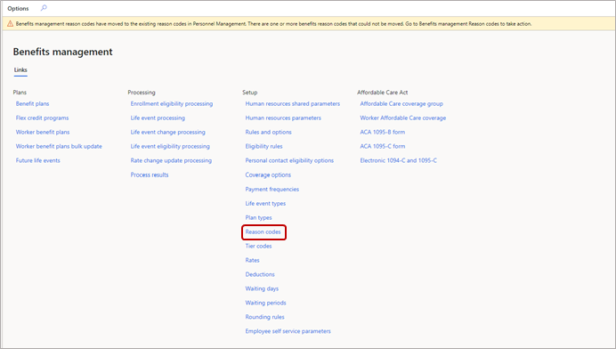
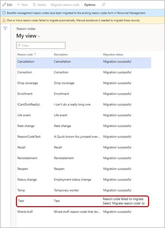
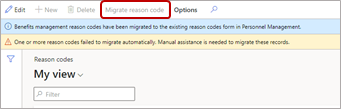
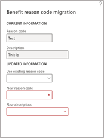
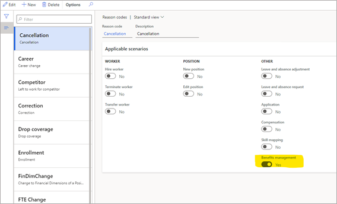

---
# required metadata

title: Set up reason codes
description: Dynamics 365 Human Resources uses reason codes to explain why an employee’s benefits are changing.
author: twheeloc
ms.date: 07/02/2024
ms.topic: article
# optional metadata

ms.search.form: BenefitWorkspace, HcmBenefitSummaryPart
# ROBOTS: 
audience: Application User
# ms.devlang: 

# ms.tgt_pltfrm: 
ms.assetid: 
ms.search.region: Global
# ms.search.industry: 
ms.author: anisagrawal
ms.search.validFrom: 2020-02-03
ms.dyn365.ops.version: Human Resources

---

# Set up reason codes

Dynamics 365 Human Resources uses reason codes to explain why an employee’s benefits are changing.

## Create reason codes

1. In the **Personnel management** workspace (or **Benefits management** workspace if your reason codes haven't migrated), select **Links**, and then select **Reason codes**.
2. Select **New**.
3. Specify values for the following fields:

   | Field | Description |
   | --- | --- |
   | **Reason code** | A unique name to identify the reason an employee would change a benefit plan enrollment. |
   | **Description** | A description of the reason code. |

4. Under **Applicable scenarios**, set **Benefits management** to **Yes**. (Not applicable if your reason codes haven't migrated to the **Personnel management** workspace.)
5. Select **Save**.

## Manually migrate reason codes to Personnel management

In January 2021, reason codes were migrated to the **Personnel management** workspace instead of the **Benefits management** workspace. Most reason code data will automatically migrate in your environment. Some reason code data might not migrate. For example, reason codes now have a 15-character maximum, so any reason codes longer than 15 characters won't migrate automatically.

You'll see a banner on the **Links** page of the **Benefits management** workspace informing you about the migration and whether any reason codes didn't migrate.

1. Select **Reason codes** for details about migration status.

   

2. Select a reason code that failed to migrate.

   

3. Select **Migrate reason code**.

   

4. In the **Benefit reason code migration** pane, you have two options for mapping to a Personnel management reason code:

   - To use an existing reason code in Personnel management, choose one from the **Use existing reason code** dropdown.
     > [!NOTE]
     > You can only use an existing reason code in Personnel management if another Benefits management reason code hasn't already migrated to it.
   - To create a new reason code in Personnel management, enter a new one in **New reason code**, and then enter a description in **New description**.

   

After reason codes migrate to Personnel management, the option for using them in Benefits management is automatically set to **Yes**.

[!INCLUDE[footer-include](../includes/footer-banner.md)]
