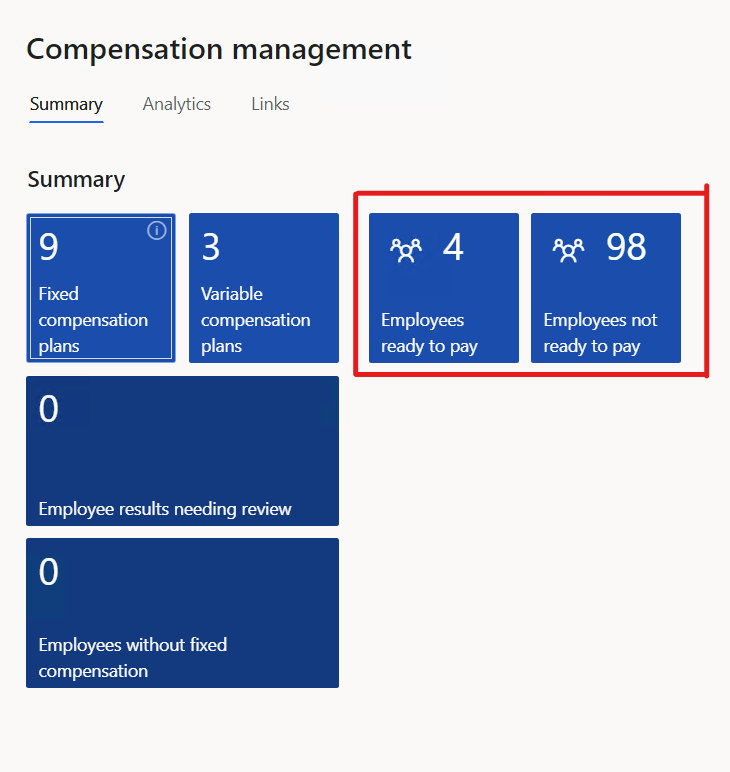
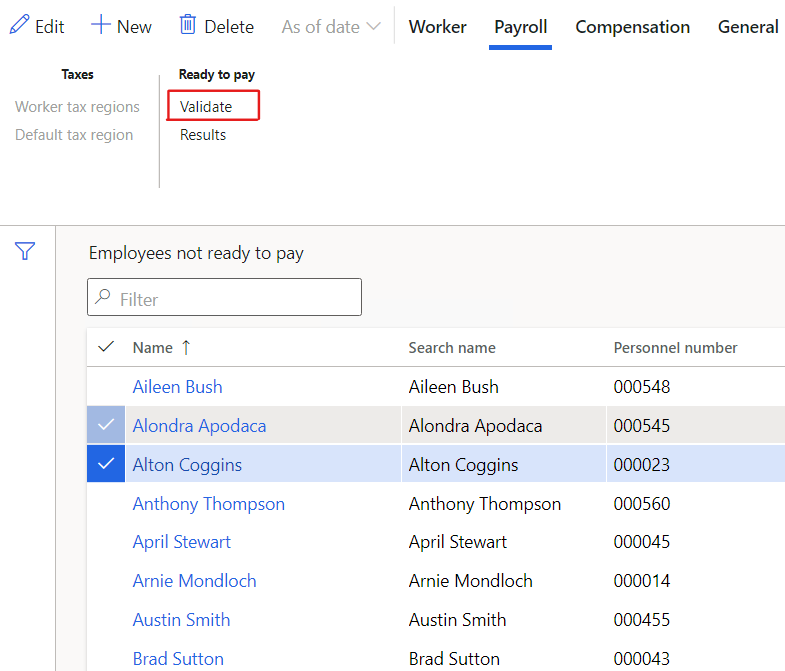
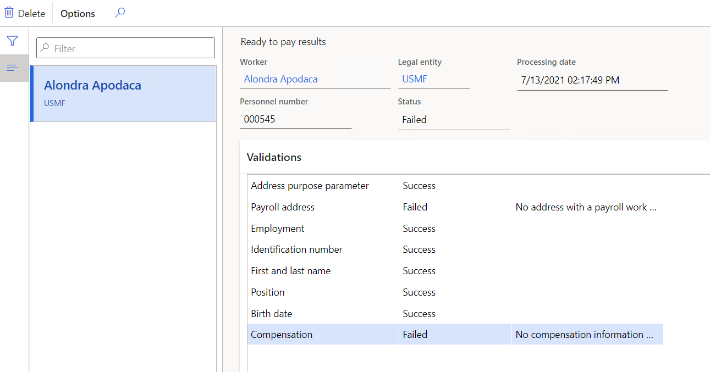

---
# required metadata

title: Ready to pay
description: This article shows how to mark an employee as ready to pay in Dynamics 365 Human Resources.
author: twheeloc
ms.date: 07/09/2024
ms.topic: article
# optional metadata

ms.search.form: 
# ROBOTS: 
audience: Application User
# ms.devlang: 

# ms.tgt_pltfrm: 
ms.custom: 
ms.assetid: 
ms.search.region: Global
# ms.search.industry: 
ms.author: ajitchandran
ms.search.validFrom: 2021-07-13
ms.dyn365.ops.version: Human Resources

---

# Ready to pay

[!include [Applies to Human Resources](../includes/applies-to-hr.md)]

> [!NOTE]
> If you want to mark an employee as ready to pay, you must first enable the **(Preview) payroll integration** functionality in feature management. For more information about enabling preview features, see [Manage features](hr-admin-manage-features.md).

This feature enables human resources professionals to understand which employees are ready for payroll processing and which require action before being consumed by a third-party payroll provider.

## Mark employee as ready to pay

Gathering and validating employee information can be time-consuming and error prone. By providing a way for human resources professionals to review and easily update employee information, Dynamics 365 Human Resources helps to reduce the time spent getting ready to process payroll.

To mark an employee as ready to pay:

1. Open **Compensation management**. There are two tiles in the workspace: 
    - **Employees ready to pay**
    - **Employees not ready to pay**
    

2. Select the **Employees not ready to pay** tile.
3. Select the employees to be validated. On the **Payroll tab**, in the **Ready to pay** group, select **Validate**.
    

4. To review the results, on the **Payroll tab**, in the **Ready to pay** group, select **Results**.

## Validation

Before marking an employee as ready to pay, the employee's profile is validated for completeness.

| Validation | Details |
| --- | --- |
| **Address purpose parameter** | Confirms the **Use payroll addresses purpose** parameter is selected. |
| **Payroll address** | Confirms the worker profile has at least one address with the purpose **Payroll residency location** or **Payroll work location**, and there's only one address per purpose. |
| **Employment** | Confirms the worker has at least one employment (current, previous, or future). |
| **Identification number** | Confirms the **Use identification types in payroll processing** field is **Yes** on the **Human resources parameters** page, and if the identification type indicated in the parameter is filled in the worker profile. |
| **First and last name** | Confirms the fields **Name** and **Last name** are filled in.|
| **Position** | Confirms the worker has a position assigned. |
| **Birth date** | Confirms the **Birthday** field is filled in. |
| **Compensation** | Confirms the worker is enrolled in a fixed compensation plan. |

If one of these validations fails, you can't mark the employee as ready to pay.

If the **Ready to pay** field is **No**, this is an indication that you must perform an action to ensure the worker profile is complete. This won't stop the data to be exposed in any data entity. 

## Process Automation

You can automate the validation of all employees by using [Process Automation](/dynamics365/fin-ops-core/dev-itpro/sysadmin/process-automation). In the **Compensation management** workspace, go to **Links** \> **Parameters** \> **Process Automations**.

## See also

[Payroll integration API introduction](hr-admin-integration-payroll-api-introduction.md) 

[!INCLUDE[footer-include](../includes/footer-banner.md)]
