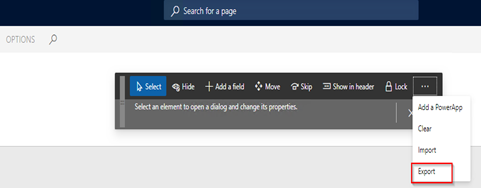

---

# required metadata

title: Dynamics 365 Human Resources customer merge overview
description: This article describes the Microsoft Dynamics 365 Human Resources customer merge.
author: twheeloc
ms.date: 01/03/2023
ms.topic: article
ms.prod: 
ms.technology: 

# optional metadata

ms.search.form: 
# ROBOTS: 
audience: Application User
# ms.devlang: 

# ms.tgt_pltfrm: 
ms.custom: 7521
ms.assetid: 
ms.search.region: Global
# ms.search.industry: 
ms.author: twheeloc
ms.search.validFrom: 2020-10-13
ms.dyn365.ops.version: Human Resources

---
# Dynamics 365 Human Resources customer merge 

[!include [Applies to Human Resources](../includes/applies-to-hr.md)]
[!include [preview banner](../includes/preview-banner.md)]

## Dynamics Human Resources 365 customer merge

As part of the infrastructure merge, all capabilities of the Human Resources application have been made available in finance and operations environments. Customers can migrate their Human Resources environments by using the migration tooling that is available in Microsoft Dynamics Lifecycle Services. They can also optionally merge their data with their existing finance and operations environment.

Customer merge or consolidation of their Human resources environment with another finance and operations environment isn't required by Microsoft. It's done at the customer's discretion and on the customer's own timeline. During this step, customer moves their data into an existing environment, such as a Finance or Project Operations environment. It's mostly manual and can be done by using Data Management Framework (DMF) data entities.

This page includes some of the resources and information that may be relevant for various customer scenarios when merging their finance and operations based environments. 

## Custom fields
While there's an extensive set of fields out-of-the-box for managing a broad range of business processes, sometimes there's a need for a company to track additional information in the system. While programmers can be used to add those fields as extensions in the developer tools, the custom fields feature allows fields to be added directly from the user interface, allowing you to tailor the application to fit your business using your web browser. Read more about how to create and work with custom fields. 

### Move custom fields from one environment to another
To move custom fields from one environment to another: 
•	Move the MetadataExtensionTable.
•	Move the tables that contain labels/translations/picklists. These tables are:
  •	SysCustomFieldLabels
  • SysCustomFieldPicklist
  • SysCustomFieldPicklistValues
      o	Open SSMS
      o	Find AXDB Data base
      o	Right click, select **Tasks**
      o	Click **Generate scripts**
      
      

     
o	Click “Next”
o	Click on “Select specific database objects”
Extract the “Tables” node and select the “MetaDataExtensionTable” table as shown below

o	Scroll down the tables list and select the tables  SysCustomFieldLabels, SysCustomFieldPicklist, SysCustomFieldPicklistValues as shown below.
Click on “Next

o	Select the highlighted options below (“Save script to a specific location”, “Save to file”, “Unicode text”.
o	Click on “Advanced”, go down to “Types of data to script” press the look up and select “Data only” and  click “Ok”

o	 Select a file name to save and click “Next”

o	Click “Next”
o	Click “Finish”

o	Move created SQL file to target environment and open by SQL query editor.

o	Outcomment the lines for “DimensionAttributeValueCombination” and “DimensionAttributeValueSet” and run the script as highlighted below. 

o	Run the script, this will import the records into DB.

### Copy custom fields metadata in Dataverse

How to copy Dynamics 365 Human Resources custom fields metadata created in Dataverse to another instance of a Dataverse environment.

1.	Create a new unmanaged solution
a.	Log into Dynamics 365 Human Resources.
b.	Navigate to System Administration > Integrations > Dataverse Configuration.
c.	The banner at the top of page will provide you with the name of the Dataverse instance being synced to and a link to the Admin Center. 

d.	Make note of the Dataverse instance name.
e.	Open a new browser tab and navigate to PowerApps Maker portal (https://make.powerapps.com).
f.	In the upper right corner, click on the Environment drop-down and find the name of the Dataverse instance.

g.	Click on Solutions in the pane on the left side toward the bottom.
h.	Click the New Solution.
i.	Enter a name, description and select the Default Publisher and click OK and the new solution will show up in the Solutions list.

2.	Add the custom fields created through HR to the new unmanaged solution
a.	Click on the name of the new solution created in step 1.
b.	Click on Add Existing > Table
c.	Search for the table name where custom fields have been added. 

d.	Select the table and click next.
e.	Click on Select Objects, then go to the Fields tab
f.	In the search, find all the fields that end in “_custom”, check them and then click Add. 

g.	The table screen should now reflect the number of objects selected, so click Add on this dialog.
h.	The solution screen should now show the name of the table added to the unmanaged solution.
i.	Repeat the process by clicking Add Existing again until all the custom fields have been added to the new solution.
j.	Go back to the Solutions list by clicking the back arrow provided in the upper left with a tool tip that says “Back to solutions”.
3.	Export the solution as managed.
a.	Check the new solution created.
b.	Click the next button since all the customizations are existing and have been published.
c.	Managed is checked by default, so simply click Export to start the export process.
d.	Once the export process is completed, click **Download**. The solution should be saved to the browser’s default download folder.
4.	Import managed solution into the other Dataverse environment
a.	In the Maker portal, change the Environment drop-down from step 1 to the destination Dataverse environment.

b.	In the Solutions list screen, click **Import**.
c.	Click **Browse**. Locate the exported managed solution from step 3.
d.	Click **Next**, then click **Import** and wait for the managed solution to be applied to the destination Dataverse environment.

Personalizations

In Order to move the personalizations:

o	From Source environment, export personalization on the page that has been modified. 

o	Copy the personalization file (from step 15) to Target environment

o	In Target environment import the file from step 116.

