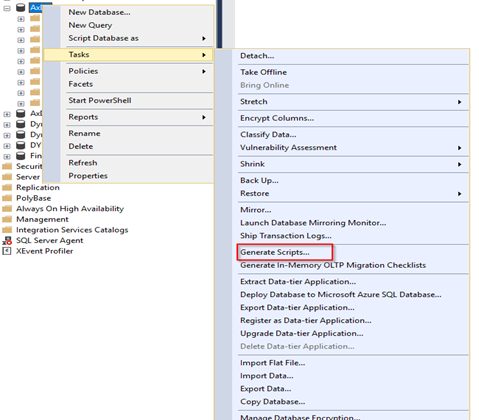
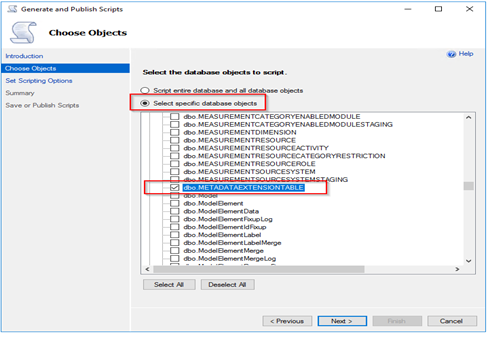
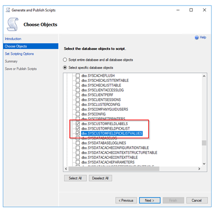
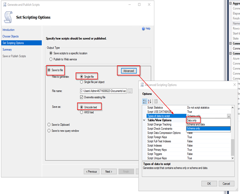
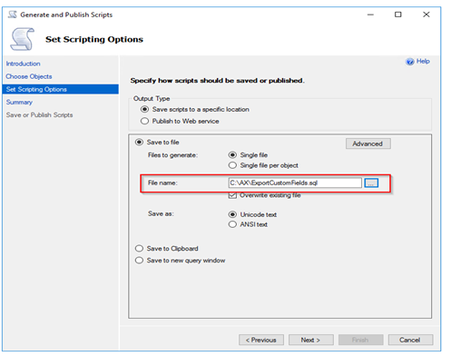
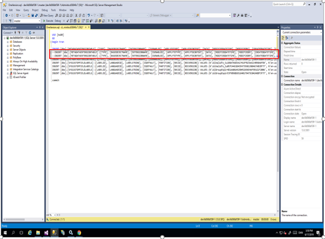
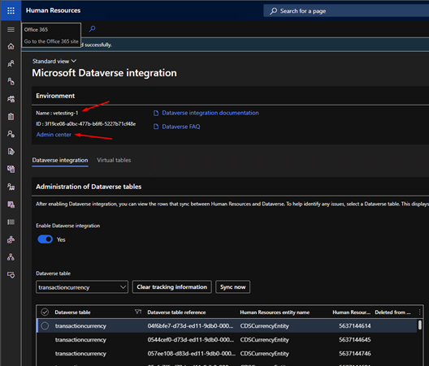
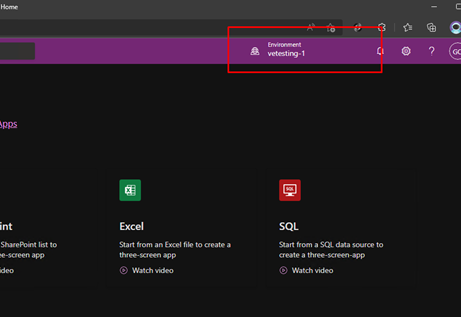
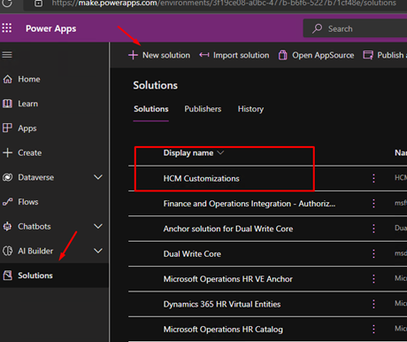

---

# required metadata

title: Dynamics 365 Human Resources customer merge overview
description: This article describes the Microsoft Dynamics 365 Human Resources customer merge.
author: twheeloc
ms.date: 01/03/2023
ms.topic: article
ms.prod: 
ms.technology: 

# optional metadata

ms.search.form: 
# ROBOTS: 
audience: Application User
# ms.devlang: 

# ms.tgt_pltfrm: 
ms.custom: 7521
ms.assetid: 
ms.search.region: Global
# ms.search.industry: 
ms.author: twheeloc
ms.search.validFrom: 2020-10-13
ms.dyn365.ops.version: Human Resources

---
# Dynamics 365 Human Resources customer merge overview

[!include [Applies to Human Resources](../includes/applies-to-hr.md)]
[!include [preview banner](../includes/preview-banner.md)]

## Dynamics Human Resources 365 customer merge

As part of the infrastructure merge, all capabilities of the Microsoft Dynamics 365 Human Resources application are available in finance and operations environments. Customers can migrate their Human Resources environments by using the migration tooling that's available in Microsoft Dynamics Lifecycle Services. They can also merge their data with their existing finance and operations environment.

Microsoft doesn't require that customers merge or consolidate their Human Resources environment with another finance and operations environment. This step is completed at the customer's discretion and on the customer's own timeline. During this step, customers move their data into an existing environment, such as a Dynamics 365 Finance or Dynamics 365 Project Operations environment. This step is mostly manual and can be done by using Data Management Framework (DMF) data entities.

This article includes resources and information about various customer scenarios where finance and operations app–based environments are merged.

## Custom fields

There's an extensive set of out-of-box fields for managing a broad range of business processes. However, a company must sometimes track additional information. One approach is to have programmers to add the required fields as extensions in developer tools. Alternatively, the custom fields feature enables fields to be added directly from the user interface (UI). This approach lets you tailor the application to your business. For more information, see [How to create and work with custom fields](/fin-ops/get-started/user-defined-fields).

### Move custom fields from one environment to another

Follow these steps to move custom fields from one environment to another.

1. Move the **MetadataExtensionTable** table, and the following three tables that contain labels, translations, and picklists:

    - SysCustomFieldLabels
    - SysCustomFieldPicklist
    - SysCustomFieldPicklistValues

    Follow these steps to move the tables:

    1. Open SQL Server Management Studio (SSMS).
    2. Find the **AXDB** database, select and hold (or right-click) it, and then select **Tasks** \> **Generate scripts**.

        

        The **Generate and Publish Scripts** wizard is opened.

    3. On the **Introduction** page, select **Next**.
    4. On the **Choose Objects** page, select the **Select specific database objects** option.
    5. In the list, expand the **Tables** node, and then select the **MetaDataExtensionTable** table.

        

    6. Scroll down the list, and select the following additional tables:

        - SysCustomFieldLabels
        - SysCustomFieldPicklist
        - SysCustomFieldPicklistValues

        

    7. Select **Next**.
    8. On the **Set Scripting Options** page, select the following options:

        - Save scripts to a specific location
        - Save to file
        - Unicode text

    9. Select **Advanced**, find **Types of data to script**, and select **Data only** in the drop-down list. Then select **OK**.

        

    10. Select the file name to save, and then select **Next**.

        

    11. Select **Next**.
    12. On the **Summary** page, select **Finish**.

3. Move the SQL file that's created to the target environment, and open it in the SQL query editor.
4. Comment out the lines for **DimensionAttributeValueCombination** and **DimensionAttributeValueSet**, and then run the script. The records are imported into the database.

    

### Copy custom field metadata in Dataverse

Follow these steps to copy Human Resources custom field metadata that's created in Dataverse to another instance of a Dataverse environment.

1. Create a new unmanaged solution.

    1. Sign in to Human Resources.
    2. Go to **System administration \> Integrations \> Dataverse configuration**.
    3. The **Environment** section at the top of the page provides the name of the Dataverse instance that's being synced to and a link to the Admin center. Make a note of the name of the Dataverse instance.

        

    4. Open a new browser tab, and go to the Power Apps Maker portal (<https://make.powerapps.com>).
    5. In the upper-right corner, on the **Environment** drop-down menu, select the name of the Dataverse instance that you made a note of in step 3.

         

    6. In the left navigation, select **Solutions**.
    7. On the **Solutions** page, select **New solution**.
    8. Enter a name and description for the new solution, and select the default publisher.
    9. Select **OK**. The new solution appears in the list of solutions on the **Solutions** page.

        

2. Add the custom fields that were created through Dynamics 365 Human Resources to the new unmanaged solution.

    1. Select the name of the solution that you created in step 1. 
    2. Select **Add existing \> Table**.
    3. Search for the name of the table where custom fields have been added.
    4. Select the table, and then select **Next**.
    5. Select **Select objects**.
    6. On the **Fields** tab, use the search functionality to find all fields that have names that end in **\_custom**.
    7. Select the fields, and then select **Add**. The table page should now reflect the number of objects that you selected.
    8. Select **Add**. The solution page should now show the name of the table that you added to the unmanaged solution.
    9. Repeat steps 2 through 8 until you've added all the custom fields to the solution.
    10. Return to the **Solutions** page by selecting the back arrow.

3. Export the solution as managed.

    1. Select the checkbox for the solution that you created.
    2. Select **Next**. 
    3. **Managed** is selected by default. Select **Export** to start the export process.
    4. After the export process is completed, select **Download**. The solution should be saved to the browser's default download folder.

4. Import the managed solution into the other Dataverse environment.

    1. In the Power Apps Maker portal, on the **Environment** drop-down menu, select the destination Dataverse environment.
    2. On the **Solutions** page, select **Import**.
    3. Select **Browse**, and select the managed solution that you exported in step 3.
    4. Select **Next**, select **Import**, and wait until the managed solution is applied to the destination Dataverse environment.

## Personalizations

By personalizing the user interface in finance and operations apps, employees of an organization can work more efficiently. To learn more about personalization, see [Personalize finance and operations apps](/fin-ops/get-started/personalize-user-experience).

To move the personalizations:

1. From Source environment, export personalization from the page that has been modified.
2. Copy the personalization file (from step 1) to the target environment.
3. In the target environment, import the file from step 2.

Optional: Move data from the application tables if the data should migrate (HcmWorker, Customer, etc…).
