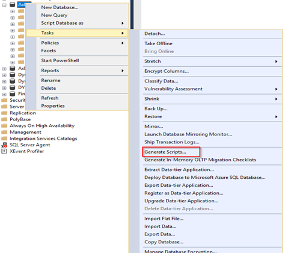
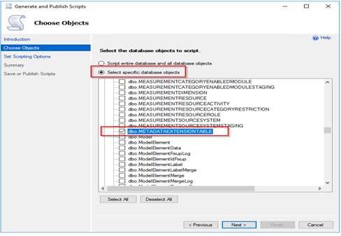
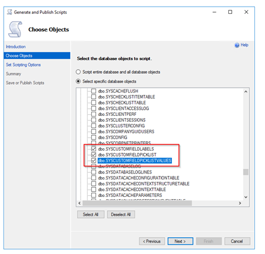
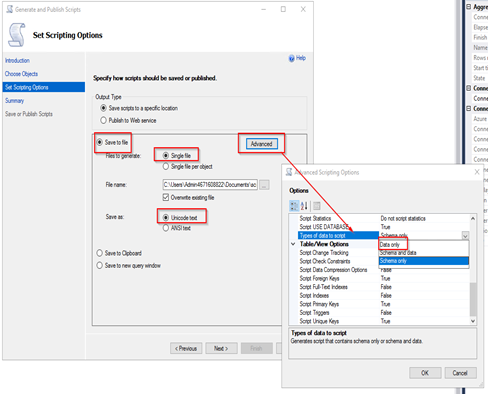
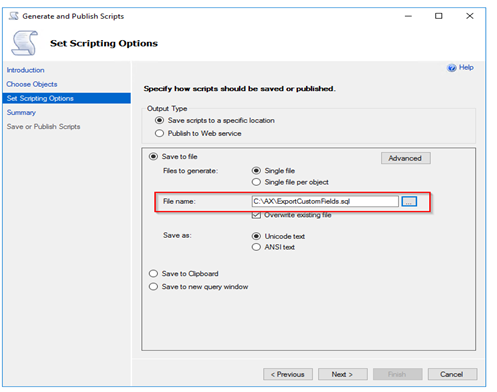
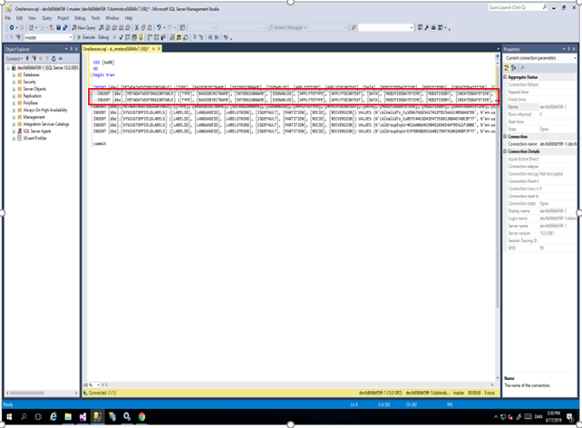
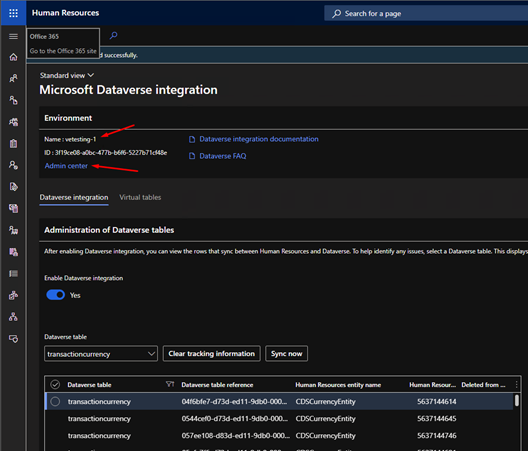
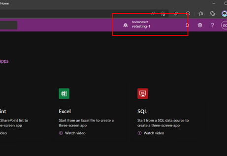
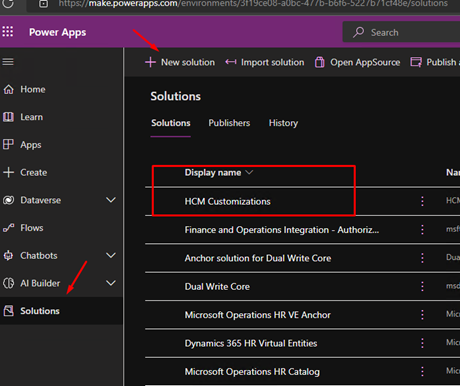

---

# required metadata

title: Dynamics 365 Human Resources customer merge overview
description: This article describes the Microsoft Dynamics 365 Human Resources customer merge.
author: twheeloc
ms.date: 08/06/2026
ms.topic: article
# optional metadata

ms.search.form: 
# ROBOTS: 
audience: Application User
# ms.devlang: 

# ms.tgt_pltfrm: 
ms.assetid: 
ms.search.region: Global
# ms.search.industry: 
ms.author: twheeloc
ms.search.validFrom: 2020-10-13
ms.dyn365.ops.version: Human Resources

---
# Dynamics 365 Human Resources customer merge overview

[!include [Applies to Human Resources](../includes/applies-to-hr.md)]
[!include [LCS freeze](includes/lcs-freeze-banner.md)]

## Dynamics 365 Human Resources customer merge

As part of the infrastructure merge, all capabilities of the Microsoft Dynamics 365 Human Resources application are available in finance and operations environments. You can migrate your Human Resources environments by using the migration tooling that's available in Microsoft Dynamics Lifecycle Services. You can also merge your data with your existing finance and operations environment.

Microsoft doesn't require that you merge or consolidate your Human Resources environment with another finance and operations environment. Complete this step at your discretion and on your own timeline. During this step, move your data into an existing environment, such as a Dynamics 365 Finance or Dynamics 365 Project Operations environment. This step is mostly manual and can be done by using Data Management Framework (DMF) data entities.

This article includes resources and information about various customer scenarios where finance and operations app–based environments are merged.

## Custom fields

There's an extensive set of out-of-box fields for managing a broad range of business processes. However, you might sometimes need to track extra information. One approach is to have programmers add the required fields as extensions in developer tools. Alternatively, use the custom fields feature to add fields directly from the user interface (UI). This approach lets you tailor the application to your business. For more information, see [How to create and work with custom fields](../fin-ops-core/fin-ops/get-started/user-defined-fields.md).

### Move custom fields from one environment to another

Follow these steps to move custom fields from one environment to another.

1. Move the **MetadataExtensionTable** table, and the following three tables that contain labels, translations, and picklists:

    - SysCustomFieldLabels
    - SysCustomFieldPicklist
    - SysCustomFieldPicklistValues

    Follow these steps to move the tables:

    1. Open SQL Server Management Studio (SSMS).
    2. Find the **AXDB** database, select and hold (or right-click) it, and then select **Tasks** \> **Generate scripts**.

        

        The **Generate and Publish Scripts** wizard opens.

    3. On the **Introduction** page, select **Next**.
    4. On the **Choose Objects** page, select the **Select specific database objects** option.
    5. In the list, expand the **Tables** node, and then select the **MetaDataExtensionTable** table.

        

    6. Scroll down the list, and select the following additional tables:

        - SysCustomFieldLabels
        - SysCustomFieldPicklist
        - SysCustomFieldPicklistValues

        

    7. Select **Next**.
    8. On the **Set Scripting Options** page, select the following options:

        - Save scripts to a specific location
        - Save to file
        - Unicode text

    9. Select **Advanced**, find **Types of data to script**, and select **Data only** in the drop-down list. Then select **OK**.

        

    10. Select the file name to save, and then select **Next**.

        

    1. Select **Next**.
    12. On the **Summary** page, select **Finish**.

1. Move the SQL file you created to the target environment, and open it in the SQL query editor.
1. Comment out the lines for **DimensionAttributeValueCombination** and **DimensionAttributeValueSet**, and then run the script. The records are imported into the database.

    

### Copy custom field metadata in Dataverse

Follow these steps to copy Human Resources custom field metadata that you created in Dataverse to another instance of a Dataverse environment.

1. Create a new unmanaged solution.

    1. Sign in to Human Resources.
    1. Go to **System administration \> Integrations \> Dataverse configuration**.
    1. The **Environment** section at the top of the page provides the name of the Dataverse instance that you're syncing to and a link to the Admin center. Make a note of the name of the Dataverse instance.

        

    1. Open a new browser tab, and go to the Power Apps Maker portal (<https://make.powerapps.com>).
    1. In the upper-right corner, on the **Environment** drop-down menu, select the name of the Dataverse instance that you noted in step 3.

        

    1. In the left navigation, select **Solutions**.
    1. On the **Solutions** page, select **New solution**.
    1. Enter a name and description for the new solution, and select the default publisher.
    1. Select **OK**. The new solution appears in the list of solutions on the **Solutions** page.

        

1. Add the custom fields that you created through Dynamics 365 Human Resources to the new unmanaged solution.

    1. Select the name of the solution that you created in step 1.
    1. Select **Add existing \> Table**.
    1. Search for the name of the table where you added custom fields.
    1. Select the table, and then select **Next**.
    1. Select **Select objects**.
    1. On the **Fields** tab, use the search functionality to find all fields that have names that end in **\_custom**.
    1. Select the fields, and then select **Add**. The table page now reflects the number of objects that you selected.
    1. Select **Add**. The solution page now shows the name of the table that you added to the unmanaged solution.
    1. Repeat steps 2 through 8 until you add all the custom fields to the solution.
    1. Return to the **Solutions** page by selecting the back arrow.

1. Export the solution as managed.

    1. Select the checkbox for the solution that you created.
    1. Select **Next**.
    1. **Managed** is selected by default. Select **Export** to start the export process.
    1. After the export process is completed, select **Download**. The solution is saved to the browser's default download folder.

1. Import the managed solution into the other Dataverse environment.

    1. In the Power Apps Maker portal, on the **Environment** drop-down menu, select the destination Dataverse environment.
    1. On the **Solutions** page, select **Import**.
    1. Select **Browse**, and select the managed solution that you exported in step 3.
    1. Select **Next**, select **Import**, and wait until the managed solution is applied to the destination Dataverse environment.

## Personalizations

When you personalize the user interface in finance and operations apps, employees of your organization can work more efficiently. For more information about personalization, see [Personalize finance and operations apps](../fin-ops-core/fin-ops/get-started/personalize-user-experience.md).

To move the personalizations:

1. From the source environment, export the personalization from the page that you modified.
1. Copy the personalization file from step 1 to the target environment.
1. In the target environment, import the file from step 2.

1. (Optional) Move data from the application tables if the data should migrate (HcmWorker, Customer, and other tables).
