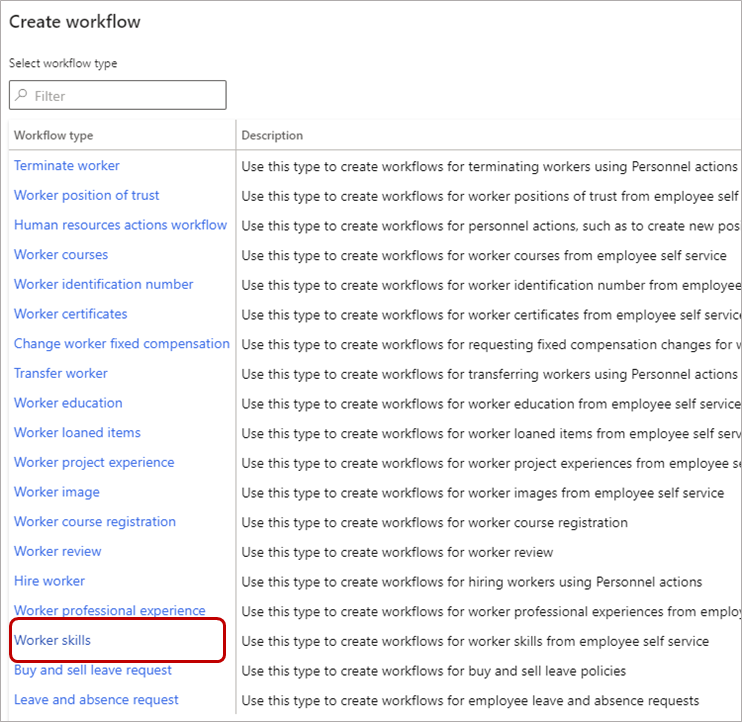
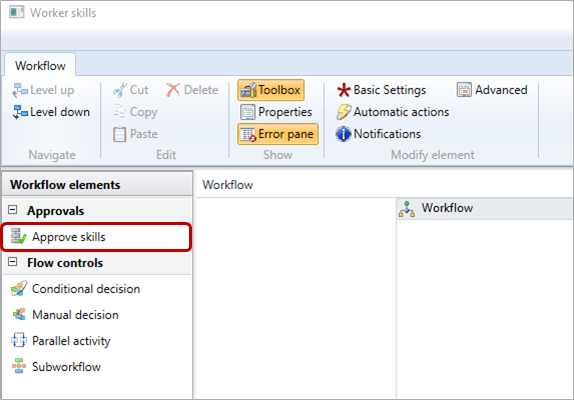
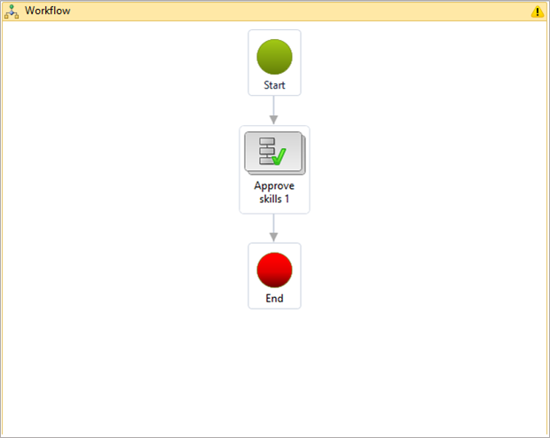

---
# required metadata

title: Enter skills
description: Works and managers can enter skills in Dynamics 365 Human Resources.
author: andreabichsel
manager: tfehr
ms.date: 03/23/2021
ms.topic: article
ms.prod: 
ms.technology: 

# optional metadata

ms.search.form: HcmSkill, HcmSkillGapProfile, HcmSkillMapping, HcmSkillType, HcmEmployeeDevelopmentWorkspace
# ROBOTS: 
audience: Application User
# ms.devlang: 
ms.reviewer: anbichse
ms.search.scope: Human Resources
# ms.tgt_pltfrm: 
ms.custom: 3361
ms.assetid: c2ce94c0-933d-4edb-822c-7f0e7b49e4ee
ms.search.region: Global
# ms.search.industry: 
ms.author: anbichse
ms.search.validFrom: 2016-02-28
ms.dyn365.ops.version: AX 7.0.0, Human Resources

---

# Enter skills

[!include [Applies to Human Resources](../includes/applies-to-hr.md)]

You can enter target skills or actual skills for workers, applicants, or contacts in Dynamics 365 Human Resources. A target skill is a skill that a person plans to achieve. An actual skill is a skill that a person currently has.

## Create a workflow to auto-approve skills

To enter skills without requiring approval, you must create a workflow to auto-approve skills.

> [!NOTE]
> Skills entered by workers always require manager approval. This workflow only auto-approves skills entered by managers on behalf of their workers.

1. In the **Personnel management** workspace, select **Links**.

2. Under **Setup**, select **Human resources workflows**.

3. Select **New**.

4. In the **Create workflow** pane, select **Worker skills**.

    

5. In the **Open this file?** dialogue, select **Open**. When prompted, enter your credentials.

6. In the workflow editor, select the **Approve skills** workflow element and drag it onto the canvas.

    

7. Connect the **Start** element to the **Approve skills 1** element, and then connect the **Approve skills 1** element to the **End** element. You might need to scroll down to see the **End** element. You can drag it closer to the other elements, if desired.

    

 

For more information about creating workflows, see [Workflow system overview](https://docs.microsoft.com/dynamics365/fin-ops-core/fin-ops/organization-administration/overview-workflow-system?toc=/dynamics365/human-resources/toc.json).

## Enter skills for a worker

1. Select a worker.

2. In the action bar of the **Worker** page, select **Person**, and then select **Skills**.

3. On the **Skills** page, complete the following fields for each skill:

   - **Skill**: Select a skill.
   - **Level type**: Select **Actual** for a skill the worker already has, or select **Target** for a skill the worker is working toward.
   - **Level**: Select a level for the worker's skill.
   - **Level date**: Select a date in the calendar tool.
   - **Examiner**: If appropriate, select an examiner from the list. You can filter your search.
   - **Years of experience**: Enter years of experience.
   - **Verified**: If the skill is verified, check the box.
   - **Verified by**: Enter the name of the verifier.

4. When you're done entering skills, select **Save**.

[!INCLUDE[footer-include](../includes/footer-banner.md)]