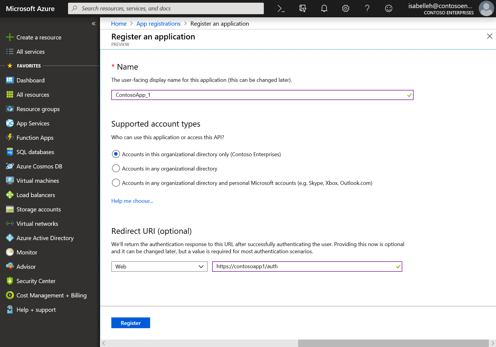

---
# required metadata

title: Authentication
description: This article provides overview information about how to authenticate with the Microsoft Dynamics 365 Human Resources data application programming interface (API).
author: twheeloc
ms.date: 02/03/2020
ms.topic: article
ms.prod: 
ms.technology: 

# optional metadata

ms.search.form: 
# ROBOTS: 
audience: Application User
# ms.devlang: 
ms.search.scope: Human Resources
# ms.tgt_pltfrm: 
ms.custom: 7521
ms.assetid: 
ms.search.region: Global
# ms.search.industry: 
ms.author: twheeloc
ms.search.validFrom: 2020-02-03
ms.dyn365.ops.version: Human Resources

---

# Authentication


[!INCLUDE [PEAP](../includes/peap-2.md)]

[!include [Applies to Human Resources](../includes/applies-to-hr.md)]

This article provides overview information about how to authenticate with the Microsoft Dynamics 365 Human Resources data application programming interface (API).

## Overview

The data API for Human Resources is an OData implementation. For more information, see [Open Data Protocol (OData)](../fin-ops-core/dev-itpro/data-entities/odata.md).

Your application must authenticate as an authorized caller before the API will service requests from your application.

## Fundamentals

To call the data API, your application must acquire an access token from the Microsoft identity platform. The access token contains information about your application and the permission that it has to call resources in Human Resources.

### Access token

Access tokens issued by the Microsoft identity platform are base64–encoded JavaScript Object Notation (JSON) Web Tokens (JWTs). They contain information (claims) that the data API (and other web APIs that are secured by the Microsoft identity platform) use to validate the caller and make sure that the caller has the correct permissions to perform the operation they're requesting. During calls, you can treat access tokens as opaque. You should always transmit access tokens over a secure channel, such as Transport Layer Security (TLS) and Hypertext Transfer Protocol Secure (HTTPS).

Here is an example of an access token that is issued by the Microsoft identity platform.

```jwt
EwAoA8l6BAAU7p9QDpi/D7xJLwsTgCg3TskyTaQAAXu71AU9f4aS4rOK5xoO/SU5HZKSXtCsDe0Pj7uSc5Ug008qTI+a9M1tBeKoTs7tHzhJNSKgk7pm5e8d3oGWXX5shyOG3cKSqgfwuNDnmmPDNDivwmi9kmKqWIC9OQRf8InpYXH7NdUYNwN+jljffvNTewdZz42VPrvqoMH7hSxiG7A1h8leOv4F3Ek/oeJX6U8nnL9nJ5pHLVuPWD0aNnTPTJD8Y4oQTp5zLhDIIfaJCaGcQperULVF7K6yX8MhHxIBwek418rKIp11om0SWBXOYSGOM0rNNN59qNiKwLNK+MPUf7ObcRBN5I5vg8jB7IMoz66jrNmT2uiWCyI8MmYDZgAACPoaZ9REyqke+AE1/x1ZX0w7OamUexKF8YGZiw+cDpT/BP1GsONnwI4a8M7HsBtDgZPRd6/Hfqlq3HE2xLuhYX8bAc1MUr0gP9KuH6HDQNlIV4KaRZWxyRo1wmKHOF5G5wTHrtxg8tnXylMc1PKOtaXIU4JJZ1l4x/7FwhPmg9M86PBPWr5zwUj2CVXC7wWlL/6M89Mlh8yXESMO3AIuAmEMKjqauPrgi9hAdI2oqnLZWCRL9gcHBida1y0DTXQhcwMv1ORrk65VFHtVgYAegrxu3NDoJiDyVaPZxDwTYRGjPII3va8GALAMVy5xou2ikzRvJjW7Gm3XoaqJCTCExN4m5i/Dqc81Gr4uT7OaeypYTUjnwCh7aMhsOTDJehefzjXhlkn//2eik+NivKx/BTJBEdT6MR97Wh/ns/VcK7QTmbjwbU2cwLngT7Ylq+uzhx54R9JMaSLhnw+/nIrcVkG77Hi3neShKeZmnl5DC9PuwIbtNvVge3Q+V0ws2zsL3z7ndz4tTMYFdvR/XbrnbEErTDLWrV6Lc3JHQMs0bYUyTBg5dThwCiuZ1evaT6BlMMLuSCVxdBGzXTBcvGwihFzZbyNoX+52DS5x+RbIEvd6KWOpQ6Ni+1GAawHDdNUiQTQFXRxLSHfc9fh7hE4qcD7PqHGsykYj7A0XqHCjbKKgWSkcAg==
```

To call the data API, you attach the access token as a bearer token to the authorization header in your HTTP request. Here is an example.

```HTTP
HTTP/1.1
Authorization: Bearer EwAoA8l6BAAU ... 7PqHGsykYj7A0XqHCjbKKgWSkcAg==
Host: https://{cluster}.hr.talent.dynamics.com
GET https://{cluster}.hr.talent.dynamics.com/namespaces/{namespace_guid}/data/JobTypes
```

## Register a new application by using the Azure portal

1. Sign in to the [Microsoft Azure portal](https://portal.azure.com) with a work or school account, or a personal Microsoft account.

2. If your account gives you access to more than one tenant, select your account in the upper-right corner, and set your portal session to the Azure Active Directory (Azure AD) tenant that you want.

3. In the left pane, select the **Azure Active Directory** service, and then select **App registrations \> New registration**.

4. When the **Register an application** page appears, enter your application's registration information:

    - **Name**: Enter a meaningful application name that will be shown to users of the app.
    - **Supported account types**: Select the types of accounts that your app should support.

        | Supported account types | Description |
        |-------------------------|-------------|
        | Accounts in this organizational directory only | Select this option if you're building a line-of-business app. This option isn't available unless you're registering the app in a directory.<p>This option is mapped to **Azure AD only single-tenant**.</p><p>This option is the default option unless you're registering the app outside a directory. In that case, the default option is **Azure AD multi-tenant and personal Microsoft accounts**.</p> |
        | Accounts in any organizational directory | Select this option to target all business and educational customers.<p>This option is mapped to **Azure AD only multi-tenant**.</p><p>If you registered the app as **Azure AD only single-tenant**, you can use the **Authentication** blade to update it to **Azure AD only multi-tenant** and then back to **Azure AD only single-tenant**.</p> |
        | Accounts in any organizational directory and personal Microsoft accounts | Select this option to target the widest set of customers.<p>This option is mapped to **Azure AD multi-tenant and personal Microsoft accounts**.</p><p>If you registered the app as **Azure AD multi-tenant and personal Microsoft accounts**, you can't change this setting in the user interface (UI). Instead, you must use the application manifest editor to change the supported account types.</p> |

    - **Redirect URI (optional)** – Select the type of app that you're building: **Web** or **Public client (mobile & desktop)**. Then enter the redirect URI (or reply URL) for the app.

        - For web apps, provide the base URL of the app. For example, `http://localhost:31544` might be the URL for a web app that runs on your local machine. Users then use this URL to sign in to a web client app.
        - For public client apps, provide the URI that Azure AD uses to return token responses. Enter a value that is specific to your app, such as `myapp://auth`.

        To see specific examples for web apps or native apps, see the quickstarts in [Microsoft identity platform (formerly Azure Active Directory for developers)](/azure/active-directory/develop/#quickstarts).

5. Under **API permissions**, select **Add a permission**. Then, on the **APIs my organization uses** tab, search for **Dynamics 365 Human Resources**, and add the **user\_impersonation** permission to your app. The Application ID for Human Resources is f9be0c49-aa22-4ec6-911a-c5da515226ff. Use this ID to ensure you have chosen the correct application.

6. Select **Register**.

   [](media/api-new-app-registration-expanded.png#lightbox)

Azure AD assigns a unique application ID (client ID) to your app, and takes you to the **Overview** page for your app. To add more capabilities to your app, you can select other configuration options, such as options for branding and for certificates and secrets.

## Retrieving an access token

The specifics of how you retrieve an access token for calling the Human Resources data API will depend on what technologies you're using to develop your client application. For example, you might be [testing with a third party utility](../fin-ops-core/dev-itpro/data-entities/third-party-service-test.md) (such as Postman), developing a C# console application or web service, or building a javascript/TypeScript client.

Example C# client application:
```C#
using System;
using System.Net.Http;
using System.Threading.Tasks;

// requires appropriate NuGet package references in the project
using Microsoft.IdentityModel.Clients.ActiveDirectory;

namespace TalentODataPoC
{
    class Program
    {
        // prereq: This client app must be registered in Azure Active Directory. The app must be
        // registered as requiring permission to the Dynamics 365 for Talent API (with the Dynamics
        // HCM Workload delegated permission).
        static string clientId = "4fc703ef-672c-4e2c-813f-2f9d29d726db"; // This value should be obtained from AAD and must match your registered app
        static string talentNamespaceUri = "";

        public static async Task CallTalentODataService()
        {
            // authority URI
            UriBuilder uri = new UriBuilder("https://login.microsoftonline.com/common");
            AuthenticationContext authenticationContext = new AuthenticationContext(uri.ToString());

            // request token for the resource we want to access (Human Resources). This will authenticate
            // the user and return an access token containing claims for the authenticated user.
            var authResult = await authenticationContext.AcquireTokenAsync(
                "http://hr.talent.dynamics.com", /*Talent app id or resource URI*/
                clientId, /*registered client app id*/
                new Uri("https://localhost"), /*redirect URI, as registered in your AAD app*/
                new PlatformParameters(PromptBehavior.SelectAccount));

            // create the authorization header, which needs to be passed in the Header of the HTTP Requests to Talent
            string authHeader = authResult.CreateAuthorizationHeader();

            // HINT: paste the JWT into https://jwt.ms to decode and view it
            Console.Write("authHeader: ");
            Console.WriteLine(authHeader);
            Console.WriteLine();

            HttpClient client = new HttpClient();
            client.DefaultRequestHeaders.Add("Authorization", authHeader);

            string s;

            Console.Write("Talent Namespace URI: ");
            Console.WriteLine(talentNamespaceUri);
            Console.WriteLine();

            // call the OData service to get JobType data from Talent
            var resultOdata = await client.GetAsync(talentNamespaceUri + "data/JobTypes");
            s = await resultOdata.Content.ReadAsStringAsync();
            Console.WriteLine(s);
            Console.WriteLine();
        }

        static void Main(string[] args)
        {
            Console.WriteLine();

            // if the user passes in a single parameter, assume it is the namespaceUri for Talent
            if (args.Length == 1)
            {
                talentNamespaceUri = args[0];
            } else if (args.Length == 0)
            {
                Console.WriteLine("Enter Talent URL including namespace.");
                Console.WriteLine("Example: https://aos-rts-sf-21454f9d830-prod-westus2.hr.talent.dynamics.com/namespaces/2328af1a-2d45-4c6a-99e3-12a4c3867dcf/");
                Console.Write("> ");
                talentNamespaceUri = Console.ReadLine();
                if (!talentNamespaceUri.EndsWith("/"))
                {
                    talentNamespaceUri = talentNamespaceUri + "/";
                }
            } else
            {
                Console.WriteLine("Unexpected Arguments");
                System.Environment.Exit(1);
            }

            Task t = Program.CallTalentODataService();
            t.Wait();
        }
    }
}
```

Once you've retrieved an access token, you'll pass the token in the Authorization header as a bearer token with each request you send to the data API, as described above.


[!INCLUDE[footer-include](../includes/footer-banner.md)]
