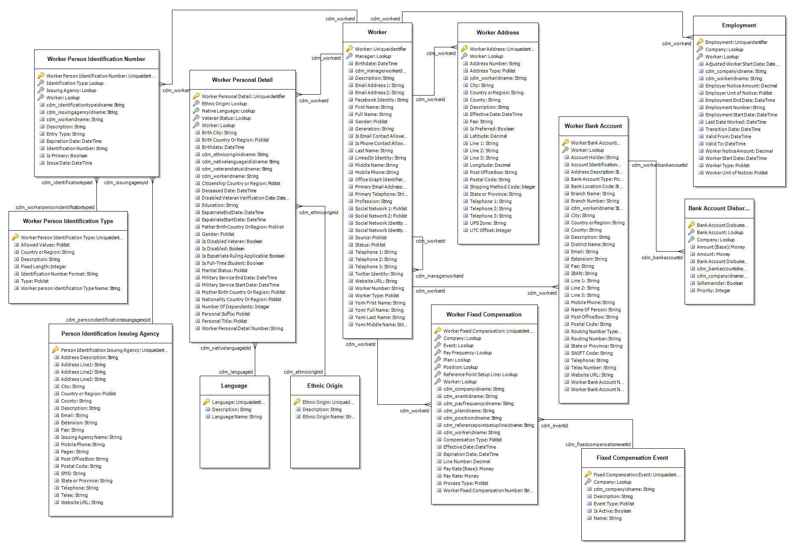
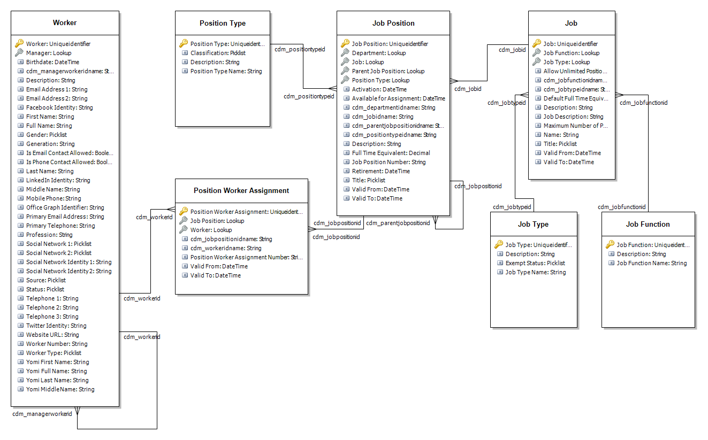
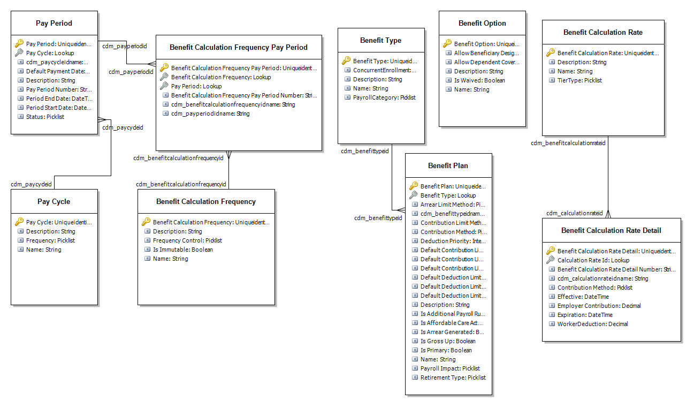
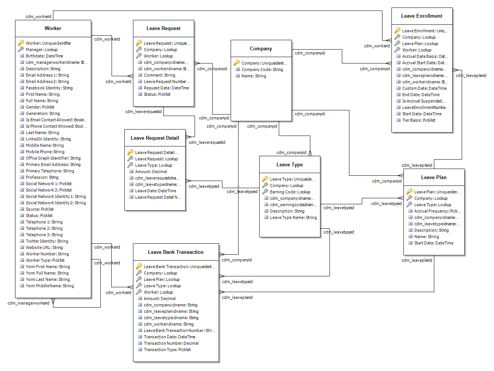
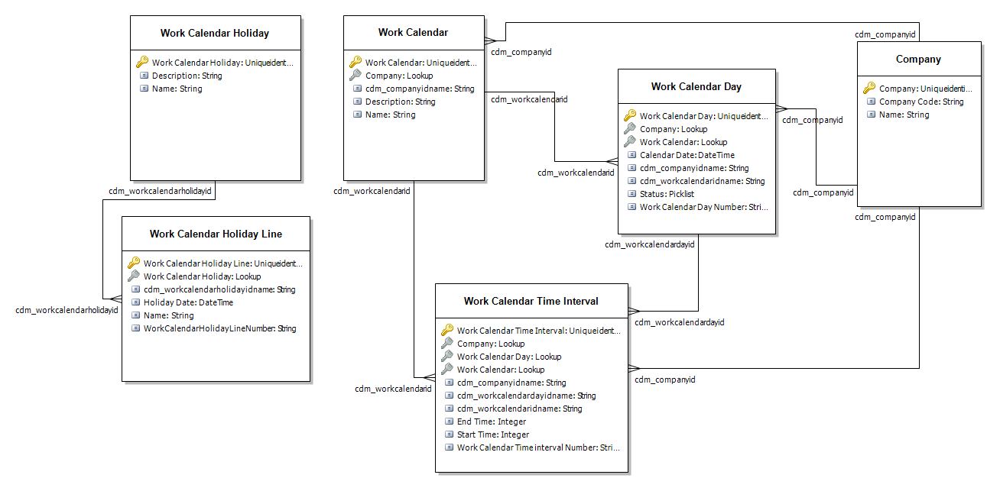

---
# required metadata

title: Dataverse tables
description: Microsoft Dynamics 365 Human Resources uses Dataverse to enable extensibility and integration scenarios.
author: twheeloc
ms.date: 12/08/2022
ms.topic: article
# optional metadata

ms.search.form: 
# ROBOTS: 
audience: Application User
# ms.devlang: 

# ms.tgt_pltfrm: 
ms.assetid: 
ms.search.region: Global
# ms.search.industry: 
ms.author: twheeloc
ms.search.validFrom: 2020-02-03
ms.dyn365.ops.version: Human Resources

---

# Dataverse tables

[!include [Applies to Human Resources](../includes/applies-to-hr.md)]

Microsoft Dynamics 365 Human Resources uses Dataverse to enable extensibility and integration scenarios.

> [!NOTE]
> Human Resources entities correspond to Dataverse tables. For more information about Dataverse (formerly Common Data Service) and terminology updates, see [What is Microsoft Dataverse?](/powerapps/maker/data-platform/data-platform-intro)

The following Dataverse tables are available based on Human Resources entities.

For more information about the known issues, see [Issue search in Lifecycle Services (LCS)](../dev-itpro/lifecycle-services/issue-search-lcs.md).

## Benefit tables

| Name | Table | Known issues  | Status |
| --- | --- |    --------|----------  |
| Benefit Calculation Frequency | cdm_benefitcalculationfrequency |     |     |
| Benefit Calculation Frequency Pay Period | cdm_benefitcalculationfrequencypayperiod |     |     |
| Benefit Calculation Rate | cdm_benefitcalculationrate |    |     |
| Benefit Calculation Rate Detail | cdm_benefitcalculationratedetail |753225 | Resolved  |
| Benefit Option | cdm_benefitoption |    |     |
| Benefit Plan | cdm_benefitplan (Not enabled for custom field support) |    |     |
| Benefit Type | cdm_benefittype |    |     |

## Business process tasks tables

| Name | Table |Known issues  | Status |
| --- | --- |   --------|----------   |
| Business Process Calendar | cdm_businessprocesscalendar | 751867 | Resolved |
| Business Process Group Assignment | cdm_businessprocessgroupassignment | 751869  751863 | Active|
| Business Process Library Task Group | cdm_businessprocesslibrarytaskgroup |751866 | Closed |
| Business Process Stage | cdm_businessprocessstage |      |     |
| Checklist Template Header | cdm_businessprocesstemplateheader |     |     |
| Checklist Template Task | cdm_businessprocesstemplatetask |      |     |

## Compensation tables

| Name | Table |Known issues  | Status |
| --- | --- | ----------      | -------    |
| Compensation Fixed Plan | cdm_compensationfixedplan |754453 | Closed |
| Compensation Grid | cdm_compensationgrid |             |     |
| Compensation Level | cdm_compensationlevel |           |     |
| Compensation Pay Frequency | cdm_compensationpayfrequency |                  |     |
| Compensation Reference Point Setup | cdm_compensationreferencepointsetup |               |     |
| Compensation Reference Point Setup Line | cdm_compensationreferencepointsetupline |             |     |
| Compensation Region | cdm_compensationregion |                   |     |
| Compensation Structure | cdm_compensationstructure |    754456        | Closed    |
| Compensation Variable Plan | cdm_compensationvariableplan |               |     |
| Compensation Variable Plan Level | cdm_compensationvariableplanlevel |                |     |
| Compensation Variable Plan Type | cdm_compensationvariableplantype |               |     |
| Fixed Compensation Event | cdm_fixedcompensationevent |               |     |
| Vesting Rule | cdm_vestingrule |              |     |
| Worker Fixed Compensation | cdm_workerfixedcompensation |              |     |

## Organization tables

| Name | Table |Known issues  | Status |
| --- | --- | ----------      | -------    |
| Department | cdm_department |  752194    | Closed    |
| Employment | cdm_employment | 762414  |  Closed  |
| Company | cdm_company |  |     |
| Job | cdm_job |  |     |
| Job Function | cdm_jobfunction |        |     |
| Job Position | cdm_jobposition | 752214      | Closed    |
| Position Type | cdm_positiontype |            |     |
| Position Worker Assignment | cdm_positionworkerassignmentmap | 752224    |  Closed   |
| Job Position Dimension | cdm_jobpositiondimension|       |     |
| Job Type | cdm_jobtype |      |     |
| Language | cdm_language |        |     |
| Title | cdm_title |       |     |

> [!NOTE]
> Financial dimensions for **Position Type**, **Position Worker Assignment**, and **Employment** provide one-direction integration to Dataverse. Financial dimensions updates currently can't synchronize from Dataverse to Human Resources. 

## Leave and absence tables

| Name | Table | Known issues  | Status |
| --- | --- |   ----------      | -------    |
| Leave Bank Transaction | cdm_leavebanktransaction |  752252    |    Resolved |
| Leave Enrollment | cdm_leaveenrollment |  752934    |Closed     |
| Leave Plan | cdm_leaveplan |   752232   |   Closed  |
| Leave Request | cdm_leaverequest | 753207     | Closed    |
| Leave Request Detail | cdm_leaverequestdetail | 753207     |   Closed  |
| Leave Type | cdm_leavetype |      |     |
| Leave Type Reason Code | cdm_leavetypereasoncode |         |     |

>[!NOTE]
>The dual-write integration using Dataverse tables for Leave and absence is only available when the **Configure multiple leave types on a single leave plan** feature is enabled in Microsoft Dynamics 365 Finance using **Feature management**. 

## Payroll tables

| Name | Table |Known issues  | Status |
| --- | --- |  ----------      | -------    |
| Pay Cycle | cdm_paycycle |    |     |
| Pay Period | cdm_payperiod |          |     |
| Payroll Earning Code | cdm_payrollearningcode |   754458        |   Closed  |
| Bank Account Disbursement | cdm_bankaccountdisbursement |    751904     |   Closed  |
| Tax Region | cdm_taxregion |          |     |

## Worker tables

| Name | Table |Known issues  | Status |
| --- | --- |----------      | -------    |
| Worker | cdm_worker |    751906    |    Closed |
| Worker Address | cdm_workeraddress |   754465     |Closed     |
| Worker Personal Detail | cdm_workerpersonaldetail |   751906     |   Closed  |
| Worker Person Identification Number | cdm_workerpersonidentificationnumber |  766704      |   Closed  |
| Worker Person Identification Type | cdm_workerpersonidentificationtype |        |     |
| Work Calendar | cdm_workcalendar |        |     |
| Work Calendar Day | cdm_workcalendarday |        |     |
| Work Calendar Holiday |cdm_workcalendarholiday |        |     |
| Work Calendar Holiday Line | cdm_workcalendarholidayline |        |     |
| Work Calendar Time Interval | cdm_workcalendartimeinterval (Not enabled for custom field support) |        |     |
| Worker Bank Account | cdm_workerbankaccount |        |     |

## Worker setup tables

| Name | Table |
| --- | --- |
| Veteran Status | cdm_veteranstatus |
| Ethnic Origin | cdm_ethnicorigin |
| Reason Code | cdm_reasoncode |
| Person Identification Issuing Agency | cdm_personidentificationissuingagency |

## Competency tables

| Name | Table |
| --- | --- |
| Skill Type | cdm_skilltype |

## Table relationship models

### Worker

### Job and Job Position

### Benefits

### Compensation

### Leave

### Work Calendar

## See also

[Choose a data integration technology](hr-admin-integration-choose-technology.md) 
[Configure Dataverse integration](hr-admin-integration-common-data-service.md) 
[Configure Dataverse virtual tables](hr-admin-integration-common-data-service-virtual-entities.md) 
[Human Resources virtual tables FAQ](dev-itpro/hr-admin-virtual-entity-faq.md) 
[What is Microsoft Dataverse?](/powerapps/maker/data-platform/data-platform-intro) 
[Terminology updates](/powerapps/maker/data-platform/data-platform-intro#terminology-updates)

[!INCLUDE[footer-include](../includes/footer-banner.md)]
