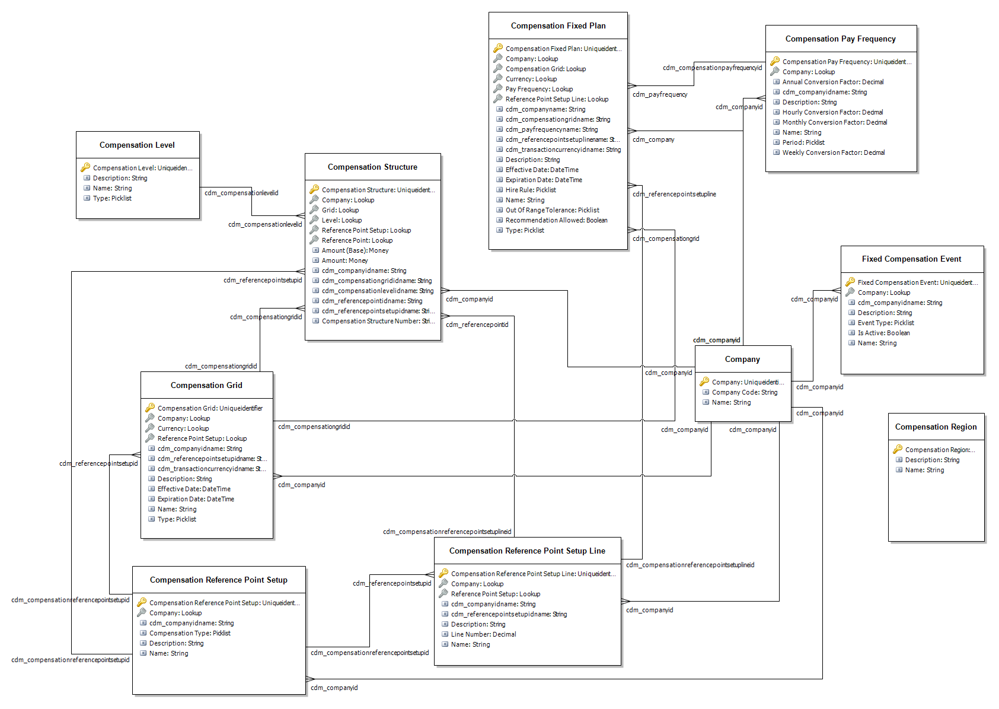

---
# required metadata

title: Common Data Service entities
description: Microsoft Dynamics 365 Human Resources uses Common Data Service to enable extensibility and integration scenarios.
author: andreabichsel
manager: AnnBe
ms.date: 02/03/2020
ms.topic: article
ms.prod: 
ms.service: dynamics-human-resources
ms.technology: 

# optional metadata

ms.search.form: 
# ROBOTS: 
audience: Application User
# ms.devlang: 
ms.reviewer: anbichse
ms.search.scope: Human Resources
# ms.tgt_pltfrm: 
ms.custom: 7521
ms.assetid: 
ms.search.region: Global
# ms.search.industry: 
ms.author: anbichse
ms.search.validFrom: 2020-02-03
ms.dyn365.ops.version: Human Resources

---

# Common Data Service entities

Microsoft Dynamics 365 Human Resources uses Common Data Service to enable extensibility and integration scenarios.

For more information about Common Data Service, see [What is Common Data Service](https://docs.microsoft.com/powerapps/maker/common-data-service/data-platform-intro).

The following Human Resources entities are available in Common Data Service.

## Benefit entities

**Benefit calculation frequency**

| **Fields**        | **Data type** | **Required** | **Searchable** |
|-------------------|---------------|--------------|----------------|
| Description       | Text          |              | X              |
| Frequency Control | Option set    | X            | X              |
| Is Immutable      | Two options   |              | X              |
| Name              | Text          | X            | X              |

**Benefit calculation rate**

| **Fields**  | **Data type** | **Required** | **Searchable** |
|-------------|---------------|--------------|----------------|
| Description | Text          |              | X              |
| Name        | Text          | X            | X              |
| TierType    | Option set    | X            | X              |

**Benefit calculation rate detail**

| **Fields**                             | **Data type**  | **Required** | **Searchable** |
|----------------------------------------|----------------|--------------|----------------|
| Benefit Calculation Rate Detail Number | Text           | X            | X              |
| Calculation Rate ID                    | Lookup         | X            | X              |
| Contribution Method                    | Option Set     | X            | X              |
| Effective                              | Date Only      | X            | X              |
| Employer Contribution                  | Decimal number |              | X              |
| Expiration                             | Date Only      | X            | X              |
| WorkerDeduction                        | Decimal number |              | X              |

**Benefit type**

| **Fields**           | **Data type** | **Required** | **Searchable** |
|----------------------|---------------|--------------|----------------|
| ConcurrentEnrollment | Option set    |              | X              |
| Description          | Text          |              | X              |
| Name                 | Text          | X            | X              |
| PayrollCategory      | Option set    |              | X              |

**Benefit plan**

| **Fields**                               | **Data type**  | **Required** | **Searchable** |
|------------------------------------------|----------------|--------------|----------------|
| Arrear Limit Method                      | Option set     |              | X              |
| Benefit Type                             | Lookup         | X            | X              |
| Contribution Limit Method                | Option set     |              | X              |
| Contribution Method                      | Option set     |              | X              |
| Currency                                 | Lookup         |              | X              |
| Deduction Priority                       | Whole Number   |              | X              |
| Default Contribution Limit Amount        | Currency       |              | X              |
| Default Contribution Limit Amount (Base) | Currency       |              | X              |
| Default Contribution Limit Period        | Option set     |              | X              |
| Default Deduction Limit Amount           | Currency       |              | X              |
| Default Deduction Limit Amount (Base)    | Currency       |              | X              |
| Default Deduction Limit Period           | Option set     |              | X              |
| Description                              | Text           |              | X              |
| Exchange Rate                            | Decimal Number |              | X              |
| Is Additional Payroll Run                | Two Options    |              | X              |
| Is Affordable Care Act Reportable        | Two Options    |              | X              |
| Is Arrear Generated                      | Two Options    |              | X              |
| Is Gross Up                              | Two Options    |              | X              |
| Is Primary                               | Two Options    |              | X              |
| Name                                     | Text           | X            | X              |
| Payroll Impact                           | Option set     |              | X              |
| Retirement Type                          | Option set     |              | X              |

**Employment entity**

| **Fields**                     | **Data type**  | **Required** | **Searchable** |
|--------------------------------|----------------|--------------|----------------|
| Adjusted worker start date     | Date and Time  |              | X              |
| Company                        | Lookup         | X            | X              |
| Employer Unit of Notice Amount | Decimal Number |              | X              |
| Employer Unit of Notice        | Option Set     |              | X              |
| Employment End Date            | Date and Time  |              | X              |
| Employment Number              | Text           | X            | X              |
| Employment Start Date          | Date and Time  |              | X              |
| Last Date Worked              | Date and Time  |              | X              |
| Transition Date                | Date and Time  |              | X              |
| Valid From                     | Date and Time  | X            | X              |
| Valid To                       | Date and Time  |              | X              |
| Worker                         | Lookup         | X            | X              |
| Worker Notice Amount           | Decimal Number |              | X              |
| Workers Start Date             | Date and Time  |              | X              |
| Worker Type                    | Option Set     | X            | X              |
| Worker Unit of Notice          | Option Set     |              | X              |

## Worker entities

**Ethnic origin**

| **Fields**         | **Data type** | **Required** | **Searchable** |
|--------------------|---------------|--------------|----------------|
| Description        | Text          |              | X              |
| Ethnic Origin Name | Text          | X            | X              |

**Language**

| **Fields**    | **Data type** | **Required** | **Searchable** |
|---------------|---------------|--------------|----------------|
| Description   | Text          |              | X              |
| Language Name | Text          | X            | X              |

**Veteran status**

| **Fields**           | **Data type** | **Required** | **Searchable** |
|----------------------|---------------|--------------|----------------|
| Description          | Text          |              | X              |
| Is Protected Veteran | Two Option    |              | X              |
| Language Name        | Text          | X            | X              |

**Worker**

| **Fields**                | **Data type** | **Required** | **Searchable** |
|---------------------------|---------------|--------------|----------------|
| Birthdate                 | Date Only     |              | X              |
| Description               | Text          |              | X              |
| Email Address 1           | Email         |              | X              |
| Email Address 2           | Email         |              | X              |
| Facebook Identity         | Text          |              | X              |
| First Name                | Text          |              | X              |
| Full Name                 | Text          |              | X              |
| Gender                    | Option Set    |              | X              |
| Generation                | Text          |              | X              |
| Is Email Contact Allowed  | Two Options   |              | X              |
| Is Phone Contact Allowed  | Two Options   |              | X              |
| Last Name                 | Text          |              | X              |
| LinkedIn Identity         | Text          |              | X              |
| Manager                   | Lookup        |              | X              |
| Middle Name               | Text          |              | X              |
| Mobile Phone              | Phone         |              | X              |
| Office Graph Identifier   | Text          |              | X              |
| Primary Email Address     | Email         |              | X              |
| Primary Telephone         | Phone         |              | X              |
| Profession                | Text          |              | X              |
| Social Network 1          | Option Set    |              | X              |
| Social Network 2          | Option Set    |              | X              |
| Social Network Identity 1 | Text          |              | X              |
| Social Network Identity 2 | Text          |              | X              |
| Source                    | Option Set    | X            | X              |
| Status                    | Option Set    | X            | X              |
| Telephone 1               | Phone         |              | X              |
| Telephone 2               | Phone         |              | X              |
| Telephone 3               | Phone         |              | X              |
| Twitter Identity          | Text          |              | X              |
| User                      | Lookup        |              | X              |
| Website URL               | URL           |              | X              |
| Worker Number             | Text          | X            | X              |
| Worker Type               | Option Set    | X            | X              |
| Yomi First Name           | Text          |              | X              |
| Yomi Full Name            | Text          |              | X              |
| Yomi Last Name            | Text          |              | X              |
| Yomi Middle Name          | Text          |              | X              |

**Worker address**

| **Fields**           | **Data type**  | **Required** | **Searchable** |
|----------------------|----------------|--------------|----------------|
| Address Number       | Text           | X            | X              |
| Address Type         | Option Set     | X            | X              |
| City                 | Text           |              | X              |
| Country or Region    | Text           |              | X              |
| County               | Text           |              | X              |
| Fax                  | Phone          |              | X              |
| Is Preferred         | Two Options    |              | X              |
| Latitude             | Decimal Number |              | X              |
| Line 1               | Text           |              | X              |
| Line 2               | Text           |              | X              |
| Line 3               | Text           |              | X              |
| Longitude            | Decimal Number |              | X              |
| Postal Code          | Text           |              | X              |
| Post Office Box      | Text           |              | X              |
| Shipping Method Code | Whole Number   |              | X              |
| State or Province    | Text           |              | X              |
| Telephone 1          | Phone          |              | X              |
| Telephone 2          | Phone          |              | X              |
| Telephone 3          | Phone          |              | X              |
| UPS Zone             | Text           |              | X              |
| UTC Offset           | Whole Number   |              | X              |
| Worker               | Lookup         | X            | X              |

**Worker personal detail**

| Fields                             | Data type    | Required | Searchable |
|------------------------------------|--------------|----------|------------|
| Birth City                         | Text         |          | X          |
| Birth Country or Region            | Option Set   |          | X          |
| Birthdate                          | Date Only    |          | X          |
| Citizenship Country or Region      | Option Set   |          | X          |
| Deceased Date                      | Date Only    |          | X          |
| Disabled Veteran Verification Date | Date Only    |          | X          |
| Education                          | Text         |          | X          |
| Ethnic Origin                     | Lookup       |          | X          |
| ExpatriateEndDate                  | Date Only    |          | X          |
| ExpatriateStartDate                | Date Only    |          | X          |
| Father Birth Country or Region     | Option Set   |          | X          |
| Gender                             | Option Set   |          | X          |
| Is Disabled                        | Two Options  |          | X          |
| Is Disabled Veteran                | Two Options  |          | X          |
| Is Expatriate Ruling Applicable    | Two Options  |          | X          |
| Is Full-Time Student               | Two Options  |          | X          |
| Marital Status                     | Option Set   |          | X          |
| Military Service End Date          | Date Only    |          | X          |
| Military Service Start Date        | Date Only    |          | X          |
| Mother Birth Country or Region     | Option Set   |          | X          |
| Nationality Country or Region      | Option Set   |          | X          |
| Native Language                    | Lookup       |          | X          |
| Number of Dependents               | Whole Number |          |            |
| Veteran Status                     | Lookup       |          | X          |
| Worker                             | Lookup       | X        | X          |
| Worker Personal Detail Number      | Text         | X        | X          |

**Worker bank account**

| **Fields**                 | **Data type** | **Required** | **Searchable** |
|----------------------------|---------------|--------------|----------------|
| Account Holder             | Text          |              | X              |
| Account Identification     | Text          |              | X              |
| Address Description        | Text          |              | X              |
| Bank Account Type          | Option Set    |              | X              |
| Bank Location Code         | Text          |              | X              |
| Branch Name                | Text          |              | X              |
| Branch Number              | Text          |              | X              |
| City                       | Text          |              | X              |
| Country or Region          | Text          |              | X              |
| County                     | Text          |              | X              |
| Description                | Text          |              | X              |
| District Name              | Text          |              | X              |
| Email                      | Text          |              | X              |
| Extension                  | Text          |              | X              |
| Fax                        | Text          |              | X              |
| IBAN                       | Text          |              | X              |
| Line 1                     | Text          |              | X              |
| Line 2                     | Text          |              | X              |
| Line 3                     | Text          |              | X              |
| Mobile Phone               | Text          |              | X              |
| Name of Person             | Text          |              | X              |
| Postal Code                | Text          |              | X              |
| Post Office Box            | Text          |              |                |
| Routing Number             | Text          |              | X              |
| Routing Number Type        | Option Set    |              | X              |
| State or Province          | Text          |              | X              |
| SWIFT Code                 | Text          |              | X              |
| Telephone                  | Text          |              | X              |
| Telex Number               | Text          |              | X              |
| Website URL                | Text          |              | X              |
| Worker                     | Lookup        | X            | X              |
| Worker Bank Account Number | Text          |              | X              |
| Worker Bank Account Number | Text          | X            | X              |

**Worker fixed compensation**

| Fields                                | Data type      | Required | Searchable |
|---------------------------------------|----------------|----------|------------|
| Company                               | Lookup         | X        | X          |
| Compensation Type                     | Option Set     |          | X          |
| Currency                              | Lookup         |          | X          |
| Effective Date                        | Date Only      |          | X          |
| Event                                 | Lookup         | X        | X          |
| Exchange Rate                         | Decimal Number |          | X          |
| Expiration Date                       | Date Only      |          | X          |
| Line Number                           | Decimal Number |          | X          |
| Pay Frequency                         | Lookup         | X        | X          |
| Pay Rate                              | Currency       |          | X          |
| Pay Rate (Base)                       | Currency       |          | X          |
| Plan                                  | Lookup         | X        | X          |
| Position                              | Lookup         | X        | X          |
| Process Type                          | Option Set     | X        | X          |
| Reference Point Setup Line            | Lookup         |          | X          |
| Worker                                | Lookup         | X        | X          |
| Worker Fixed Compensation Number      | Text           | X        | X          |

**Worker person identification number**

| Fields                 | Data type   | Required | Searchable |
|------------------------|-------------|----------|------------|
| Description            | Text        |          | X          |
| Entry Type             | Text        |          | X          |
| Expiration Date        | Date Only   |          | X          |
| Identification Number  | Text        | X        | X          |
| Identification Type    | Lookup      | X        | X          |
| Is Primary             | Two Options |          | X          |
| Issue Date             | Date Only   |          | X          |
| Issuing Agency         | Lookup      | X        | X          |
| Worker                 | Lookup      | X        | X          |

## Position entities

**Job position**

| **Fields**               | **Data type**  | **Required** | **Searchable** |
|--------------------------|----------------|--------------|----------------|
| Activation               | Date and Time  |              | X              |
| Available for Assignment | Date and Time  |              | X              |
| Department               | Lookup         |              | X              |
| Description              | Text           |              | X              |
| Full Time Equivalent     | Decimal Number |              | X              |
| Job                      | Lookup         | X            | X              |
| Job Position Number      | Text           | X            | X              |
| Parent Job Position      | Lookup         |              | X              |
| Position Type            | Lookup         |              | X              |
| Retirement               | Date and Time  |              | X              |
| Title                    | Option Set     |              | X              |
| Valid From               | Date and Time  | X            | X              |
| Valid To                 | Date and Time  |              | X              |

**Position type**

| **Fields**         | **Data type** | **Required** | **Searchable** |
|--------------------|---------------|--------------|----------------|
| Classification     | Option Set    |              | X              |
| Description        | Text          |              | X              |
| Position Type Name | Text          | X            | X              |

**Position worker assignment**

| **Fields**                        | **Data type** | **Required** | **Searchable** |
|-----------------------------------|---------------|--------------|----------------|
| Job Position                      | Lookup        | X            | X              |
| Position Worker Assignment Number | Text          | X            | X              |
| Valid From                        | Text          | X            | X              |
| Valid To                          |               |              | X              |
| Worker                            |               | X            | X              |

## Job entities

**Job**

| **Fields**                   | **Data type**  | **Required** | **Searchable** |
|------------------------------|----------------|--------------|----------------|
| Allow unlimited positions    | Two Options    |              | X              |
| Default Full Time Equivalent | Decimal Number |              | X              |
| Description                  | Text           |              | X              |
| Job Description              | Text           |              | X              |
| Job Function                 | Lookup         |              | X              |
| Job Type                     | Lookup         |              | X              |
| Maximum Number of Positions  | Whole Number   |              | X              |
| Name                         | Text           | X            | X              |
| Title                        | Option Set     |              | X              |
| Valid From                   | Date and Time  | X            | X              |
| Valid To                     | Date and Time  |              | X              |

**Job function**

| **Fields**        | **Data type** | **Required** | **Searchable** |
|-------------------|---------------|--------------|----------------|
| Description       | Text          | X            | X              |
| Job Function Name | Text          | X            | X              |

**Job type**

| **Fields**    | **Data type** | **Required** | **Searchable** |
|---------------|---------------|--------------|----------------|
| Description   | Text          | X            | X              |
| Exempt Status | Option Set    | X            | X              |
| Job Type Name | Text          | X            | X              |

## Leave and absence entities

**Leave enrollment**

| **Fields**            | **Data type** | **Required** | **Searchable** |
|-----------------------|---------------|--------------|----------------|
| Accrual Date Basis    | Date Only     | X            | X              |
| Accrual Start Date    | Date Only     | X            | X              |
| Custom Date           | Date Only     | X            | X              |
| Is Accrual Suspended  | Two Options   |              | X              |
| LeaveEnrollmentNumber | Text          | X            | X              |
| Leave Plan            | Lookup        | X            | X              |
| Start Date            | Date Only     | X            | X              |
| Tier Basis            | Option Set    | X            | X              |
| Worker                | Lookup        | X            | X              |

**Leave bank transaction**

| **Fields**                    | **Data type**  | **Required** | **Searchable** |
|-------------------------------|----------------|--------------|----------------|
| Amount                        | Decimal Number | X            | X              |
| Company                       | Lookup         | X            | X              |
| Leave Bank Transaction Number | Text           | X            | X              |
| Leave Plan                    | Lookup         |              | X              |
| Leave Type                    | Lookup         | X            | X              |
| Transaction Date              | Date Only      | X            | X              |
| Transaction Number            | Decimal Number | X            | X              |
| Transaction Type              | Option Set     | X            | X              |
| Worker                        | Lookup         | X            | X              |

**Leave plan**

| **Fields**        | **Data type** | **Required** | **Searchable** |
|-------------------|---------------|--------------|----------------|
| Accrual Frequency | Option Set    | X            | X              |
| Company           | Lookup        | X            | X              |
| Description       | Text          |              | X              |
| Leave Type        | Lookup        | X            | X              |
| Name              | Text          | X            | X              |
| Start Date        | Date Only     | X            | X              |

**Leave request**

| **Fields**           | **Data type** | **Required** | **Searchable** |
|----------------------|---------------|--------------|----------------|
| Comment              | Text          | X            | X              |
| Company              | Lookup        | X            | X              |
| Leave Request Number | Text          |              | X              |
| Request Date         | Date and Time | X            | X              |
| Status               | Option Set    | X            | X              |
| Worker               | Lookup        | X            | X              |

**Leave request detail**

| **Fields**                  | **Data type**  | **Required** | **Searchable** |
|-----------------------------|----------------|--------------|----------------|
| Amount                      | Decimal Number | X            | X              |
| Leave Date                  | Date and Time  | X            | X              |
| Leave Request               | Lookup         | X            | X              |
| Leave Request Detail Number | Text           | X            | X              |
| Leave Type                  | Lookup         | X            | X              |

**Leave type**

| **Fields**      | **Data type** | **Required** | **Searchable** |
|-----------------|---------------|--------------|----------------|
| Company         | Lookup        | X            | X              |
| Description     | Text          |              | X              |
| Earning Code    | Lookup        |              | X              |
| Leave Type Name | Text          | X            | X              |

**Work calendar**

| **Fields**  | **Data type** | **Required** | **Searchable** |
|-------------|---------------|--------------|----------------|
| Company     | Lookup        | X            | X              |
| Description | Text          |              | X              |
| Name        | Text          | X            | X              |

**Work calendar day**

| **Fields**               | **Data type** | **Required** | **Searchable** |
|--------------------------|---------------|--------------|----------------|
| Calendar Date            | Date Only     | X            | X              |
| Company                  | Lookup        |              | X              |
| Status                   | Text          |              | X              |
| Work Calendar            | Lookup        | X            | X              |
| Work Calendar Day Number | Text          | X            | X              |

**Work calendar holiday**

| **Fields**  | **Data type** | **Required** | **Searchable** |
|-------------|---------------|--------------|----------------|
| Name        | Text          |              | X              |
| Description | Text          | X            | X              |

**Work calendar holiday line**

| **Fields**                        | **Data type** | **Required** | **Searchable** |
|-----------------------------------|---------------|--------------|----------------|
| Holiday Date                      | Date Only     | X            | X              |
| Name                              | Text          |              | X              |
| Work Calendar Holiday             | Lookup        | X            | X              |
| Work Calendar Holiday Line Number | Text          | X            | X              |

**Work calendar time interval**

| **Fields**                         | **Data type** | **Required** | **Searchable** |
|------------------------------------|---------------|--------------|----------------|
| Company                            | Lookup        |              | X              |
| End Time                           | Whole Number  |              | X              |
| Start Time                         | Whole Number  |              | X              |
| Work Calendar                      | Lookup        | X            | X              |
| Work Calendar Day                  | Lookup        | X            | X              |
| Work Calendar Time Interval Number | Text          | X            | X              |

## Organization entities

**Company**

| **Fields**   | **Data type** | **Required** | **Searchable** |
|--------------|---------------|--------------|----------------|
| Company code | Text          | X            | X              |
| Name         | Text          | X            | X              |

**Department**

| **Fields**        | **Data type** | **Required** | **Searchable** |
|-------------------|---------------|--------------|----------------|
| Department Number | Text          | X            | X              |
| Description       | Text          |              | X              |
| Name              | Text          | X            | X              |
| Parent Department | Lookup        |              | X              |

**Currency**

| **Fields**         | **Data type**  | **Required** | **Searchable** |
|--------------------|----------------|--------------|----------------|
| Currency Code      | Text           | X            | X              |
| Currency Name      | Text           | X            | X              |
| Currency Precision | Whole Number   | X            | X              |
| Currency Symbol    | Text           | X            | X              |
| Entity Image       | Image          |              |                |
| Exchange Rate      | Decimal Number | X            | X              |
| Organization       | Lookup         | X            | X              |
| Status             | Option Set     |              | X              |

## Payroll entities

**Pay cycle**

| **Fields**  | **Data type** | **Required** | **Searchable** |
|-------------|---------------|--------------|----------------|
| Description | Text          | X            | X              |
| Frequency   | Option Set    | X            | X              |
| Name        | Text          | X            | X              |

**Pay period**

| **Fields**           | **Data type** | **Required** | **Searchable** |
|----------------------|---------------|--------------|----------------|
| Default Payment Date | Date Only     |              | X              |
| Description          | Text          |              | X              |
| Pay Cycle            | Look          | X            | X              |
| Pay Period Number    | Text          | X            | X              |
| Period End Date      | Date Only     | X            | X              |
| Period Start Date    | Date Only     | X            | X              |
| Status               | Option Set    |              | X              |

**Payroll earning code**

| **Fields**              | **Data type** | **Required** | **Searchable** |
|-------------------------|---------------|--------------|----------------|
| Description             | Text          | X            | X              |
| Include in Payment Type | Option Set    | X            | X              |
| Is Productive           | Two Options   | X            | X              |
| Name                    | Text          |              | X              |
| Quantity Unit           | Option Set    |              | X              |
| Track FMLA Hours        | Two Options   |              | X              |

**Tax region**

| **Fields**        | **Data type** | **Required** | **Searchable** |
|-------------------|---------------|--------------|----------------|
| City              | Text          |              | X              |
| Country or Region | Text          |              | X              |
| County            | Text          |              | X              |
| Name              | Text          | X            | X              |
| State or Province | Text          |              | X              |

**Benefit calculation frequency pay period**

| **Fields**                                      | **Data type** | **Required** | **Searchable** |
|-------------------------------------------------|---------------|--------------|----------------|
| Benefit Calculation Frequency                   | Lookup        | X            | X              |
| Benefit Calculation Frequency Pay Period Number | Text          | X            | X              |
| Pay Period                                      | Lookup        | X            | X              |

**Bank account disbursement**

| **Fields**                       | **Data type**  | **Required** | **Searchable** |
|----------------------------------|----------------|--------------|----------------|
| Amount                           | Currency       |              | X              |
| Amount (Base)                    | Currency       |              | X              |
| Bank Account                     | Lookup         | X            | X              |
| Bank Account Disbursement Number | Text           | X            | X              |
| Company                          | Lookup         | X            | X              |
| Currency                         | Lookup         |              | X              |
| Exchange Rate                    | Decimal Number |              | X              |
| Is Remainder                     | Two Options    |              | X              |
| Priority                         | Whole Number   |              | X              |

**Person identification issuing agency**

| **Fields**           | **Data type** | **Required** | **Searchable** |
|----------------------|---------------|--------------|----------------|
| Address Description  | Text          |              | X              |
| Address Line 1       | Text          |              | X              |
| Address Line 2       | Text          |              | X              |
| Address Line 3       | Text          |              | X              |
| City                 | Text          |              | X              |
| Country or Region    | Option Set    |              | X              |
| County               | Text          |              | X              |
| Description          | Text          |              | X              |
| Email                | Text          |              | X              |
| Extension            | Text          |              | X              |
| Fax                  | Text          |              | X              |
| Issuing Agency Name  | Text          | X            | X              |
| Mobile Phone         | Text          |              | X              |
| Page                 | Text          |              | X              |
| Postal Code          | Text          |              | X              |
| Post Office Box      | Text          |              | X              |
| SMS                  | Text          |              | X              |
| State or Province    | Text          |              | X              |
| Telephone            | Text          |              | X              |
| Telex                | Text          |              | X              |
| Website URL          | Text          |              | X              |

**Worker person identification type**

| **Fields**                        | **Data type**  | **Required** | **Searchable** |
|-----------------------------------|----------------|--------------|----------------|
| Allowed Values                    | Option Set     |              | X              |
| Country or Region                 | Text           |              | X              |
| Description                       | Text           |              | X              |
| Fixed Length                      | Whole Number   |              | X              |
| Identification Number Format      | Text           |              | X              |
| Type                              | Option Set     |              | X              |
| Worker Person Identification Type | Text           | X            | X              |

## Fixed compensation entities

**Compensation fixed plan**

| **Fields**                  | **Data type** | **Required** | **Searchable** |
|-----------------------------|---------------|--------------|----------------|
| Company                     | Lookup        | X            | X              |
| Compensation Grid           | Lookup        |              | X              |
| Currency                    | Lookup        | X            | X              |
| Description                 | Text          | X            | X              |
| Effective Date              | Date Only     | X            | X              |
| Expiration Date             | Date Only     | X            | X              |
| Hire Rule                   | Option Set    | X            | X              |
| Name                        | Text          | X            | X              |
| Out of Range Tolerance      | Option Set    | X            | X              |
| Pay Frequency               | Lookup        | X            | X              |
| Recommendation Allowed      | Two Options   | X            | X              |
| Reference Point Line Setup  | Lookup        |              | X              |
| Type                        | Option Set    | X            | X              |

**Compensation grid**

| **Fields**                  | **Data type** | **Required** | **Searchable** |
|-----------------------------|---------------|--------------|----------------|
| Company                     | Lookup        | X            | X              |
| Currency                    | Lookup        |              | X              |
| Description                 | Text          | X            | X              |
| Effective Date              | Date Only     |              | X              |
| Expiration Date             | Date Only     |              | X              |
| Name                        | Text          | X            | X              |
| Reference Point Setup       | Lookup        | X            | X              |
| Type                        | Option Set    | X            | X              |

**Compensation level**

| **Fields**      | **Data type** | **Required** | **Searchable** |
|-----------------|---------------|--------------|----------------|
| Description     | Text          |              | X              |
| Name            | Text          | X            | X              |
| Type            | Option Set     | X            | X              |

**Compensation pay frequency**

| **Fields**                  | **Data type**   | **Required** | **Searchable** |
|-----------------------------|-----------------|--------------|----------------|
| Annual Conversion Factor    | Decimal Number  |              | X              |
| Company                     | Lookup          | X            | X              |
| Description                 | Text            |              | X              |
| Hourly Conversion Factor    | Decimal Number  |              | X              |
| Monthly Conversion Factor   | Decimal Number  |              | X              |
| Name                        | Text            | X            | X              |
| Period                      | Option Set      |              | X              |
| Weekly Conversion Factor    | Option Set      |              | X              |

**Compensation reference point setup**

| **Fields**          | **Data type**   | **Required** | **Searchable** |
|---------------------|-----------------|--------------|----------------|
| Company             | Lookup          | X            | X              |
| Compensation Type   | Option Set      | X            | X              |
| Description         | Text            | X            | X              |
| Name                | Text            | X            | X              |

**Compensation reference point setup line**

| **Fields**            | **Data type**   | **Required** | **Searchable** |
|-----------------------|-----------------|--------------|----------------|
| Company               | Lookup          | X            | X              |
| Description           | Text            | X            | X              |
| Line Number           | Decimal Number  | X            | X              |
| Name                  | Text            | X            | X              |
| Reference Point Setup | Lookup          | X            | X              |

**Compensation region**

| **Fields**      | **Data type** | **Required** | **Searchable** |
|-----------------|---------------|--------------|----------------|
| Description     | Text          | X            | X              |
| Name            | Text          | X            | X              |

**Compensation structure**

| **Fields**                    | **Data type**   | **Required** | **Searchable** |
|-------------------------------|---------------  |--------------|----------------|
| Amount                        | Currency        |              | X              |
| Amount Base                   | Currency        |              | X              |
| Company                       | Lookup          | X            | X              |
| Compensation Structure Number | Text            | X            | X              |
| Currency                      | Lookup          |              | X              |
| Exchange Rate                 | Decimal Number  |              | X              |
| Grid                          | Lookup          | X            | X              |
| Level                         | Lookup          | X            | X              |
| Reference Point               | Lookup          | X            | X              |
| Reference Point Line Setup    | Lookup          | X            | X              |

**Fixed compensation event**

| **Fields**            | **Data type**   | **Required** | **Searchable** |
|-----------------------|-----------------|--------------|----------------|
| Company               | Lookup          | X            | X              |
| Description           | Text            | X            | X              |
| Event Type            | Option Set      | X            | X              |
| Is Active             | Two Options     | X            |                |
| Name                  | Text            | X            | X              |

## Entity relationship models

### Worker

### Job and Job Position

### Benefits

### Compensation

### Leave

### Work Calendar

