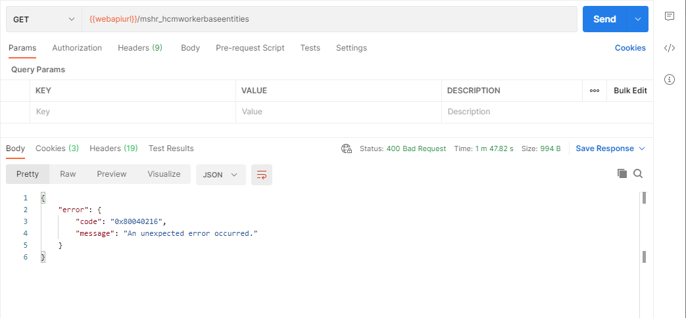
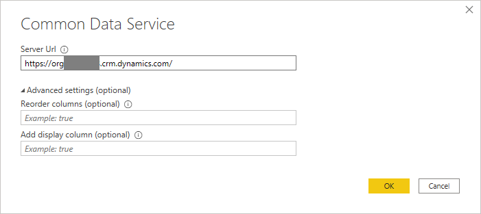
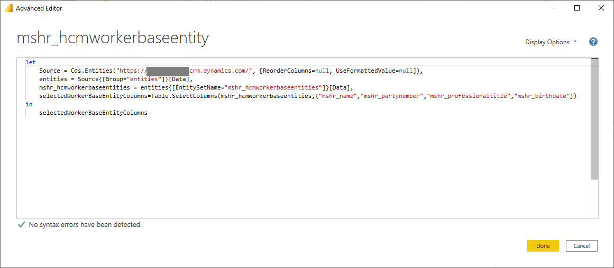

---
# required metadata

title: Optimize Dataverse virtual table queries
description: Optimize and troubleshoot performance of Dataverse virtual table queries
author: twheeloc
ms.date: 04/02/2021
ms.topic: article
# optional metadata

ms.search.form: 
# ROBOTS: 
audience: Application User
# ms.devlang: 

# ms.tgt_pltfrm: 
ms.assetid: 
ms.search.region: Global
# ms.search.industry: 
ms.author: twheeloc
ms.search.validFrom: 2021-04-02
ms.dyn365.ops.version: Human Resources

---

# Optimize Dataverse virtual table queries


[!include [Applies to Human Resources](../includes/applies-to-hr.md)]


## Issue

### Overview

When using Dataverse virtual tables to develop integrations and other data connections with Dynamics 365 Human Resources, you can experience performance issues with queries against the virtual tables. The slow query execution can occur across various clients or interfaces. For example, you may experience the issue in the following circumstances:

- When querying a virtual table through the Dataverse Web API
- When creating a Power App against a virtual table
- When building a Power BI report on a virtual table

All these interfaces have the potential to surface the performance issue.

One cause of slow performance with Dataverse virtual tables for Human Resources is the foreign key columns of the virtual table related to the table's [navigation properties](/powerapps/developer/data-platform/webapi/web-api-types-operations#navigation-properties). When navigation properties are created for a virtual table, a foreign key column is automatically added to the table to represent the value of the key for the related virtual table's key column. For example, the **_mshr_fk_person_id_value** column is added to the **mshr_hcmworkerbaseentity** entity with the foreign key property from the **mshr_dirpersonentity** entity. Because of how the values for these foreign key columns are maintained in a table, fetching the values can have a negative impact on the performance of a query against the virtual table.

### Potential symptoms

An example where you may see this impact is in queries against the Worker (**mshr_hcmworkerentity**) or Base worker (**mshr_hcmworkerbaseentity**) entity. You may see the performance issue manifest itself in a few different ways:

- **Slow query execution**: The query against the virtual table may return the expected results, but take longer than expected to complete execution of the query.
- **Query timeout**: The query may time out and return the following error: "A token was obtained to call finance and operations, but finance and operations returned an error of type InternalServerError."
- **Unexpected error**: The query may return an error type 400 with the following message: "An unexpected error occurred."

  

- **Throttling**: The query may overuse server resources, and become subject to throttling. In this case, the query returns the following error: "A token was obtained to call finance and operations, but finance and operations returned an error of type 429." For more information in throttling in Human Resources, see [Throttling FAQ](./hr-admin-integration-throttling-faq.md).

  

## Resolution

### Limit the number of columns included in your data query

With virtual tables, one of the methods with the greatest potential to improve query performance is to limit the number of columns selected in the query. The general guidance for optimizing query performance is to limit the columns returned in your query to only those properties that you need. This is particularly true with the foreign key columns on virtual tables. If you don't need the values in the foreign key columns for your integration or report, then structure the query to select only the columns you need, excluding the foreign key columns.

#### Selecting columns in an OData query

When querying a virtual table through the Dataverse Web API, you can limit the number of columns included in the query by using the **$select** system query option, and define the columns for which you need results returned. To maximize performance, exclude foreign key columns (those with the **_mshr_FK_** prefix) from the query.

For example, the following query against the **mshr_hcmworkerbaseentity** entity will include only the columns included in the **$select** query option clause, excluding foreign key values. This provides significant improvements in performance over a query that includes all table columns.

```http
GET [Organization URI]/api/data/v9.1/mshr_hcmworkerbaseentities?$select=mshr_name, mshr_firstname, mshr_gender, mshr_partynumber, mshr_phoneticfirstname, mshr_deceaseddate, mshr_nationalitycountryregion, mshr_allowrehire, mshr_electroniclocationid, mshr_middlename, mshr_knownas, mshr_professionaltitle, mshr_nativelanguageid, mshr_disabledverificationdate, mshr_personalsuffix, mshr_lastnameprefix, mshr_personbirthcity, mshr_personaltitle, mshr_phoneticlastname, mshr_namesequencedisplayas, mshr_personbirthcountryregion, mshr_isdisabled, mshr_birthdate, mshr_professionalsuffix, mshr_isfulltimestudent, mshr_education, mshr_namealias, mshr_phoneticmiddlename, mshr_personnelnumber, mshr_hcmworkerbaseentityid, mshr_motherbirthcountryregion, mshr_fatherbirthcountryregion, mshr_lastname, mshr_languageid, mshr_partytype, mshr_ethnicoriginid, mshr_citizenshipcountryregion HTTP/1.1
Accept: application/json
OData-MaxVersion: 4.0
OData-Version: 4.0
```

The recommendation to limit the number of columns selected also applies when using the **$expand** query option to expand the query to related virtual tables through navigation properties. For example, the following query includes columns from the **mshr_hcmworkerbaseentity** entity with expanded columns from the **mshr_dirpersonentity** entity. Note that the **$select** query option is also included in the **$expand** query option clause.

```http
GET [Organization URI]/api/data/v9.1/mshr_hcmworkerbaseentities?$select=mshr_name, mshr_firstname, mshr_gender, mshr_partynumber, mshr_phoneticfirstname, mshr_deceaseddate, mshr_nationalitycountryregion, mshr_allowrehire, mshr_electroniclocationid, mshr_middlename, mshr_knownas&$expand=mshr_FK_Person_id($select=mshr_addressstreet, mshr_addresscity, mshr_addressstate, mshr_addresszipcode) HTTP/1.1
Accept: application/json
OData-MaxVersion: 4.0
OData-Version: 4.0
```

When using this method of retrieving data with the **$select** query option in the **$expand** query option clause, you will typically see greater performance improvements when the navigation property between the entities is a many-to-one relationship. You may not see the same decrease in query execution time when expanding a one-to-many relationship. For more information on relationship definition for Dataverse virtual tables, see [Table relationships](/powerapps/maker/data-platform/create-edit-entity-relationships).

For more information on using the **$select** and **$expand** system query options in the Dataverse Web API, see [Retrieve related entity records with a query](/powerapps/developer/data-platform/webapi/retrieve-related-entities-query).

#### Selecting columns in Power BI

If you experience any of the aforementioned indications of slow performance when building a Power BI report against a Dataverse virtual table, you can improve the performance by excluding foreign key columns from the columns selected from the table for the report. For example, if you are using Power BI Desktop to create a report against the **mshr_hcmworkerbaseentity** entity, you can use the following steps to select the columns you want included in the report query.

1. In Power BI Desktop, select **More...** from the **Get data** drop-down list on the action ribbon.
2. In the **Get Data** window, enter **Common Data Service** in the search box, select the **Common Data Service** connector, and select **Connect**.
3. In the **Server Url** field of the Common Data Service window, enter the organization URI for your Dataverse environment, and select **OK**.
  
   
  
4. In the Navigator window, expand the **Entities** node.
5. In the search box, enter **mshr_hcmworkerbaseentity**, and select the entity.
6. Select **Transform Data**.
7. In the Power Query Editor window, select **Advanced Editor**.
8. In the **Advanced Editor** window, update the query to look like the below, adding or removing any columns to the array as needed.

   ```
   let
     Source = Cds.Entities("[Your Organization URI]", [ReorderColumns=null, UseFormattedValue=null]),
     entities = Source{[Group="entities"]}[Data],
     mshr_hcmworkerbaseentities = entities{[EntitySetName="mshr_hcmworkerbaseentities"]}[Data],
     selectedWorkerBaseEntityColumns=Table.SelectColumns(mshr_hcmworkerbaseentities,{"mshr_name","mshr_partynumber", "mshr_professionaltitle","mshr_birthdate"})
   in
     selectedWorkerBaseEntityColumns
   ```
   

9. Select **Done**.

   > [!NOTE]
   > If you previously received an error of type 429 from the query prior to updating, you may need to wait for the retry period prior to refreshing the query for it to complete successully.

10. Click **Close & Apply** on the Power Query Editor action ribbon.

You're then able to begin building your Power BI report against the columns selected from the virtual table.

#### Selecting columns in Power Apps

Similar to Dataverse Web API queries and Power BI, you can improve query performance for Power Apps based on Dataverse virtual tables by excluding columns of related tables from your app. If any columns from a related table have been included on a page, then the request URL constructed to fetch the data will include foreign key properties of the related table. This, as in the examples of [Selecting columns in an OData Query](#selecting-columns-in-power-apps) above, reduces performance by causing additional data lookups.

To work around this, you can validate that no data fields from related tables have been included on any data form of your Power App.

1. In the Tree view pane, select the data form for the screen.
2. In the **Properties** pane, select **Edit** on the **Fields** property.
3. In the **Data** pane, verify that none of the selected fields are fields of the virtual table of the data source.

For example, if one of the data fields included on a page in the app references another table, such as **ThisItem.Worker.Name**, where **Worker** is the related table, there is a potential for reduced performance in fetching the data.

You can use the [Power Apps Monitor](/powerapps/maker/monitor-overview) to ensure that only the columns you need are being included in the query to get the data for the Power App. You can view the URL constructed for the getRows operation to ensure the columns you have selected for your app will be optimal for retrieving the data.


### Filtering the data query

Another method for improving query execution performance is to limit the number of records returned in the query results. You can do this by filtering the results to ensure that you are only receiving the records you need.

See [Filter results](/powerapps/developer/data-platform/webapi/query-data-web-api#filter-results) for more information on filtering query data.

### Limiting the page size of the query

If you're working with large data sets, you can divide query results into multiple pages by adding the `odata.maxpagesize` preference header to data queries.

For more information on paging, see [Specify the number of entities to return in a page](/powerapps/developer/data-platform/webapi/query-data-web-api#specify-the-number-of-entities-to-return-in-a-page).

## See also

- [Configure Dataverse virtual tables](hr-admin-integration-common-data-service-virtual-entities.md)
- [Human Resources virtual tables FAQ](dev-itpro/hr-admin-virtual-entity-faq.md)
- [Throttling FAQ](./hr-admin-integration-throttling-faq.md)

[!INCLUDE[footer-include](../includes/footer-banner.md)]

