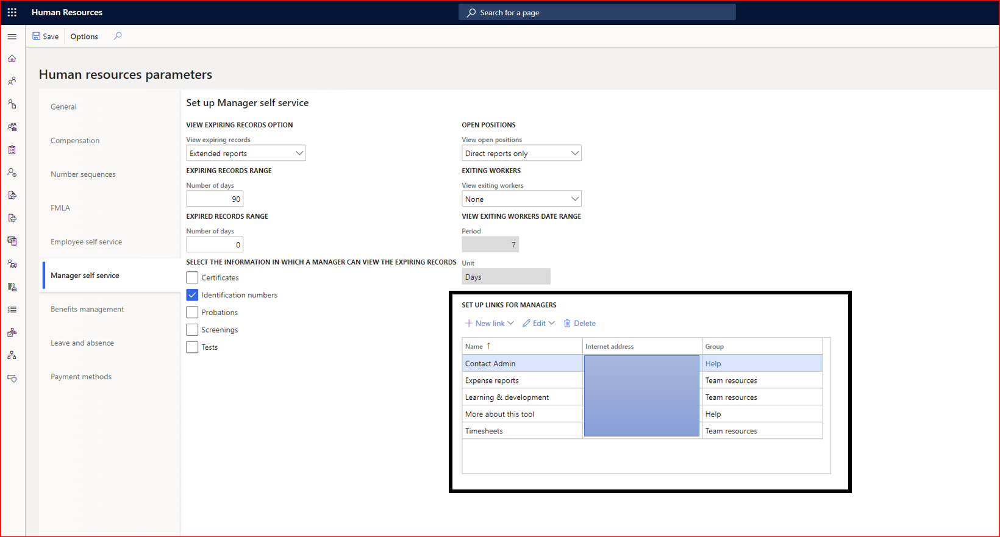
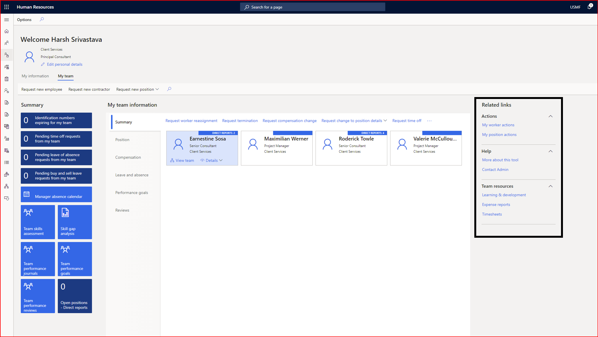

---
# required metadata

title: Create custom links in Manager self service
description: This article describes how to create custom links in Manager self service in Dynamics 365 Human Resources.
author: twheeloc
ms.date: 08/26/2021
ms.topic: article
ms.prod: 
ms.technology: 

# optional metadata

ms.search.form: HRMParameters, EssWorkspace
# ROBOTS: 
audience: Application User
# ms.devlang: 

# ms.tgt_pltfrm: 
ms.assetid: 2cfb061a-a616-4bf9-9d98-9cde00039eec
ms.search.region: Global
# ms.search.industry: 
ms.author: twheeloc
ms.search.validFrom: 2020-10-21
ms.dyn365.ops.version: Human Resources

---

# Create custom links in Manager self service

[!INCLUDE [PEAP](../includes/peap-2.md)]

[!include [Applies to Human Resources](../includes/applies-to-hr.md)]

You can add custom links on the **My team** tab in **Manager self service**. This feature lets you provide quick access to important information. It's similar to adding custom links in the **My information** tab in **Employee self service**.

## Enable the feature

To use this feature, enable **Custom links in Manager self service** in the **Feature management** workspace. For more information about enabling preview features, see [Manage features](hr-admin-manage-features.md).

## Set up custom links

1. In **Human Resources parameters**, select **Manager self service**.

2. Under **Set up links for Managers**, you can add, edit, or remove a link. You can also group the links together so they display in a group in **Manager self service**.

   

3. To see the links, go to the **My team** tab in **Employee self service**.

   

## See also

[Employee and Manager self service overview](hr-employee-manager-self-service-overview.md)

[!INCLUDE[footer-include](../includes/footer-banner.md)]
