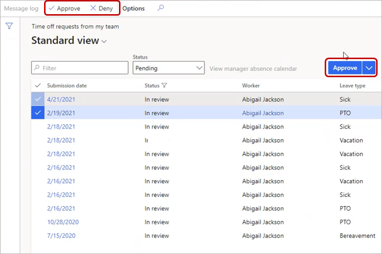

---
# required metadata

title: Manage leave and absence requests
description: View and approve leave and absence requests in Dynamics 365 Human Resources.
author: twheeloc
ms.date: 06/24/2024
ms.topic: article
# optional metadata

ms.search.form: EssWorkspace
# ROBOTS: 
audience: Application User
# ms.devlang: 

# ms.tgt_pltfrm: 
ms.assetid: 
ms.search.region: Global
# ms.search.industry: 
ms.author: ajitchandran
ms.search.validFrom: 2020-02-03
ms.dyn365.ops.version: Human Resources

---

# Manage leave and absence requests

[!include [Applies to Human Resources](../includes/applies-to-hr.md)]

Manage time off requests from the **Employee self service** workspace in Dynamics 365 Human Resources. Requests might be simple single day requests or multiple day requests that include multiple leave and absence types. If a workflow isn't enabled, the requests are automatically approved. When a workflow is enabled, the approval can be automatic or require sign off, depending on the workflow configuration.

1. In the **Employee self service** workspace, select **My team**.
2. Under **My team information**, select the **Leave and absence** tab.
3. View and approve your team members' time off requests as necessary.

## Leave request workflow experience enhancements

This feature provides the following enhancements:

- You can select multiple leave requests and perform the same action on all of them.
- The ribbon across the top and a new workflow button on the page show the actions you can take on leave requests.

## See also

- [Leave and absence overview](hr-leave-and-absence-overview.md)
- [Create a leave and absence plan](hr-leave-and-absence-plans.md)

[!INCLUDE[footer-include](../includes/footer-banner.md)]
