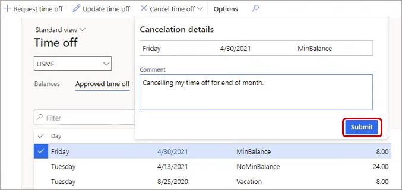

---
# required metadata

title: Request time off
description: Request time off in Dynamics 365 Human Resources.
author: twheeloc
ms.date: 11/03/2021
ms.topic: article
ms.prod: 
ms.technology: 

# optional metadata

ms.search.form: EssWorkspace
# ROBOTS: 
audience: Application User
# ms.devlang: 
ms.search.scope: Human Resources
# ms.tgt_pltfrm: 
ms.custom: 7521
ms.assetid: 
ms.search.region: Global
# ms.search.industry: 
ms.author: twheeloc
ms.search.validFrom: 2020-02-03
ms.dyn365.ops.version: Human Resources

---

# Request time off

>[!Important]
>The functionality noted in this topic is currently available for customers on the stand-alone Dynamics 365 Human Resources. Some or all of the functionality will be available as part of a future release on the Finance infrastructure after Finance release 10.0.26.

[!include [Applies to Human Resources](../includes/applies-to-hr.md)]

You can submit requests for time off, view your vacation and leave balances, and see the status of your leave requests in Dynamics 365 Human Resources.

## Request time off

1. In the **Employee self service** workspace, select **Request time off** in the **Time Off Balances** tile.

2. Enter information for **Leave type**, **Reason code**, **Start date**, and **End date**.

3. Under **Dates**, select the dates for your leave request.

4. If you need to submit any supporting documentation, select **Upload** under **Attachments**.

5. Enter information in **Comment**, if needed.

6. Select **Submit** when you're ready to submit your request. Otherwise, select **Save draft**.

Employees who submit a new leave request can select different leave types to construct their leave request. However, all leave types that are selected as part of a single leave request should have the same leave unit. Employees can view the leave unit for each leave type on the **Request time off** page.

## Add an attachment to an existing request

When updating an existing time off request, you can add an attachment. You can also see all the related requests for a specific date.

## View leave balances

1. In the **Employee self service** workspace, select **More** (...) in the **Time Off Balances** tile.

2. Select **Balances**.

## View leave request status

1. In the **Employee self service** workspace, select **More** (...) in the **Time Off Balances** tile.

2. To view your approved time off requests, select **Approved time off**. To view your pending time off requests, select **Time off requests**.

## Cancel time off requests

1. In the **Employee self service** workspace, select **View time off** in the **Time Off Balances** tile.

2. On the **Time off** page, select one or more time off requests to cancel.

3. Select the **Cancel** button.

4. In the **Cancellation details** pane, enter a comment and then select **Submit**.

   

## See also

- [Leave and absence overview](hr-leave-and-absence-overview.md)

[!INCLUDE[footer-include](../includes/footer-banner.md)]
