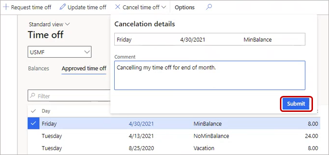

---
# required metadata

title: Request time off
description: Request time off in Dynamics 365 Human Resources.
author: twheeloc
ms.date: 08/06/2026
ms.topic: how-to
# optional metadata

ms.search.form: EssWorkspace
# ROBOTS: 
audience: Application User
# ms.devlang: 

# ms.tgt_pltfrm: 
ms.assetid: 
ms.search.region: Global
# ms.search.industry: 
ms.author: ajitchandran
ms.search.validFrom: 2020-02-03
ms.dyn365.ops.version: Human Resources

---

# Request time off

[!include [Applies to Human Resources](../includes/applies-to-hr.md)]

In Dynamics 365 Human Resources, you can submit requests for time off, view your vacation and leave balances, and see the status of your leave requests.

## Request time off

1. In the **Employee self service** workspace, select **Request time off** in the **Time off balances** tile.
1. Enter information for **Leave type**, **Reason code**, **Start date**, and **End date**.
1. Under **Dates**, select the dates for your leave request.
1. If you need to submit any supporting documentation, select **Upload** under **Attachments**.
1. Enter information in **Comment**, if needed.
1. Select **Submit** when you're ready to submit your request. Otherwise, select **Save draft**.

When you submit a new leave request, you can select different leave types to construct your leave request. However, all leave types that you select as part of a single leave request should have the same leave unit. You can view the leave unit for each leave type on the **Request time off** page.

## Add an attachment to an existing request

When updating an existing time off request, you can add an attachment. You can also see all the related requests for a specific date.

## View leave balances

1. In the **Employee self service** workspace, select **More** (...) in the **Time Off Balances** tile.
1. Select **Balances**.

## View leave request status

1. In the **Employee self service** workspace, select **More** (...) in the **Time Off Balances** tile.
1. To view your approved time off requests, select **Approved time off**. To view your pending time off requests, select **Time off requests**.

## Cancel time off requests

>[!NOTE]
> The **Cancel time off** option is available when the feature **Leave request workflow experience enhancements** is enabled in the **Feature management** workspace.  

1. In the **Employee self service** workspace, select **View time off** in the **Time Off Balances** tile.
1. On the **Time off** page, select one or more time off requests to cancel.
1. Select the **Cancel time off** button.
1. In the **Cancellation details** pane, enter a comment and then select **Submit**.

   

1. You can't mandate attachments for cancellation of a time off leave request.

>[!Note]
>If you mandate an attachment for updating a time off leave request and select **Update time off** to cancel a leave, when the **Amount** is 0, you must upload an attachment. If attachments aren't required, use the **Cancel time off** option.

## See also

- [Leave and absence overview](hr-leave-and-absence-overview.md)

[!INCLUDE[footer-include](../includes/footer-banner.md)]
