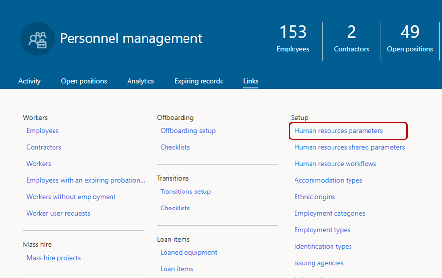

---
# required metadata

title: Restrict editing contact details
description: Restrict employees from editing contact details in Dynamics 365 Human Resources.
author: andreabichsel
manager: tfehr
ms.date: 03/03/2020
ms.topic: article
ms.prod: 
ms.service: dynamics-human-resources
ms.technology: 

# optional metadata

ms.search.form: EssWorkspace
# ROBOTS: 
audience: Application User
# ms.devlang: 
ms.reviewer: anbichse
ms.search.scope: Human Resources
# ms.tgt_pltfrm: 
ms.custom: 7521
ms.assetid: 
ms.search.region: Global
# ms.search.industry: 
ms.author: anbichse
ms.search.validFrom: 2020-03-03
ms.dyn365.ops.version: Human Resources
---

# Restrict editing contact details

[!include [applies to](../includes/applies-to-hr.md)]
[!include [preview feature](./includes/preview-feature.md)]

This topic describes how to restrict employees from editing contact details in Dynamics 365 Human Resources. You might want to prevent employees from editing contact details, such as their business location or email address.

> [!NOTE]
> To use this feature, you must first enable **(Preview) Restrict employees from adding or editing address and contact information for select purposes** in Feature management. For more information about enabling preview features, see [Manage features](../hr-admin-manage-features.md).  

## Choose the information an employee can add or edit

1. In Human Resources, select **Personnel management**, select **Links**, and then select **Human resources parameters**.
   

2. On the **Human resources parameters** page, select the **Employee self service** tab.
   

3. On the **Employee self service** tab, uncheck all information in the **Address and contact information** section that you don't want employees to add or edit. In this example, we've unchecked **Business** contact information.
   

4. Select **Save**.
   

## Employee experience

When you restrict 

## See also