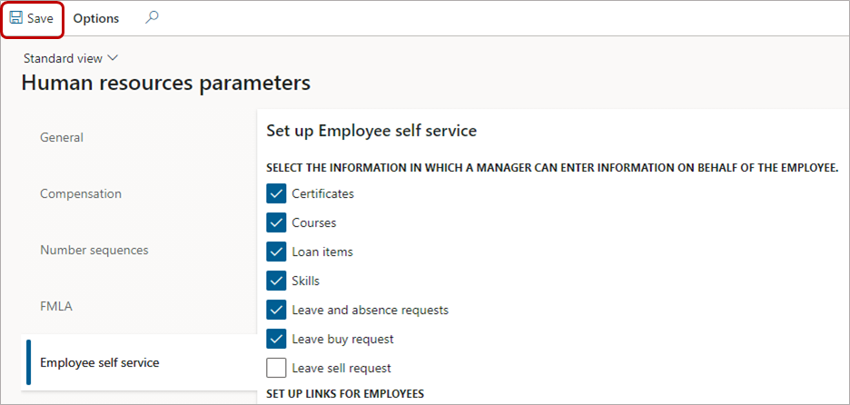

---
# required metadata

title: Restrict editing of personal information
description: Restrict employees from editing contact details in Dynamics 365 Human Resources.
author: twheeloc
ms.date: 08/26/2021
ms.topic: article
# optional metadata

ms.search.form: EssWorkspace
# ROBOTS: 
audience: Application User
# ms.devlang: 

# ms.tgt_pltfrm: 
ms.assetid: 
ms.search.region: Global
# ms.search.industry: 
ms.author: twheeloc
ms.search.validFrom: 2020-03-03
ms.dyn365.ops.version: Human Resources
---

# Restrict editing of personal information

[!include [applies to](../includes/applies-to-hr.md)]
[!include [preview feature](./includes/preview-feature.md)]

This article describes how to restrict employees from editing contact details in Dynamics 365 Human Resources. You might want to prevent employees from editing certain contact details, such as their business location or email address.

> [!NOTE]
> To use this feature, you must first enable **(Preview) Restrict employees from adding or editing address and contact information for select purposes** in Feature management. For more information about enabling preview features, see [Manage features](hr-admin-manage-features.md).  

## Choose the information an employee can add or edit

1. In Human Resources, select **Personnel management**, select **Links**, and then select **Human resources parameters**.

   

2. On the **Human resources parameters** page, select the **Employee self service** tab.

   

3. On the **Employee self service** tab, uncheck all information in the **Address and contact information** section that you don't want employees to add or edit. In this example, we've unchecked **Business** contact information.

   

4. Select **Save**.

   

## Employee experience

After you've restricted employees from adding or editing contact details, they can see the information, but can't change it.

In this example, where employees are restricted from editing **Business** contact details, they can still see the information in **Employee self service**:

However, when they select the business contact details, the **Edit address** pane appears as read-only, and they can't change any of the fields.

In addition, if they select **Add** to add a new address, they can't select **Business** from the **Purpose** dropdown box.

Employees get the same experience when they select **Contact details** on the **Personal information** page and add a new address. The **Purpose** dropdown box only displays the types of information they can add. 

**Contact details** now shows **Purpose** in the grid.

## See also

[Employee and Manager self service overview](hr-employee-manager-self-service-overview.md) 
[Configure Human resources parameters](hr-setup-parameters.md) 
[Edit personal information](hr-employee-manager-self-service-edit-personal-information.md)
