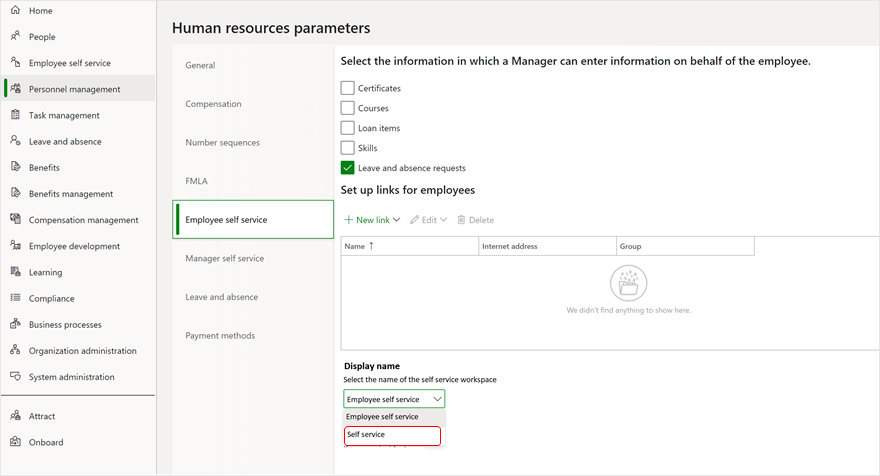

---
# required metadata

title: Change Employee self service workspace name
description: This topic describes how to change the display name of the Employee self-service workspace in Dynamics 365 Human Resources.
author: andreabichsel
manager: AnnBe
ms.date: 07/09/2020
ms.topic: article
ms.prod: 
ms.service: dynamics-human-resources
ms.technology: 

# optional metadata

ms.search.form: EssWorkspace
# ROBOTS: 
audience: Application User
# ms.devlang: 
ms.reviewer: anbichse
ms.search.scope: Human Resources
# ms.tgt_pltfrm: 
ms.custom: 7521
ms.assetid: 
ms.search.region: Global
# ms.search.industry: 
ms.author: anbichse
ms.search.validFrom: 2020-07-09
ms.dyn365.ops.version: Human Resources

---

# Change Employee self service workspace name

If you have volunteers or other non-employees, you might want to change the name of the **Employee self-service** workspace. You can change this workspace to **Self service** instead.

> [!NOTE]
> Changing the name of the **Employee self-service** workspace also changes the menu item that is used internally by Dynamics 365 Human Resources. If you previously applied security customizations to the **HcmEmployeeSelfServiceWorkspace** menu item, we recommend applying the same changes to **HcmSelfServiceWorkspace** to maintain parity.

1. In Human Resources, select **Personnel management**, select **Links**, and then select **Human resources parameters**.

2. Select the **Employee self-service** tab.

3. Under **Display name**, select **Self service**.

   

4. Select **Save**.

## Additional resources

- [Employee and Manager self-service overview](hr-employee-manager-self-service-overview.md)
