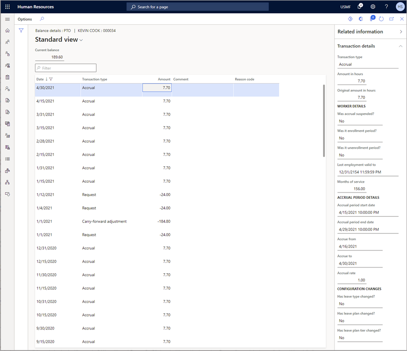

---
# required metadata

title: Accrue leave and absence plans
description: You can accrue leave and absence in Dynamics 365 Human Resources for multiple employees or for an individual.
author: twheeloc
ms.date: 06/24/2024
ms.topic: article
# optional metadata

ms.search.form: LeavePlanFormPart, LeaveAbsenceWorkspace
# ROBOTS: 
audience: Application User
# ms.devlang: 
ms.reviewer: twheeloc

# ms.tgt_pltfrm: 
ms.assetid: 
ms.search.region: Global
# ms.search.industry: 
ms.author: ajitchandran
ms.search.validFrom: 2020-02-03
ms.dyn365.ops.version: Human Resources

---

# Accrue leave and absence plans

[!include [Applies to Human Resources](../includes/applies-to-hr.md)]

You can accrue leave and absence in Dynamics 365 Human Resources for multiple employees or for an individual.

## Accrue leave and absence for multiple employees

1. On the **Leave and absence** page, select the **Links** tab.
2. Under **Manage leave**, select **Accrue leave and absence plans**.
3. The **Accrue leave and absence plans** dialog box appears. In **Accrue as of**, either select **Today's date** or select **Custom date** and enter a custom date.
4. If you want to run accruals for all companies, select **All companies**. If you want to process accruals for a single leave plan, select **No** for **All plans**, and then select a **Leave plan**. If you select all companies, you can't select an individual leave plan.
5. If you want to run the accrual process in the background, select **Run in the background** and do the following tasks:

    1. Enter information for the accrual process.
    2. To set up a recurring job, select **Recurrence**, enter the recurrence information, and then select **OK**.
    3. To set up a job alert, select **Alerts**, select the alerts to receive, and then select **OK**.
    4. Select **OK**. The accrual process will run with the parameters you set. 

## Accrue leave and absence for an employee

1. On the employee's record, select **Leave**.
2. Select **Accrue leave and absence**.
3. The **Accrue leave and absence plans** dialog box appears. In **Accrue as of**, either select **Today's date** or select **Custom date** and enter a custom date.
4. If you want to run accruals for all companies, select **All companies**. If you want to process accruals for a single leave plan, select **No** for **All plans**, and then select a **Leave plan**. If you select all companies, you can't select an individual leave plan.
5. If you want to run the accrual process in the background, select **Run in the background** and do the following tasks:

   1. Enter information for the accrual process.
   2. To set up a recurring job, select **Recurrence**, enter the recurrence information, and the select **OK**.
   3. To set up a job alert, select **Alerts**, select the alerts to receive, and then select **OK**.

   4. Select **OK**. The accrual process will run with the parameters you set.

## Delete leave and absence accruals for multiple employees

Delete accrual records for a specific plan and date range. Accrual dates must be dated today or in the future.

1. On the **Leave and absence** page, select the **Links** tab.
2. Under **Manage leave**, select **Delete leave and absence plan accruals**.
3. In the **Delete leave and absence plan accruals** dialog box, select the **Leave plan**.
4. If applicable, choose **Delete balance adjustments**.
5. Enter or select a **Leave accrual date**. This date has to be either today or in the future.
6. Select **OK**. The accrual process will delete accruals with the parameters you set.

## Delete leave and absence accruals for a single employee

1. On the employee's record, select **Leave**.
2. Select **Delete leave and absence plan accruals**.
3. In the **Delete leave and absence plan accruals** dialog box, select **Leave plan**.
4. If applicable, choose **Delete balance adjustments**.
5. Enter or select a **Leave accrual date**. This date must be either today or in the future.
6. Select **OK**. The accrual process will delete accruals with the parameters you set.

## Review leave accrual and deletion processes

**Leave accrual audit** displays each time you run or delete an accrual for one or all employees. The date and person who performed the action also displays.

1. On the **Leave and absence** page, select the **Links** tab.
2. Under **Manage leave**, select **Delete leave accrual audit**.

## Leave accrual rounding
When an employee is either enrolled or unenrolled, leave accrual rounding will be prorated. Previously, rounding was only allowed when a leave plan was set to prorate, and an employee was enrolled/unenrolled during mid-period. Leave accruals will now round regardless of enrollment/unenrollment at mid-period or at the start of a period.

## Leave accrual transaction auditing

This feature helps leave and absence managers understand the leave and absence accrual transactions related to an employee’s time off balances for a specific leave type.

To view transaction details:

1. On the employee's record, select **Leave**.
2. Select **View time off**, and then select the **Balances** tab.
To view the accrual transactions related to a specific leave type, select the numerical value in the **Current balance** column.

To view the transaction details for a specific accrual amount, select an accrual row, open the **Related information** panel on the right, and then open the **Transaction details** section. The Transaction details section displays:

- Changes to the employee’s leave type balance
- Employment details for that specified accrual period
- Details about the accrual period and rates
- Any changes made to leave plan configurations

## See also

[Leave and absence overview](hr-leave-and-absence-overview.md) 
[Create a leave and absence plan](hr-leave-and-absence-plans.md)

[!INCLUDE[footer-include](../includes/footer-banner.md)]
