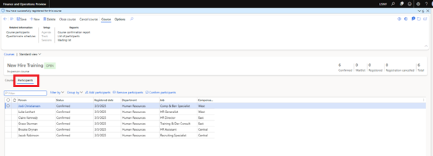
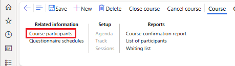
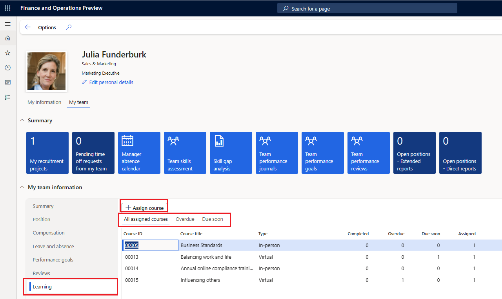

---
# required metadata

title: Manage participants in training courses
description: This article explains how Human resources administrators and managers can use the course features to maintain information about course participants.
author: twheeloc
ms.date: 03/20/2023
ms.topic: article
ms.prod: 
ms.technology: 

# optional metadata

ms.search.form: HcmCourseType, HcmCourseTypeGroup, HRMCourseTable, HcmLearningWorkspace
# ROBOTS: 
audience: Application User
# ms.devlang: 

# ms.tgt_pltfrm: 
ms.custom: 7532
ms.assetid: a6950c29-8b3e-45b2-9084-ddfb1317ffaa
ms.search.region: Global
# ms.search.industry: 
ms.author: twheeloc
ms.search.validFrom: 2016-02-28
ms.dyn365.ops.version: AX 7.0.0, Human Resources

---

# Manage participants in training courses

Course participants are workers who participate in a training course or event. You can register participants only for open courses. The minimum number and maximum number of participants that can register for a course are defined on the **General** FastTab of the **Courses** page.

There are two ways to manage participants:

- **Option 1:** This option works well for mass assignment of more than one participant at a time.

    1. On the **Course details** page, on the **Participants** tab, find and select participants. You can use the **Filter by** or **Group by** functionality to easily find participants.
    1. After you've selected the participants, select **Assign participants**.

    

    On the **Participants** tab, you can perform the following tasks:

    - Add participants.
    - Remove participants.
    - Confirm participants (in-person courses only).
    - Add or change the due date (virtual courses only).
    - Change the status (virtual courses only).

- **Option 2:** This option is used to assign one participant at a time. (For mass assignment, use option 1.) 

    1. On the Action Pane, on the **Course** tab, in the **Related information** group, select **Course participants**.
    2. Select a course participant, and then select **New** to add a participant.

    

## Manager self service

Managers can use the **Learning** tab to manage learning for direct reports and extended reports.

To view the **Learning** tab in **Manager self service**, open the **Human resources parameters** page, and then, on the **Learning** tab, in the **View direct reports** assigned course, select **Direct reports only** or **Extended reports**. (If you select **Extended reports**, direct reports are included.)

This feature gives managers visibility into learning, including all courses that are assigned, overdue, and due soon. Manager can assign courses by selecting **Assign courses**. This information can help managers track courses for direct reports (or extended reports), and progress through them, to ensure that workers stay on track and complete assigned courses in a timely manner.

