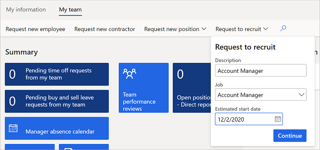
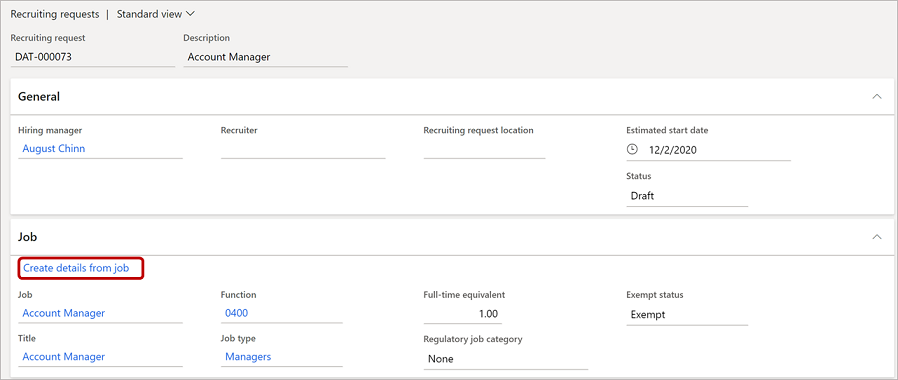
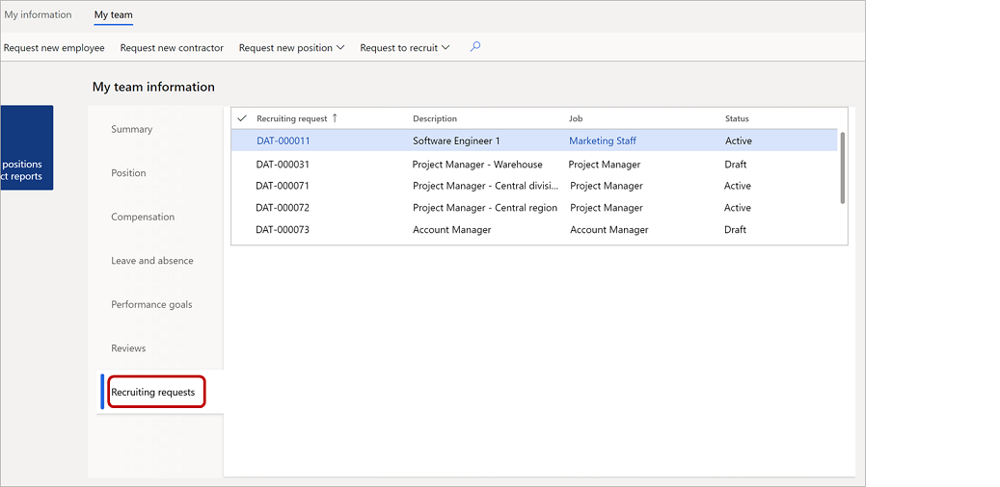
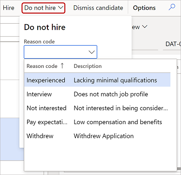

---
# required metadata

title: Recruit job candidates
description: This article describes how to recruit candidates in Dynamics 365 Human Resources.
author: twheeloc
ms.date: 10/28/2021
ms.topic: article
# optional metadata

ms.search.form: 
# ROBOTS: 
audience: Application User
# ms.devlang: 

# ms.tgt_pltfrm: 
ms.assetid: 
ms.search.region: Global
# ms.search.industry: 
ms.author: twheeloc
ms.search.validFrom: 2020-12-03
ms.dyn365.ops.version: Human Resources

---

# Recruit job candidates

[!include [Applies to Human Resources](../includes/applies-to-hr.md)]

Dynamics 365 Human Resources helps you to manage recruiting requests. It also helps you seamlessly transition job candidates to employees. If your organization uses a separate recruiting application, your recruiting process might include the following steps:<!--note from editor: Should this be a numbered list? These steps do seem to follow a particular order.-->

- Enter your recruiting request in Human Resources.
- Receive candidate referrals in Human Resources from the recruiting application.
- Complete the candidate approval process in Human Resources.

If you aren't using a separate recruiting application, you can also manually manage candidates in Human Resources.

> [!NOTE]
> If you're an admin or developer and want to integrate Human Resources with a third-party recruiting application, go to [Configure Dataverse integration](hr-admin-integration-common-data-service.md) and [Configure Dataverse virtual tables](hr-admin-integration-common-data-service-virtual-entities.md)
>
> You can also find recruiting integration apps on [AppSource](https://appsource.microsoft.com/marketplace/apps?search=recruiting%20dynamics).
>
## Enable recruiting requests on the merged infrastructure

If you want to submit recruiting requests in HR recruitment, you must first enable the **HR user experience** and **Recruiting process management** features.

Once the features are turned on, select the functionality with the following steps: 
1. Go to **Human resources** > **Setup** > **Human resources parameters**.
2. On the **Recruitment** tab, set the **Recruitment enabled** field to **Yes**.
3. In the **Recruitment experience** dropdown, select **HR recruitment**.  
4. Click **Save**. 

> [!Note] 
> Once **HR recruitment** is selected, **Recruitment projects** (legacy) will not be available. 

## Add a recruiting request location

If your organization has multiple locations, you can add them so requestors can select a location where the new recruit will be working. The location will be included in the job posting.

1. In the search bar, enter **Recruiting request location**.
2. Select **New**.
3. In the **Recruiting request location** field, enter the location name.

    

4. For **Description**, enter a description for the location.
5. Under **Location**, select **Add**. If the **New address** dialog appears, enter the address for the location.<!--note from editor: Please make the address in this image less plausible. Via the fictitious guidelines on CELAweb: For street addresses, you should use sequential numbers, common street names, and incorrect zip codes (e.g., 4567 Main St Buffalo, NY 98052). (See https://microsoft.sharepoint.com/sites/CELAWeb-Copyrights-Trademarks-And-Patents/SitePages/trademarks-fictitious-names.aspx)-->

    

6. Under **Contact information**, enter the information for the location's contact.
7. Select **Save**.

## Add a recruiting request

Managers can submit recruiting requests in Human Resources. If you use a separate recruiting application, completing these steps will send a recruiting request and start the recruiting process in that application. Otherwise, complete this procedure to begin the workflow for your own internal recruiting process.

1. Select **Employee self service**.
2. Select the **My team** tab.
3. Select **Request to recruit**.

    

4. Complete the **Description**, **Job**, and **Estimated start date** fields.

    

5. Select **Continue**. The recruiting request for your position appears.
6. Under **General**, select a recruiter from the **Recruiter** dropdown list, and then select a location from the **Recruiting request location** dropdown list.
7. Under **Job**, change any information as needed, and then select **Create details from job**.

    

    The rest of the recruiting request will be populated with the default information for the job you entered.

8. Under **External description**, enter an external-facing job description.
9. Under **Positions**, select **Add**, and then select a position for this recruiting request.<!--note from editor: In all of these images, are they approved fictitious names, or do they come from sample data included with the app?-->

    

10. Under **Skills**, select **Add**, and then select a skill.
11. Under **Educational requirements**, select **Add**, and then select values from the **Education** and **Level of education** dropdown menus.

    

12. Under **Comment**, add comments as necessary.
13. Under **Compensation**, select a level from the **Level** dropdown list, and then adjust **Low threshold**, **Control point**, and **High threshold** as necessary.
14. When your recruiting request is complete and you're ready to start the recruiting process, select **Activate** in the menu bar.

    

15. Select **Save**.

## View and edit your recruiting requests

If you're a manager and want to view your own requests:

1. Select **Employee self service**.
2. Select the **My team** tab.
3. Under **My team information**, select the **Recruiting requests** tab.

    

4. To view or edit a recruiting request, select it in the grid.

If you're an HR pro and want to view all recruiting requests:

1. Select **Personnel management**.
2. Select **Recruiting requests**.

    

3. To view or edit a recruiting request, select it in the grid.

## Add or edit a candidate profile

If your organization has integrated with another application to manage recruiting requests, recruiting requests are forwarded to that application. The recruiting application then sends candidate information back to Human Resources. Otherwise, you can follow your own internal recruiting processes and enter candidate information manually.

1. Select **Personnel management**.
2. Select **Links**.
3. Under **Recruiting**, select **Candidates**.

    

4. To add a candidate, select **New**. To edit an existing candidate, select the candidate from the list and then select **Edit**. The candidate profile appears.
5. Under **Candidate summary**, enter or edit the candidate information as necessary.
6. Under **Recruiting request**, select a recruiting request to link the candidate to. Then complete the **Estimated start date**, **Hiring manager**, **Position**, and **Description** fields, as appropriate.

    

7. Complete all the information in the following areas that you want to include in the candidate's record:

    - **Comments**
    - **Professional experience**
    - **Contact information**
    - **Education**
    - **Skills**
    - **Certificates**
    - **Screenings**

8. Select **Save**.

## Hire a candidate

When you're ready to hire a candidate, follow this procedure to transition the candidate to an employee.

1. On the **Candidate** page, select **Hire**.

    

2. On the **Hire new worker** page, under **Details**, complete all the fields.

    

3. Under **Position details**, verify and change information as necessary.
4. Under **Onboarding checklists**, select the relevant onboarding checklists for this employee.
5. Select **Continue** to create the employee record.

    > [!NOTE]
    > Depending on your organization's workflows, the candidate record might go through additional approval steps before becoming an employee record.

## Decide not to hire a candidate

If you decide not to hire a candidate, follow this procedure to remove them from the vetting process. 

1. On the **Candidate** page, select **Do not hire**.

    

2. Select a **Reason code** and include any comments.
3. Select **OK**.

## Dismiss a candidate

If needed, you can dismiss a candidate after hiring them. For example, a candidate might reject your offer or not show up on their first day.

- On the **Candidate** page, select **Dismiss candidate**.

    

## See also

[Configure Dataverse virtual tables](hr-admin-integration-common-data-service-virtual-entities.md) 
[Organize your workforce](hr-personnel-departments-jobs-positions.md) 
[Set up the components of a job](hr-personnel-jobs.md)

[!INCLUDE[footer-include](../includes/footer-banner.md)]
