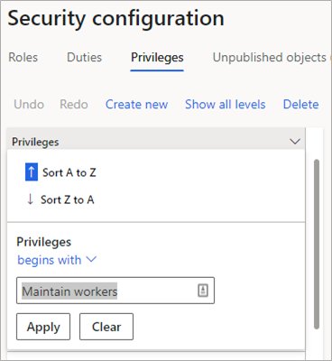

--- 
# required metadata 
 
title: Workers without employment
description: Workers with no future, active, or historical employment with your organization appear in the Workers without employment form. 
author: andreabichsel
ms.date: 04/06/2021
ms.topic: 
ms.prod:  
ms.technology:  
 
# optional metadata 
 
ms.search.form: HcmWorkerV2, HRMMassHireProject, HRMMassHireLine, HcmPersonnelManagementWorkspace
audience: Application User 
# ms.devlang:  
ms.reviewer: anbichse
ms.search.scope: Human Resources
# ms.tgt_pltfrm:  
# ms.custom:  
ms.search.region: Global
# ms.search.industry: 
ms.author: anbichse
ms.search.validFrom: 2021-04-06
ms.dyn365.ops.version: Version 7.0.0 
---

# Workers without employment

[!include [Applies to Human Resources](../includes/applies-to-hr.md)]

Workers with no future, active, or historical employment with your organization appear in the **Workers without employment** form. Workers with this status can appear when you import workers without an employment record, or when you delete a worker's employment via **Workers > Employment history**.

By default, the **Workers without employment** form is available to the following roles:

- Human Resources Assistant
- Human Resources Manager
- Recruiter
- Comp and Benefits Manager
- Payroll Administrator
- Payroll Manager
- Training Manager

In the **Workers without employment** list, you can delete the individuals listed. By default, this privilege is given to the Human Resources Assistant role. You can give this privilege to other roles with the following steps:

1. Select **System administration** tile, and then select **Security configuration**.

2. In the **Privileges** tab, filter the **Privileges** list to **Maintain workers**.

   

3. In the **References** column, select **Display menu items**.

4. In **Display menu items**, select **HcmWorkersWithoutEmployment**.

   

5. Set the **Delete** permission to **Grant**.

6. Select the **Unpublished objects** tab.

7. Select **Publish all**.

   

[!INCLUDE[footer-include](../includes/footer-banner.md)]