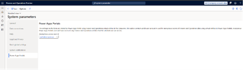

---
# required metadata

title: Set up the careers site in the HR Recruiting app 
description: This article explains how to set up the careers site in the HR Recruiting app in Microsoft Dynamics 365 Human Resources.
author: twheeloc
ms.date: 12/02/2025
ms.topic: how-to
# optional metadata

ms.search.form: 
# ROBOTS: 
audience: Application User
# ms.devlang: 

# ms.tgt_pltfrm: 
ms.assetid: 
ms.search.region: Global
# ms.search.industry: 
ms.author: twheeloc
ms.search.validFrom: 2020-12-03
ms.dyn365.ops.version: Human Resources

---

# Set up the careers site in the HR Recruiting app 

This article explains how to install and configure the careers site in the HR Recruiting app in Microsoft Dynamics 365 Human Resources. You can change many aspects of your careers site, such as the background, introduction, images, privacy policy, and site name.

## Install 
>[!NOTE]
>The Dynamics 365 Human Resources recruiting add-on app must be installed in Dataverse. 

To install the Dynamics 365 Human Resources careers, follow these steps:
1. Go to the [Power Platform admin center](https://admin.powerplatform.microsoft.com/).
2. Sign-in as administrator.
3. Select your environment.
4. Go to Dynamics 365 apps
5. Click **Install app**.
6. Search and install Dynamics 365 Human Resources careers. 

### Troubleshooting installation failures

**Recruiting add-on not found** error:
  1. Gp to the [Power Platform admin center](https://admin.powerplatform.microsoft.com/).
  2. Sign-in as administrator.
  3. Select your environment.
  4. Go to Dynamics 365 apps
  5. Click **Install app**.
  6. Search and install Dynamics 365 Human Resources recruiting add-on. 
 
Installing the new version of Careers requires deleting the previous version: 
  1. Go to Power Apps > **Solutions** > **Managed solutions**.
  2. Find the **HCM Recruiting portal** solution and delete it. Remove any dependencies if present.
  3. After the deletion is completed successfully, proceed to reinstall Dynamics 365 Human Resources Careers from Power platform admin center. 

**Languages not selected for careers** error: 
  1. Go to igate to the URL mentioned in the error message to open the **Settings** page in the Recruiting add-on application.
  2. Select the preferred languages from the dropdown menu.
  3. Select **Save**.
  4. Retry installing Dynamics 365 Human Resources careers from Power platform admin center.

### Upgrade careers with custom settings
Upgrading to a new career version overwrites your customizations. To avoid data loss, back up and restore your settings using the following steps.
1. Back up the careers customization. For more information, see [Power platform pages](/power-platform/developer/cli/reference/pages#pac-pages-download).
2. Reinstall the current version:
3. Go to **Power Apps** > **Solutions** > **Managed solutions**.
4. Search for HCM Recruiting careers (msdyn_HCMRecruitingCareers) and delete it.
5. Remove any dependencies if present. Deletion of msdyn_HCMRecruitingCareers enables you to reinstall the careers.
6. Install or update the Dynamics 365 Human Resources careers app from Power platform admin center.
7. To restore your customization, upload the previously downloaded code from step one. For more information, see  by executing [Power platform pages](/power-platform/developer/cli/reference/pages#pac-pages-upload). This overrides the present code on the environment.

For more information, see [Microsoft Power Platform CLI pages command group](/power-platform/developer/cli/reference/pages). 

### Enable careers to access Dynamics 365 Human resources virtual entities 

To assign roles to the **Portal anonymous** user in Dynamics 365 Human Resources, follow these steps:
1. In Dynamics 365 Human Resources, go to **Users**.
2. Select the user, and assigning roles. If this user doesn't exist, select another or create a new one. 
Assign the following roles:
 - **Dataverse Virtual entity anonymous user**
 - **Portal authenticated user for Recruitment** 

>[!NOTE]
> The **Portal authenticated user for Recruitment** role is available in Dynamics 365 Human Resources version 10.0.45. For version 10.0.44, use the **Recruiting application** role.

3. Go to **System administration** > **Setup** > **System parameters** > **Power Apps Portals**.
4. Enter the user in the **Anonymous access user id** field.
5. Click **Save**. 

  
>[!Note]
> If the user is already assigned in the above screen, assign them the specified roles. 

## Activate the careers site

**Prerequisites** 

The following must be install in Dataverse:
 - The Recruiting add-on app 
 - The Dynamics 365 Human Resources careers  

To activate the careers site, follow these steps:

1. Sign in to [Power Pages](https://make.powerpages.microsoft.com/) as an admin.
2. Select your environment.
3. Select the **Inactive sites** tab.
> [!Note]
> If you can't view the inactive site, create a temporary site using any available template. After creating a temporary site, you'll be able to access the inactive site.
 
4. Select **Reactivate** for **Recruiting-careers site** to activate the site.
5. Provide a name and web address for the website, and then select **Done**.
    > [!NOTE]
    > To ensure that future updates can be installed, don't modify the input of the **Reactivated website** field.

Site activation might take up to 10 minutes. After the site activated, it's available on the **Active sites** tab. 

> [!IMPORTANT]
> After your site is activated, confirm that the version number is at least 9.6. If it's earlier than 9.6, contact us. To find the version, execute {siteUrl}/_services/about in the browser.

### Enable local login 
To enable local login, follow these steps:
1. Sign in to Power Pages.
2. Select your active site, select the ellipsis (…), and then select **Power pages management**.
3. In the left pane, select **Site settings**.
4. Set the following sites to **True** if currently set to **False**:
  - Authentication/Registration/Enabled
  - Authentication/Registration/LocalLoginEnabled
  - Authentication/Registration/OpenRegistrationEnabled 
5. Save and publish the changes. Local sign-in and registration pages will visible on your Careers site. 

For more information, see [Local authentication, registration, and other settings](/power-pages/security/authentication/set-authentication-identity).

### Set up Compliance link
To set up a compliance link, follow these steps:
1. Sign in to Power Pages.
2. Select your active site, select the ellipsis (…), and then select **Power pages management**.
3. In the left pane, select **Content snippets**. 

 - Add a Privacy link to the login page
   -  Search and select **Account/SignIn/PrivacyLink**.
   -  Provide the link in value section. 

 - Add a Privacy link in footer
   -  Search and select **Footer/PrivacyLink**.
   -  Provide the link in the **Value** section.

 - Add Terms link in footer
   -  Search and select **Footer/TermsOfUseLink**.
   -  Provide the link in **Value** section.

 - Add copyright in footer
   -  Search and select **Footer/CopyrightLabel**.
   -  Provide the link in **Value** section. 

## Configure external identity providers

Users can sign in by using different out-of-box identity providers on the website. The administrator must configure these identity providers so that they appear on the sign-in page.

To configure external identity providers, follow these steps:

1. Sign in to [Power Pages](https://make.powerpages.microsoft.com/).
1. Select your active site, and then select **Edit**.
1. In the left pane, select **Security**.
1. Select **Identity providers**.
1. You can enable or disable any provider. The **Local sign in** and **Azure Active Directory** configurations for the providers contain "dummy" values.

For more information about how to set up identity providers, see [Set up an OAuth 2.0 provider](/power-pages/security/authentication/oauth2-provider).

## Enable email accounts to send notifications

**Prerequisites:** 
 - You must finish setting up your email accounts
 - Local login must be enabled 

Email notifications can be sent in different situations on the careers site. For example, they can be sent when users forget their password, for confirmation, or when users create email accounts.

To enable email accounts to send notifications, follow these steps:

1. Sign in to [Power Apps](https://make.powerapps.com/).
1. Select the environment where your Recruiting add-on app is installed.
1. In the left pane, select **Solutions**.
1. In the list of solutions, select **Default Solution**.
1. In the left pane, select **Processes**.
1. In the list, select **Send Password Reset To Contact**.
1. Deactivate the process.
1. Select **Set properties**.
1. On the **Send email** page, change the value of the **From** field.
1. Select the user that you created in the prerequisite step.
1. Select **Save** and then **Close**.
1. Reactivate the process.
1. Follow steps 6 through 12 for the **Send Email Confirmation To Contact** process.

### Reinstall careers with language change 

>[!Note]
> Reinstalling erases all site components and remove any customizations. 

To update career portal languages after installing Dynamics 365 Human Resources, delete the Dynamics 365 Human Resources careers solution.  

To delete the HCM Recruiting careers solution, follow these steps: 
1. Go to Power Apps > **Solutions** > **Managed solutions**.
2. Search for **HCM Recruiting careers** and delete it. Remove any dependencies if present.
3. After deletion, update and save the languages list in the Dynamics 365 Human Resources Recruiting add-on **Settings** page.
4. Install the app again from Power platform admin center. 

