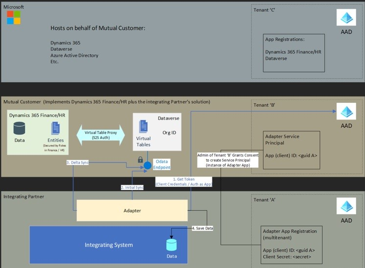
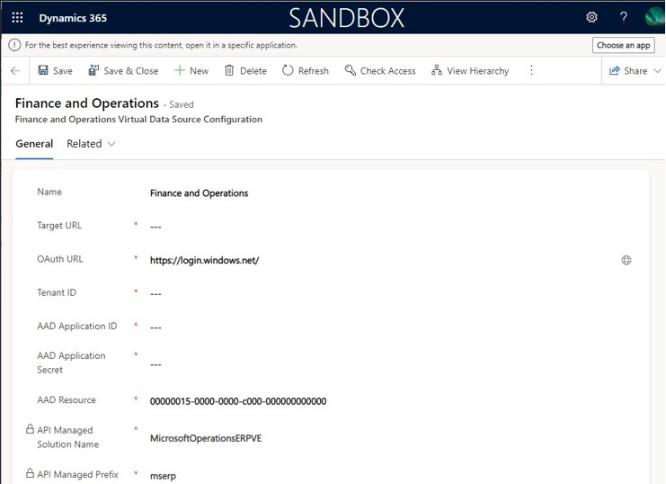

---
# required metadata

title: Security configuration concepts for virtual table-based integrations
description: This article explains an architecture for building an integration between Microsoft Dynamics 365 Human Resources and other systems.
author: twheeloc
ms.date: 11/19/2022
ms.topic: article
# optional metadata

ms.search.form: CDSIntegrationAdministration
# ROBOTS: 
audience: Application User
# ms.devlang: 

# ms.tgt_pltfrm: 
ms.assetid: 
ms.search.region: Global
# ms.search.industry: 
ms.author: twheeloc
ms.search.validFrom: 2020-10-05
ms.dyn365.ops.version: Human Resources
---

# Security configuration concepts for virtual table-based integrations

[!include [Applies to Human Resources](../includes/applies-to-hr.md)]

This article describes an architecture for using [Microsoft Dataverse virtual tables (entities)](../fin-ops-core/dev-itpro/power-platform/virtual-entities-overview.md) to build an integration between Dynamics 365 Human Resources and a third-party system. The focus of the article is on the security configuration, and on the authentication and authorization aspects that are required between the system boundaries to build a functional, secure system.

## Prerequisite reference articles

The following articles provide more information about the concepts in this article:

- [Virtual entities overview](../fin-ops-core/dev-itpro/power-platform/virtual-entities-overview.md)
- [OAuth 2.0 client credentials flow on the Microsoft identity platform](/azure/active-directory/develop/v2-oauth2-client-creds-grant-flow)
- [Authentication and authorization](../fin-ops-core/dev-itpro/power-platform/authentication-and-authorization.md)

## Architecture 

The following architectural diagram shows the major concepts that are involved in an integration that uses virtual tables (entities).

Here's an explanation of some of the elements in the preceding diagram:

- **Microsoft** – Microsoft hosts and operates the different Dynamics 365 products on behalf of customers.

    - **Microsoft Entra tenant C** – An Microsoft Entra tenant that's owned by Microsoft. It's the tenant that the Dynamics 365 applications are registered in.

- **Integrating partner**

    - **Integrating system** – The system that's being integrated with Dynamics 365. It might be a payroll system or any system that relies on data that's stored in Dynamics 365.
    - **Adapter** – The software or service that's responsible for interacting with both Dynamics 365 and the integrating system.

        > [!NOTE]
        > If an adapter is intended to be used by multiple Dynamics 365 customers, the expectation is that it will be registered as a multitenant application in Microsoft Entra ID.

    - **Microsoft Entra tenant A** – An Microsoft Entra tenant that's owned by the integrating partner. It's the tenant that the adapter's application ID is registered in.

- **Mutual customer** – A customer that implements Dynamics 365 Human Resources and the integrating partner's solution.

    - **Dynamics 365 Finance or Human Resources** – The customer-specific instance of Dynamics 365 Finance or Human Resources that contains the customer data that the integrating system requires.
    - **Dataverse** – The customer-specific Dataverse environment that's connected to either Finance or Human Resources. Dataverse provides a Web API for interaction with Dynamics 365 data.
    - **Microsoft Entra tenant B** – The customer's Microsoft Entra tenant. It functions as the identity provider (authorization server) and issues tokens that authorize callers to call the customer's Dataverse instance.

## Basic request flow

This section describes the basic flow of a typical request that's involved in an integration. It references the architectural diagram earlier in this article.

A typical request requires that the adapter query Dynamics 365 for data, and then save and sync that data to the integrating system.

1. The adapter calls the Dataverse Web API to query for relevant data.

    > [!NOTE]
    > Authentication is a prerequisite, and token acquisition is a major part of the process. Authentication will be described in the [Authentication and authorization at system boundaries](#authentication-and-authorization-at-system-boundaries) section.

    This call is made against the Dataverse Web API to query for application data that's exposed through a virtual table. (See "2. Initial Sync" and "3. Delta Sync" in the diagram.)

2. Dataverse handles the request by querying the virtual table through the Virtual entity plugin ("Virtual Table Proxy" in the diagram). The Dataverse request is forwarded to the Finance or Human Resources Virtual entity service to query for the data that's physically stored in the Finance or Human Resources database.
3. The Finance or Human Resources Virtual entity service translates the request against the virtual entity into a query against the Finance or Human Resources entity that backs the Dataverse virtual entity. The data is retrieved from the database, translated back into the Dataverse entity representation, and returned to the caller.
4. The adapter completes any required mapping and data translation, and makes a call to the integrating system to persist the data in the integrating 
system database. (See "4. Save Data" in the diagram.)

## Authentication and authorization at system boundaries

*Authentication* validates that a user's or application's identity has been proven, and confirms that the user or application is who they say they are. *Authorization* grants the user or application the right to access specific application-level permissions. For more information, see [Authentication vs. authorization](/azure/active-directory/develop/authentication-vs-authorization).

Most cross-system calls in the architectural diagram earlier in this article involve the adapter. The adapter must authenticate itself to make the following calls:

- The call to Dataverse
- The call to the integrating system

Look at the system boundaries in the diagram. Every web request between systems must be authenticated, and application-level authorization checks must be passed before data is returned to the caller. For a request against a Dynamics 365 virtual table that's backed by Finance or Human Resources, authentication and authorization checks are enforced at the following system boundaries:

- The call between the adapter and the Dataverse Web API (OData) endpoint
- The call between the Dataverse Virtual entity plugin and the Finance or Human Resources Virtual entity service

In both cases, authentication checks are done first. Then application-level authorization checks are done to ensure that the authenticated user or application has the correct application-level privileges to retrieve the requested data.

Authentication to call Dataverse is handled through a bearer token that must be included as an HTTP header in the web request to Dataverse. The adapter must get a token from the tenant B Microsoft Entra instance. (See "1. Get Token" in the diagram.) Microsoft Entra acts as the identity provider in the authentication flow.

The adapter authenticates by providing its application identity (non-secret, as registered in Microsoft Entra tenant A) and an application secret or certificate that only the adapter application has.

After the user or application has been authenticated to make calls to Dataverse, the Dataverse-level authorization checks are done against each request. These checks make sure that the caller (the adapter application's identity, which is designated "\<guid A\>" in the diagram) has the appropriate application permissions. Application-level authorization is managed in Dataverse through an application user that represents the adapter's application ID. Application-level permissions are managed by granting access to specific Dataverse-defined application roles. Those roles provide granular privileges to the application.

For more detailed guidance, see [Use multi-tenant server-to-server authentication](/power-apps/developer/data-platform/use-multi-tenant-server-server-authentication).

If Dataverse-level application permission checks are passed, the Virtual entity plugin makes a call to the Virtual entity service endpoint in the Finance or Human Resources environment. Server-to-server (S2S) authentication is used to make this call. It uses the identity and secret that are configured in the Finance and Operations virtual data source configuration record.

For more information, see [Configure Dataverse virtual entities](../fin-ops-core/dev-itpro/power-platform/admin-reference.md).

The call from the Dataverse Virtual entity plugin to Finance or Human Resources includes the adapter identity of the original call to Dataverse from the adapter (the identity that's designated "\<guid A\>" in the architectural diagram). If the virtual entity data source is correctly configured, and the S2S authentication checks are passed, the Virtual entity service in Finance or Human Resources will run the query in the context of the original caller (the adapter, \<guid A\>). Application permission checks (authorization) at the Finance or Human Resources level will be done to ensure that the adapter has the privileges that are required to access the data entities that are requested through the query.

Finance and Human Resources security is managed in the following ways:

1. By mapping the adapter identity (\<guid A\>) to a specific Finance or Human Resources user. This mapping is done on the **Azure active directory applications** page. For more information, see [Register your external application](../fin-ops-core/dev-itpro/data-entities/services-home-page.md#register-your-external-application).
2. By granting the Finance or Human Resources user the appropriate application-level roles, duties, and privileges. For more information, see [Role-based security](../fin-ops-core/dev-itpro/sysadmin/role-based-security.md).

If the adapter application (\<guid A\>) is granted the privileges that are required to access the requested data, the following events occur:

1. The query is run.
2. The data is translated back to its Dataverse entity page.
3. The data is returned to the adapter.

> [!IMPORTANT]
> During development, the adapter can be run by using a Finance or Human Resources user that has the Administrator role. However, in a production environment, the adapter should never be run with Administrator privileges.

## Key takeaways

Here are some important implications of the virtual table or entity architecture:

- The security configuration for virtual tables that are backed by Human Resources is managed in Human Resources.
- The customer ("Mutual Customer" in the architectural diagram earlier in this article) has full control over what privileges are granted to the integrating adapter identity (designated "\<guid A\>" in the diagram).
- The customer is responsible for the correct security configuration of their Human Resources environment. The integrating partner who creates the adapter must provide guidance about the privileges that the adapter requires.
