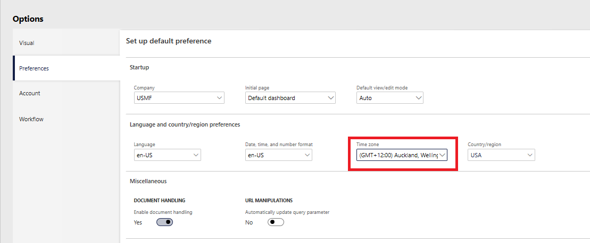
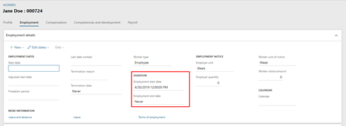
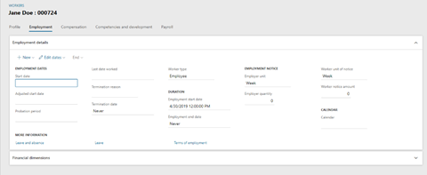
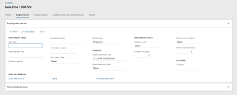
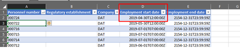
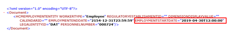
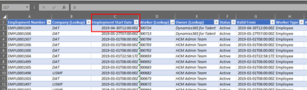

---
# required metadata

title: Understand Date and Time fields
description: This topic explains what to expect when you use Date and Time fields in Microsoft Dynamics 365 Human Resources.
author: twheeloc
ms.date: 10/28/2021
ms.topic: article
ms.prod: 
ms.technology: 

# optional metadata

ms.search.form: HcmPersonnelManagementWorkspace
# ROBOTS: 
audience: Application User
# ms.devlang: 
ms.search.scope: Human Resources
# ms.tgt_pltfrm: 
ms.custom: 
ms.assetid: 
ms.search.region: Global
# ms.search.industry: 
ms.author: jaredha
ms.search.validFrom: 2020-02-03
ms.dyn365.ops.version: Human Resources

---

# Understand Date and Time fields

[!include [Applies to Human Resources](../includes/applies-to-hr.md)]

**Date and Time** fields are a fundamental concept in Microsoft Dynamics 365 Human Resources. It's important that you understand how to work with **Date and Time** data on pages, in Dataverse, and in external sources.

## Understanding the difference between Date and Date and Time field data types

**Date and Time** fields contain time zone information, whereas **Date** fields don't. **Date** fields show the same information in any location. When you enter a date in a **Date** field, that same date is written to the database.

When data is shown in a **Date and Time** field, the date and time are adjusted based on the user's time zone that is selected on the **User Options** page (**Common \> Setup \> User Options**). Date and time information that you enter in the field might not be the same as the information that is written to the database.

## Understanding Date and Time fields on pages 

**Date and Time** data displayed on the screen isn't the same as the data stored in the database if the user's time zone isn't set to Coordinated Universal Time (UTC). Data in **Date and Time** fields is always stored as UTC.

## Understand Date and Time fields in the database 

When a **Date and Time** value is written to the database, the data is stored as UTC. Therefore, users can see any **Date and Time** data relative to the time zone that is defined in their user options.
 
In the example above, the start time is a point in time, not a particular date. By changing the time zone of the logged in user from GMT +12:00 to GMT UTC, the same record shows 04/30/2019 12:00:00 instead of 05/01/2019 12:00:00.

In the example below, employee 000724's employment becomes active at the same time regardless of time zone. The employee will be active on 04/30/2019 in the GMT time zone, which is the same as 05/01/2019 in GMT+12:00 time zone. Both refer to the same point in time and not a particular date. 

## Date and Time data in Data Management Framework, Excel, Dataverse, and Power BI 

The Data Management Framework (DMF), Excel Add-In, Dataverse, and Power BI reporting are all designed to interact with data directly on the database level. Since there's no client to adjust **Date and Time** data to the time zone of the user, all **Date and Time** values are in UTC, which can lead to some incorrect assumptions when entering or viewing data.
 
When **Date and Time** data is submitted via DMF, Excel, or Dataverse, the database assumes that it's in UTC. However, if users who view the data don't have their user time zone set to UTC, the submitted **Date and Time** value won't appear as expected, and users might become confused. 
 
The same thing can happen in reverse when data is exported. The **Date and Time** data in the exported DMF entity can be different than what is displayed in the Dynamics client. 
 
When using external sources like DMF to view or author data, keep in mind that the **Date and Time** values are considered by default to be in UTC regardless of the time zone of the user's computer or their current user time zone settings. 

## Examples of the same record being displayed in different product areas 

**Human Resources with user time zone set to UTC**

**Human Resources with user time zone set to GMT +12:00** 

**Excel Via OData**

**DMF Staging**

**DMF Export**

**Excel via Dataverse**

## See also

[Date and time data](/dynamics365/unified-operations/fin-and-ops/organization-administration/date-time-zones)  
[User preferred time zones](/dynamics365/unified-operations/fin-and-ops/organization-administration/tasks/set-users-preferred-time-zone) 

[!INCLUDE[footer-include](../includes/footer-banner.md)]
