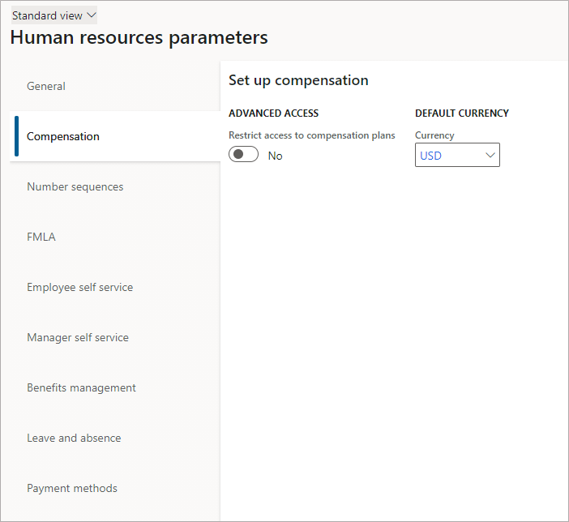
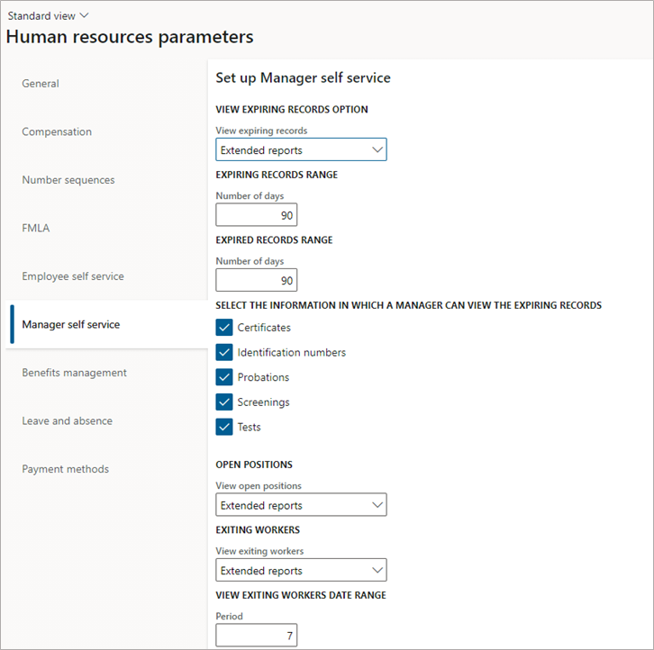

---
# required metadata

title: Configure Human resources parameters
description: This topic explains how to set up company-specific parameters in Dynamics 365 Human Resources.
author: twheeloc
ms.date: 11/03/2021
ms.topic: article
ms.prod: 
ms.technology: 

# optional metadata

ms.search.form: HRMParameters, HcmPersonnelManagementWorkspace
# ROBOTS: 
audience: Application User
# ms.devlang: 
ms.search.scope: Human Resources
# ms.tgt_pltfrm: 
ms.custom: 51941
ms.assetid: 2cfb061a-a616-4bf9-9d98-9cde00039eec
ms.search.region: Global
# ms.search.industry: 
ms.author: twheeloc
ms.search.validFrom: 2020-02-03
ms.dyn365.ops.version: Human Resources

---

# Configure Human resources parameters

[!include [Applies to Human Resources](../includes/applies-to-hr.md)]

The settings of some Human resources parameters are shared across companies, while the settings of other parameters are company-specific. This topic explains how to set up company-specific Human resources parameters.

Two pages are used to set Human resources parameters. For parameters that are shared across companies, you use the **Human resources shared parameters** page. For parameters that are company-specific (in other words, the settings apply to a single company), you use the **Human resource parameters** page.

On the **Human resources parameters** page, the settings are divided among six tabs:

- **General**
- **Recruitment** (this tab isn't included in Dynamics 365 Human Resources)
- **Compensation**
- **Number sequences**
- **FMLA**
- **Employee self service**
- **Manager self service**
- **Benefits management**
- **Leave and absence**
- **Payment methods**

Each tab contains information that pertains to a single company.

## General

The settings on the **General** tab define the appearance of information about absence, injury and illness, and new hires. The settings on this tab also define some default entries that appear as you work. Specifically, this tab lets you:

- Select a color to apply to open absence transactions.
- Specify the style sheet to use for reports.
- Enable the integration between training courses and absence registration.
- Select the absence code that is used to control this integration.
- Indicate how long to keep injury and illness case incidents.
- Specify the default identification number shown when a new worker is hired.
- Specify the date that is used to calculate years of service. 

## Recruitment

The settings on the **Recruitment** tab define the document types used for correspondence automatically sent to applicants. You can also indicate the recruitment project used for unsolicited applications.

The period that is defined in **Recruitment project aging** determines which recruitment projects are included on the **Aging projects** tile in the **Recruitment management** workspace. The period that is defined for the application deadline warning is used to show recruitment projects that are approaching their application deadline on the **Application deadline approaching** tile in the **Recruitment** workspace.

For more information about recruiting, see [Recruit job candidates](hr-personnel-recruit.md).

## Compensation

In Dynamics 365 Finance, the settings on the **Compensation** tab define whether users must confirm that they want to save information for a fixed or variable compensation plan. If you select **Enable save validation**, when users close a compensation-related page, they receive a message that asks whether they want to save the record. Some pages in Compensation management don't let users delete information. By prompting users to verify that they want to save information, you might be able to limit the amount of information that is saved but can't be deleted later. If you clear **Enable save validation**, records save immediately, possibly before the user is ready. If you're using Performance management, the **Compensation** tab also lets you select a rating model to use instead of the model assigned to compensation plans when rating performance.

In Human Resources, you can use the **Compensation** tab to choose to restrict access to compensation plans and to set a default currency.

For more information about compensation, see [Compensation plans overview](hr-compensation-overview.md).

## Number sequences

The settings on the **Number sequence** tab determine the sequences used to automatically assign IDs to items in Human Resources, such as:

- Applications
- Absence registrations
- Compensation process results
- Case numbers
- Courses
- Course agendas

To maintain number sequence references and codes, use the **Number sequences** list page (select **Organization administration > Number sequences > Number sequences**).

For more information, see [Number sequences overview](../fin-ops-core/fin-ops/organization-administration/number-sequence-overview.md?toc=%2fdynamics365%2fhuman-resources%2ftoc.json).

> [!NOTE]
> The number of hours that are worked can't exceed 1,250, and the length of employment can't exceed 12 months. These maximum values are in accordance with federal law in the United States.

## FMLA

On the FMLA tab, you set FMLA eligibility requirements and FMLA entitlement hours. For more information, see [Configure leave and absence parameters](hr-leave-and-absence-parameters.md).

## Employee self service

The settings on the **Employee self service** tab affect how **Employee self service** appears to employees. On this tab, you can complete the following tasks:

- Enter a name for the **Employee self service** workspace
- Select which information a manager can enter for employees
- Add useful links for employees
- Restrict employees from adding or editing business contact details. For more information, see [Restrict editing of personal information](hr-employee-self-service-restrict-editing.md).

For more information about how to set up **Employee self service**, see [Employee and Manager self service overview](hr-employee-manager-self-service-overview.md).

## Manager self service

The settings on the **Manager self service** tab affect what managers see in **Manager self service**. On this tab, you can configure the following options:

- The range for expiring records
- Information managers can view in expiring records
- Whether managers can view open positions for extended reports
- Views of exiting workers
- Useful links for managers

For more information about how to set up **Manager self service**, see [Employee and Manager self service overview](hr-employee-manager-self-service-overview.md).

## Benefits management

On the **Benefits management** tab, you can configure email options for Benefits management. For information about how to set up and use Benefits management, see [Benefits management overview](hr-benefits-management-overview.md).

## Leave and absence

For information about setting up and using Leave and absence, see [Leave and absence overview](hr-leave-and-absence-overview.md).

## Payment methods

On the **Payment methods** tab, you can select the payment methods supported by your organization. For more information about configuring compensation, see [Compensation plans overview](hr-compensation-overview.md).

[!INCLUDE[footer-include](../includes/footer-banner.md)]
