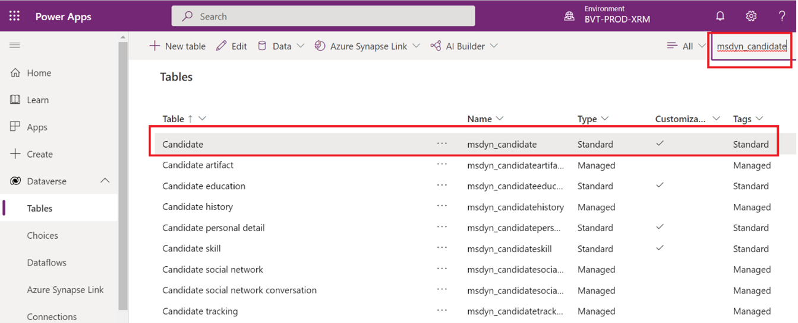
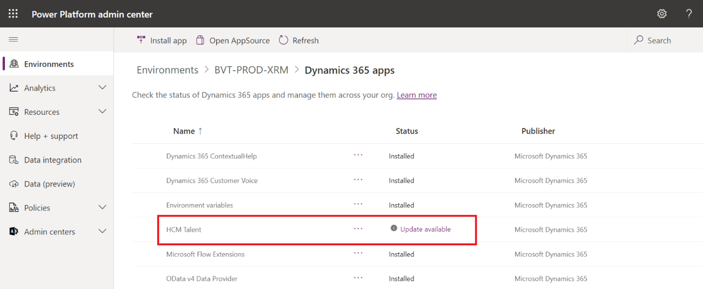

---
# required metadata

title: Retirement of Dynamics 365 Talent - Attract and Onboard apps
description: This article describes the retirement of the Dynamics 365 Talent - Attract and Onboard apps. 
author: twheeloc
ms.date: 01/27/2022
ms.topic: article
ms.prod: 
ms.technology: 

# optional metadata

ms.search.form: HcmBenefitEligibilityDetail, SysPolicyListPage, SysPolicySourceDocumentRuleType, BenefitWorkspace, HcmBenefitSummaryPart
# ROBOTS: 
audience: Application User
# ms.devlang: 

# ms.tgt_pltfrm: 
ms.assetid: 4ad0106f-5b07-4fd5-bc1a-5834fa9b198e
ms.search.region: Global
# ms.search.industry: 
ms.author: twheeloc
ms.search.validFrom: 2020-02-03
ms.dyn365.ops.version: AX 7.0.0, Human Resources

---

# Dynamics 365 Talent: Attract and Onboard apps retirement

In December 2019, we announced the February 1, 2022 retirement of Dynamics 365 Talent - Attract and Onboard apps, giving our customers two years to plan.

For more information regarding the retirement of these apps, see:
 - [Retiring Dynamics 365 Talent - Attract and Dynamics 365 Talent: Onboard Apps](https://community.dynamics.com/365/humanresources/b/dynamics365forhumanresources/posts/retiring-dynamics-365-talent-attract-and-onboard-apps)
 - [Building a more successful workforce with Dynamics 365 Human Resources](https://cloudblogs.microsoft.com/dynamics365/bdm/2019/12/06/building-a-more-successful-workforce-with-dynamics-365-human-resources)

We'll continue to support Dynamics 365 Human Resources, which will help our customers get the workforce insights needed to build data-driven employee experiences across multiple  areas, such as:

- Compensation
- Benefits
- Leave and absence
- Compliance
- Payroll
- Performance feedback
- Training and certification
- Self-service programs

## Dynamics 365 Talent apps retirement FAQ

###	What is the user experience for both Dynamics 365 Talent - Attract and Onboard apps starting February 1, 2022?

Users will not be able to use the applications and are redirected to a retirement page.

### Can customers continue to export data for both Dynamics 365 Talent - Attract and Onboard apps after February 1, 2022?
  
No, retirement was announced in December 2019 and the required export capabilities were provided until February 1, 2022. 

### Will the customer’s data related to both Dynamics 365 Talent - Attract and Onboard apps in Dataverse be deleted after February 1, 2022?

No, the Dataverse entities will remain in the customer’s Microsoft Dataverse environment even after retirement unless the Human Capital Management Talent solution is deleted or uninstalled.

### I know the name of the Talent environment. How can I see the Attract and Onboard data in Dataverse?

1.	Sign into Power Apps: https://make.powerapps.com
2.	Select the environment in which you would like to see Attract and Onboard data.
3.	Go to **Dataverse > Tables**. 
4.	Type “msdyn_” in **Search**. If you see the list of tables starting with “msdyn_” + table names (example: msdyn_candidate) then you have found the environment with Attract and Onboard data.

### I don’t know the name of the Talent environment. How can I find the environment that has the data for the Dynamics 365 Talent: Attract and Dynamics 365 Talent: Onboard applications?

1)	Sign into Power Platform admin center: https://admin.powerplatform.microsoft.com/
2)	Select **Environments**.
3)	Select a particular environment to evaluate.
4)	Select **Resources > Dynamics 365 apps**.
5)	If you see **HCM Talent** solution installed, this environment should have Attract and Onboard data stored within it. 

> [!NOTE] 
> The **HCM Talent** solution is also used in Dynamics 365 Human Resources.
