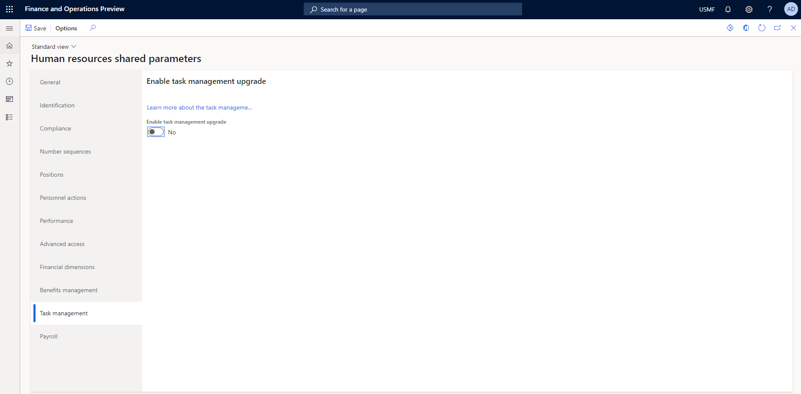

---
# required metadata

title: Set up tasks in Task management
description: This article explains how to set up tasks in Task management in Microsoft Dynamics 365 Human Resources.
author: twheeloc
ms.date: 07/01/2024
ms.topic: article
# optional metadata

ms.search.form: 
# ROBOTS: 
audience: Application User
# ms.devlang: 

# ms.tgt_pltfrm: 
ms.assetid: 
ms.search.region: Global
# ms.search.industry: 
ms.author: anisagrawal
ms.search.validFrom: 2022-06-09
ms.dyn365.ops.version: Human Resources

---

# Set up tasks in Task management

In Microsoft Dynamics 365 Human Resources version 10.0.30, users can select how edited tasks are handled. If a task that is being edited is on a checklist, the **Enable task management upgrade** option must be selected on the **Task management** tab of the **Human resources shared parameters** page to enable the checklist to use the edited task.

If edits to tasks should be applied to all associated checklist tasks, a relationship must already exist between the task in the task library and the task on the checklist. An option was added to create the relationship between the library task and the checklist task.

You can create tasks individually and then reuse them in multiple checklists. To create a task, on the **Onboarding setup** page, on the **Tasks** tab, select **New**.

## Set up tasks

To assign a created task to multiple checklists, select the task, and then select **Apply to checklists** on the menu.

Alternatively, you can add tasks directly to a checklist. To add a task to a checklist, on the **Onboarding setup** page, on the **Checklist** tab, either create a new checklist to add the task to or add the task to an existing checklist.

To edit a library task, select **Edit** on the task library menu. If the task is associated with any checklists, those checklists will appear on the **Edit task** page. If you want the tasks on any of the checklists to be updated with the edits, select those checklists in the **Apply to checklists** section.

To delete tasks from the task library, select **Delete**. If the task is associated with a checklist, this action won't delete the task from the checklist. A separate action is required to remove a task from a checklist.

### Set up checklists

A checklist is a group of tasks. You can create as many checklists as you require, and you can assign the same tasks to multiple checklists. When you create a checklist, you specify an owner and a calendar.

To create a new task on a checklist, select **New** on the task menu bar. When you create a new task, you can optionally add the task to the task library, so that it can be shared across multiple checklists. To add the task to the task library, you must set the **Apply task to library** option to **Yes**. If you choose to add the task to the task library, you can also add the task to other checklists at the same time by selecting those checklists in the **Apply to checklists** section. If you choose not to add the task to the task library, the task will exist only on the checklist where you create it.

To edit a task on a checklist, select **Edit** on the task menu. If the task is associated with any checklists, those checklists will appear on the **Edit task** page. If you want the tasks on any of the other checklists to be updated with the edits, select those checklists in the **Apply to checklists** section.

To remove tasks from a checklist, select **Remove**. This action will remove the tasks from the checklist. However, it won't delete the tasks from the task library. To delete tasks from the task library, open the **Task library** page, and select **Delete**.
