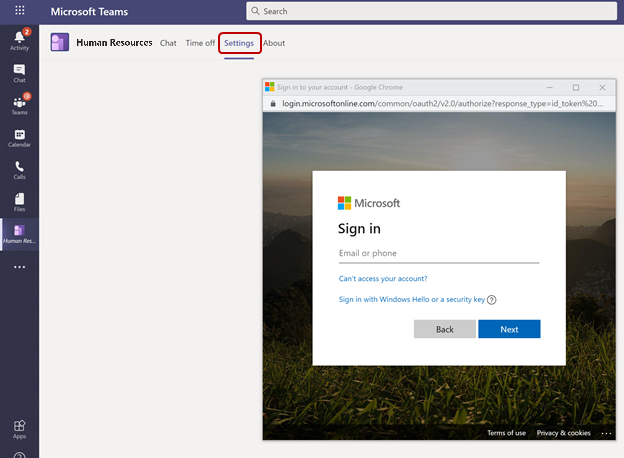
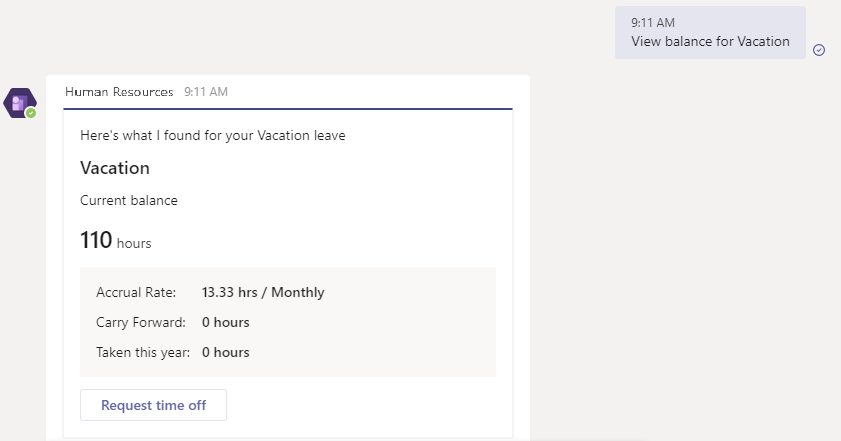
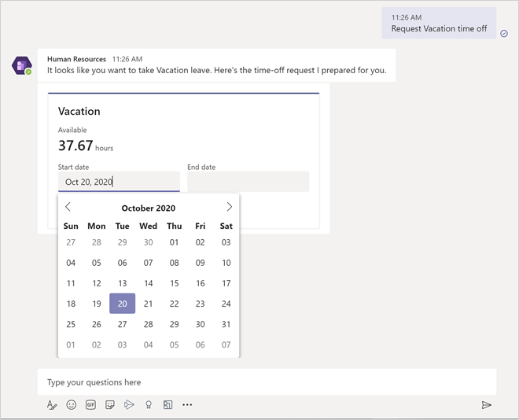
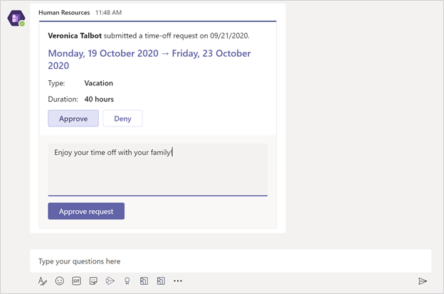
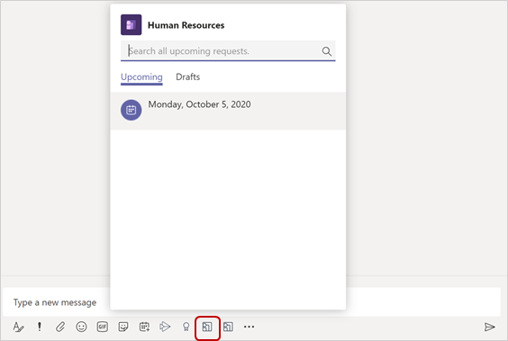
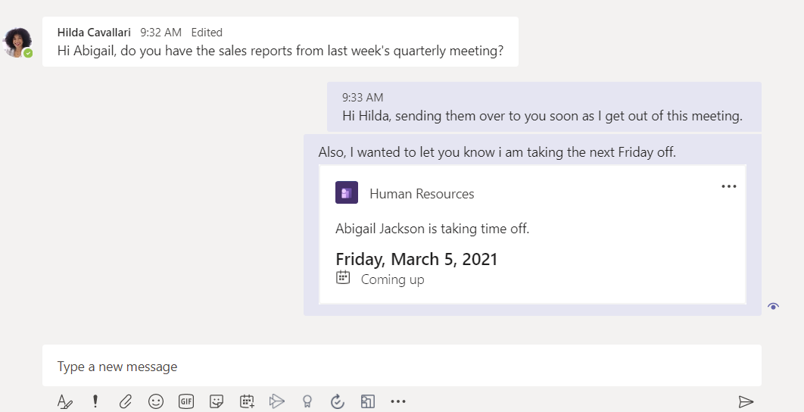
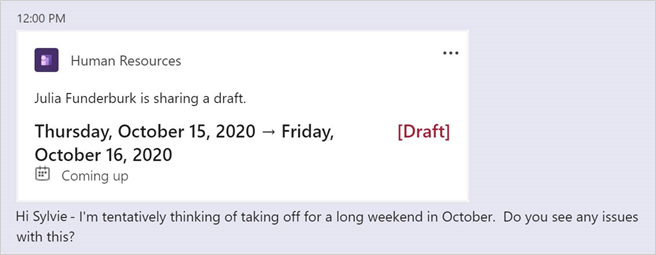
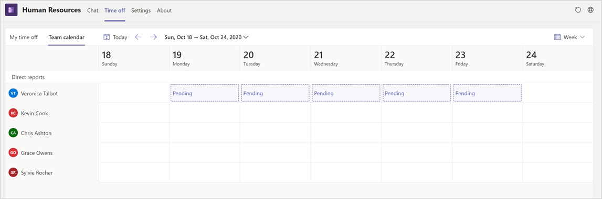

---
# required metadata

title: Manage leave requests in Teams
description: This topic shows how to request time off in the Dynamics 365 Human Resources app in Microsoft Teams.
author: andreabichsel
manager: AnnBe
ms.date: 10/28/2020
ms.topic: article
ms.prod: 
ms.service: dynamics-human-resources
ms.technology: 

# optional metadata

ms.search.form: LeaveAbsenceWorkspace
# ROBOTS: 
audience: Application User
# ms.devlang: 
ms.reviewer: anbichse
ms.search.scope: Human Resources
# ms.tgt_pltfrm: 
ms.custom: 7521
ms.assetid: 
ms.search.region: Global
# ms.search.industry: 
ms.author: anbichse
ms.search.validFrom: 2020-05-18
ms.dyn365.ops.version: Human Resources

---

# Manage leave requests in Teams

[!include [banner](includes/preview-feature.md)]

The Microsoft Dynamics 365 Human Resources app in Microsoft Teams lets you quickly request time off and view your time-off balance information right in Microsoft Teams. You can interact with a bot to request information and start a leave request. The **Time off** tab provides more detailed information. You can also send people information about your upcoming time off in teams and chats outside the Human Resources app.

## Install the app

You can find the Human Resources app in the Teams store.

1. In Microsoft Teams, select the ellipses.

   
 
2. Search for Dynamics 365 Human Resources, and then select the **Human Resources** tile.

   

3. Select the **Add** button to install the app.

   

If the app doesn't automatically sign you in, select the **Settings** tab to sign in.

> [!NOTE]
> If you don’t see a sign-in dialog box, check your browser settings to allow pop-ups. 

If you have access to more than one instance of Human Resources, you can select which environment you want to connect to in the **Settings** tab.

> [!NOTE]
> The app now supports the System Administrator security role.
 
## Use the bot

After the app installs, a welcome message appears, letting you know the types of actions the bot can take on your behalf.

 
> [!NOTE]
> When first interacting with the bot, you might need to sign in. If you don’t see a sign-in dialog box, check your browser settings to allow pop-ups.

You can ask the bot to:

- Show time-off balance information for each leave type you're enrolled in.

   
 
- Show additional details about a specific leave type.

   

- Start a leave request for you.

   
 
After you start a leave request, you can adjust the days right within the card.

 
When you're done entering information, select **Submit** to submit it for approval. You can also select **Save as draft** to come back to it later.

## Manage your leave in Teams

The **Time off** tab allows you to view:

- Balance information for each leave type you're enrolled in

- Upcoming leave requests

- Time-off requests

- Draft leave requests

 
### Create a new request

1. To create a new leave request, select **New request**.

   

2. Enter the day or days you want to take off, and then select **Add**.

   

3. If applicable, enter a reason code. Also enter any comments and add any attachments.

4. When you're done entering information, type **Submit** to submit it for approval. You can also type **Save as draft** to come back to it later.

### Manage draft requests

1. Select the **Drafts** tab.

   

2. Select the pencil to edit the request, or select the trash can to delete the request.

3. Make any necessary changes. When you're done entering information, type **Submit** to submit it for approval. You can also select **Save as draft** to come back to it later.

   
   
### Respond to Teams notifications

When you or a worker you're an approver for submits a leave request, you'll receive a notification in the Human Resources app in Teams. You can select the notification to view it. Notifications also appear in the **Chat** area.

If you're an approver, you can select **Approve** or **Deny** in the notification. You can also provide an optional message.

## Send upcoming time-off information to your coworkers

After you install the Human Resources app for Teams, you can easily send information about your upcoming time off to your coworkers in teams or chats.

1. In a team or chat in Teams, select the Human Resources button below the chat window.

   

2. Select the leave request you want to share. If you want to share a draft leave request, select **Drafts** first.

   

Your leave request will display in the chat.

If you shared a draft request, it will display as a draft:

## View your team's leave calendar

If you're a manager with direct reports, you can view your team's approved and pending time off.

1. In the Human Resources app in Teams, select **Time off**.

2. Select **Team calendar**.

   

The calendar displays your direct reports' approved and pending time off.

## Troubleshooting

If you're having trouble signing into or using the Human Resources Teams app, try following these troubleshooting instructions. If you're still having problems after troubleshooting, contact Support. For more information, see [Get support](hr-admin-troubleshooting-support.md).

### Can't sign into the Human Resources app in Teams

If you can't sign into the app, it's possible that the account you're using to sign into Microsoft Teams isn't associated with an employee record in Dynamics 365 Human Resources. Contact your system administrator to ensure your employee record is correctly associated.

### Error when approving leave requests in the Human Resources app in Teams

If you receive an error when you're trying to approve leave requests in the Teams app, try the following troubleshooting steps:

1. Verify that the account you're using to sign into Microsoft Teams is the same one you use for accessing Dynamics 365 Human Resources.

2. Verify that you're a valid approver for the request by checking the workflow settings for leave approval. For more information about leave request workflows, see [Create a leave request workflow](hr-leave-and-absence-workflow.md).

## Known accessibility issues

The Human Resources app in Teams has the following accessibility issues that we're working on fixing in future releases. Where applicable, the table includes a workaround.

| Issue | Workaround |
| --- | --- |
| Zooming to 400% on desktop hides some of the action buttons from view. | We recommend using a magnifier instead until we can support this zoom level. |
| On the **Time off** tab, voiceover announces a button action while reading the header for the time-off grid. | No workaround at this time. |
| If you swipe while a popup or menu is open, voiceover skips reading the popup or menu contents. | Explore the content using finger scanning. |
| On the **Time off** tab, there's an extra swipe gesture when navigating to **Reason code** in a new request. | No workaround at this time. |
| On the **Time off** tab, if you swipe while the calendar is open, you end up outside the control instead of at the top in a new request or while editing a request. | When you reach **Go to today**, consider that to be the end of the control and swipe in the reverse direction to get back to the top. |
| Voiceover doesn't read the **Start date** and **End date** labels for dates. | No workaround at this time. |
| On the **Chat** tab, the focus jumps back to the top when you enter a date while using the assistive tool or keyboard navigation. | Tab until you reach your input area again. |

## Privacy notice

### Microsoft Language Understanding Intelligent Service (LUIS)

With the Dynamics 365 Human Resources bot in Microsoft Teams, the user’s text inputs are analyzed for understanding the underlying query/intent. The user’s input such as “Search account Contoso” is routed to one of Microsoft’s Cognitive Service called Language Understanding Intelligent Service (LUIS). Read more about LUIS [here](https://www.luis.ai/). The LUIS service disambiguates or understands the intent of user input (in this case, the intent is to find information) and the target entity (in this case, the intended entity is an account named Contoso). This information is then passed on to Microsoft’s [Azure bot framework](https://azure.microsoft.com/services/bot-service/), which interacts with data from Dynamics 365 Human Resources and retrieves the desired information for the user query. 

By installing and allowing access to use of the bot, you agree to allow the LUIS service and Azure bot framework to process the intent behind the input,  which results in an enhanced conversational user experience. The LUIS service and Azure bot framework may have varying levels of compliance compared to Dynamics 365 Human Resources. While the LUIS service has access to only the user queries and is not designed to be connected to the user’s Dynamics 365 Human Resources data or account, a user of the Dynamics 365 Human Resources bot could voluntarily enter a query containing Customer Data, Personal Data, or other data and such query content could get sent to the LUIS service and the Azure bot framework. 

The content of user’s queries and messages is retained in LUIS system for a maximum of 30 days, is encrypted at rest, and is not used for training or service improvement. Read more about Cognitive Services [here](https://azure.microsoft.com/services/cognitive-services/language-understanding-intelligent-service/). 

To manage admin settings for apps in Microsoft Teams, go to the [Microsoft Teams admin center](https://admin.teams.microsoft.com/).

### Microsoft Teams, Azure Event Grid, and Azure Cosmos DB

When using the Dynamics 365 Human Resources app in Microsoft Teams, certain customer data may flow outside of the geographic region where your tenant’s Human Resources service is deployed.

Dynamics 365 Human Resources transmits the employee’s leave request and workflow task details to Microsoft Azure Event Grid and Microsoft Teams. This data may be stored in Microsoft Azure Event Grid for up to 24 hours and will be processed in the United States, is encrypted in transit and at rest, and is not used by Microsoft or its subprocessors for training or service improvements. To understand where your data is stored in Teams, please see: [Location of data in Microsoft Teams](https://docs.microsoft.com/microsoftteams/location-of-data-in-teams?view=o365-worldwide&preserve-view=true).

While conversing with the chat bot in the Human Resources app, the conversation content may be stored in Azure Cosmos DB and transmitted to Microsoft Teams. This data may be stored in Azure Cosmos DB for up to 24 hours and may be processed outside of the geographic region where your tenant's Human Resources service is deployed, is encrypted in transit and at rest, and is not used by Microsoft or its subprocessors for training or service improvements. To understand where your data is stored in Teams, please see: [Location of data in Microsoft Teams](https://docs.microsoft.com/microsoftteams/location-of-data-in-teams?view=o365-worldwide&preserve-view=true).
 
To restrict access to the Human Resources app in Microsoft Teams for your organization or users within your organization, see [Manage app permission policies in Microsoft Teams](https://docs.microsoft.com/MicrosoftTeams/teams-app-permission-policies).

## See also

[Download and install Microsoft Teams](https://support.office.com/article/download-and-install-microsoft-teams-422bf3aa-9ae8-46f1-83a2-e65720e1a34d) 
[Microsoft Teams help center](https://support.office.com/teams) 
[Human Resources app in Teams](hr-admin-teams-leave-app.md)
