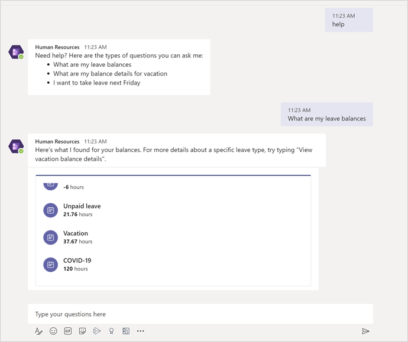
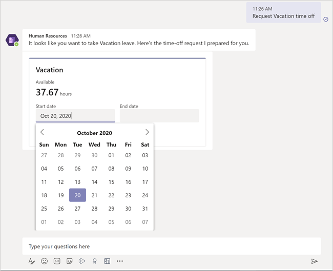
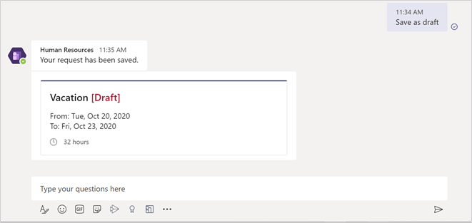
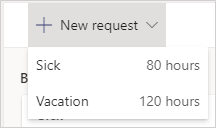

---
# required metadata

title: Manage leave requests in Teams
description: This article shows how to request time off in the Dynamics 365 Human Resources app in Microsoft Teams.
author: andreabichsel
manager: AnnBe
ms.date: 05/04/2020
ms.topic: article
ms.prod: 
ms.service: dynamics-human-resources
ms.technology: 

# optional metadata

ms.search.form: 
# ROBOTS: 
audience: Application User
# ms.devlang: 
ms.reviewer: anbichse
ms.search.scope: Human Resources
# ms.tgt_pltfrm: 
ms.custom: 7521
ms.assetid: 
ms.search.region: Global
# ms.search.industry: 
ms.author: anbichse
ms.search.validFrom: 2020-05-04
ms.dyn365.ops.version: Human Resources

---

# Manage leave requests in Teams

[!include [banner](includes/preview-feature.md)]

The Microsoft Dynamics 365 Human Resources app in Microsoft Teams lets you quickly request time off and view your time-off balance information right in Teams. You can interact with a bot to request information. The **Time off** tab provides more detailed information.

## Install the app

You can find the Human Resources app in the Teams store.

1. In Microsoft Teams, select the ellipses.

   
 
2. Search for Dynamics 365 Human Resources, and then select the **Human Resources** tile.

   

3. Select the **Add** button to install the app.

   

4. After the app installs, select the **Settings** tab to sign in.

   

   > [!NOTE]
   > If you don’t see a sign-in dialog, check your browser settings to allow pop-ups. 

If you have access to more than one instance of Human Resources, you can select which environment you want to connect to in the **Settings** tab.
 
## Use the bot

After the app installs, a welcome message appears, letting you know the types of actions the bot can take on your behalf.

 
> [!NOTE]
> When first interacting with the bot, you might need to sign in. If you don’t see a sign-in dialog, check your browser settings to allow pop-ups.

You can ask the bot to:

- Show time-off balance information for each leave type you're enrolled in.

   
 
- Show additional details about a specific leave type.

   

- Start a leave request for you.

   
 
After you start a leave request, you can adjust the days right within the card, or you can select **Edit details** to add additional information to your request.

 
When you're done entering information, type **Submit** to submit it for approval. You can also type **Save as draft** to come back to it later.

## Manage your leave in Teams

The **Time off** tab allows you to view:

- Balance information for each leave type you're enrolled in

- Upcoming leave requests

- Time-off requests

- Draft leave requests

 
### Create a new request

1. To create a new leave request, select **New request**.

   

2. Enter the day or days you want to take off, and then select **Add**.

   

3. If applicable, enter a reason code. Also enter any comments and add any attachments.

4. When you're done entering information, type **Submit** to submit it for approval. You can also type **Save as draft** to come back to it later.

### Manage draft requests

1. Select the **Drafts** tab.

   

2. Select the pencil to edit the request, or select the trash can to delete the request.

3. Make any necessary changes. When you're done entering information, type **Submit** to submit it for approval. You can also select **Save as draft** to come back to it later.

   

## See also

[Human Resources app in Teams](hr-admin-teams-leave-app.md)

