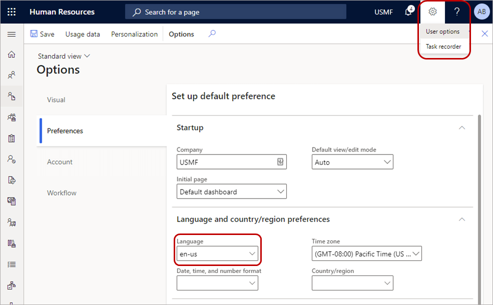

---
# required metadata

title: Manage leave requests in Teams
description: This article shows how to request time off in the Dynamics 365 Human Resources app in Microsoft Teams.
author: twheeloc
ms.date: 12/15/2021
ms.topic: article
ms.prod: 
ms.technology: 

# optional metadata

ms.search.form: LeaveAbsenceWorkspace
# ROBOTS: 
audience: Application User
# ms.devlang: 

# ms.tgt_pltfrm: 
ms.custom: 7521
ms.assetid: 
ms.search.region: Global
# ms.search.industry: 
ms.author: twheeloc
ms.search.validFrom: 2020-05-18
ms.dyn365.ops.version: Human Resources

---

# Manage leave requests in Teams

>[!Important]
>The functionality noted in this article is currently available for customers on the stand-alone Dynamics 365 Human Resources. 
>

[!include [Applies to Human Resources](../includes/applies-to-hr.md)]

The Dynamics 365 Human Resources app in Microsoft Teams lets you quickly request time off and view your time-off balance information right in Microsoft Teams. You can interact with a bot to request information and start a leave request. The **Time off** tab provides more detailed information. You can also send people information about your upcoming time off in Teams and chats outside the Human Resources app.

## Install the app

You can find the Dynamics 365 Human Resources app in the Teams store.

1. In Microsoft Teams, navigate to the list of apps.
 
2. Search for Dynamics 365 Human Resources, and then select the **Human Resources** tile.

> [!NOTE]
> Starting December 20, 2021, the Human Resources App bot services (version 1.1.4) hosted in Microsoft tenant will be decommissioned. The most up-to-date extension (version 1.1.5) is available for install. For more information, see [Manage leave requests in Teams](hr-admin-teams-leave-app.md#update-app).

3. Select the **Add** button to install the app.

If the app doesn't automatically sign you in, select the **Settings** tab to sign in.

> [!NOTE]
> If you don't see a sign-in dialog box, update your browser settings to allow pop-ups. 

If you have access to more than one instance of Human Resources, you can select which environment you want to connect to in the **Settings** tab.

> [!NOTE]
> The app now supports the System Administrator security role.
 
## Use the bot

After the app installs, a welcome message appears, letting you know the types of actions the bot can take on your behalf.

> [!NOTE]
> When you first interact with the bot, you might have to sign in. If you don't see a sign-in dialog box, update your browser settings to allow pop-ups.

You can ask the bot to:

- View your current leave balances. For example, send a message that says, "View leave balances."

- Start a leave request for you. For example, send a message that says, "Take time off" or "I want to take vacation time off next Thursday and Friday" to be more specific for requesting leave for the vacation leave type. 

  

- The chat bot will populate a leave request for you. Select **Request time off** and edit the details for your request.

   If you want to submit leave requests for multiple leave types for the same date, select the **Split day with** option from the **More options** menu. 

   If you select a half day leave when the leave request unit is in days, you can specify whether you want to request time off the first half day or the second half day by selecting the **Half day definition** option from the **More options** menu.
   
   

- When you're done editing your leave request details, select **Submit** to submit it for approval.

  

## Manage your leave in Teams

The **Time off** tab allows you to view: 

- Balance information for each leave type you're enrolled in

- Upcoming leave requests

- Time off requests

- Draft leave requests
 
### Create a new request

1. To create a new leave request, select **New request**.

2. Enter the day or days you want to take off, and then select **Add**.

   

3. If applicable, enter a reason code. Also enter any comments and add any attachments.

4. Select the **Split day with** option from the **More options** menu if you want to submit multiple leave request entries for the same date for different leave types.

5. Select the **Half day definition** option to specify if you want to request the first half day off or the second half day off. This option is available when the leave request unit is in days and the amount requested is 0.5 days.

6. When you're done entering information, enter **Submit** to submit it for approval. You can also enter **Save as draft** to come back to it later.

### Manage draft requests

1. Select the **Drafts** tab.

2. Select the pencil to edit the request, or select the trash can to delete the request.

3. Make any necessary changes. When you're done entering information, type **Submit** to submit it for approval. You can also select **Save as draft** to come back to it later.
   
### Respond to Teams notifications

When you or a worker that you're an approver for submits a leave request, you will receive a notification in the Human Resources app in Teams. You can select the notification to view the leave request. Notifications also appear in the **Chat** area.

If you're an approver, you can select **Approve** or **Deny** in the notification. You can also provide an optional message.

## Send upcoming time off information to your coworkers

After you install the Human Resources app for Teams, you can easily send information about your upcoming time off to your coworkers in teams or chats.

1. In a team or chat in Teams, select the Human Resources button below the chat window.

   

2. Select the leave request you want to share. If you want to share a draft leave request, select **Drafts** first.

Your leave request will display in the chat.

If you shared a draft request, it will display as a draft.

## View your team's leave calendar

If you're a manager with direct reports, you can view your team's approved and pending time off.

1. In the Human Resources app in Teams, select **Time off**.

2. Select **Team calendar**. The calendar displays your direct reports' approved and pending time off.

   > [!NOTE]
   > If you can't see the team calendar, ask your admin to enable it. For more information, see [Install and setup](hr-admin-teams-leave-app.md#install-and-setup).

## Supported languages

The Dynamics 365 Human Resources app in Teams supports the following languages:

| Locale ID | Language |
| --- | --- |
| de-DE | German (Germany) |
| es-ES | Spanish (Spain) |
| es-MX | Spanish (Mexico) |
| fr-CA | French (Canada) |
| fr-FR | French (France) |
| it-IT | Italian (Italy) |
| nl-NL | Dutch (Netherlands) |
| pt-BR | Portuguese (Brazil) |
| tr-TR | Turkish (Türkiye) |
| zh-CN | Chinese (Simplified) |

## Troubleshooting

If you're having trouble signing into or using the Dynamics 365 Human Resources Teams app, try following these troubleshooting instructions. If you're still having problems after troubleshooting, contact Support. For more information, see [Get support](../fin-ops-core/dev-itpro/lifecycle-services/lcs-support.md).

### Can't sign into the Human Resources app in Teams

If you can't sign into the app, it's possible that the account you're using to sign into Microsoft Teams isn't associated with an employee record in Dynamics 365 Human Resources. Contact your system administrator to ensure your employee record is correctly associated.

### Can't find the Dynamics 365 Human Resources environment in settings

If you can't select the correct Dynamics 365 environment, the user record might not have been correctly synced. Contact your system administrator to re-create the user record and associate it with the user credentials. Then try to sign in to the Human Resources app for Microsoft Teams in a few minutes.

### Translations don't display correctly

If translations don't display as expected, make sure the language you select in Teams matches the language selected in Human Resources **User options**.

In Teams, look at **App language** in **Settings**.

In Human Resources, select **Settings** and then select **User options**. Verify that the **Language** field matches the **App language** field in Teams.

If you still experience translation issues, let us know. For information, see [Get support for finance and operations apps or Lifecycle Services (LCS)](../fin-ops-core/dev-itpro/lifecycle-services/lcs-support.md?toc=%2fdynamics365%2fhuman-resources%2ftoc.json).

### Error when approving leave requests in the Human Resources app in Teams

If you receive an error when you're trying to approve leave requests in the Teams app, try the following troubleshooting steps:

1. Verify that the account you're using to sign into Microsoft Teams is the same one you use for accessing Dynamics 365 Human Resources.

2. Verify that you're a valid approver for the request by checking the workflow settings for leave approval. For more information about leave request workflows, see [Create a leave request workflow](hr-leave-and-absence-workflow.md).

### Leave approvers don't receive Teams chat messages to approve leave requests

1. Ensure notifications are enabled for the environment and the user. For more information, see [Enable notifications for the Human Resources app in Teams](hr-admin-teams-leave-app.md#enable-notifications-for-the-human-resources-app-in-teams) and [Turn Teams notifications on or off for individual users](hr-admin-teams-leave-app.md#turn-teams-notifications-on-or-off-for-individual-users).

2. Ensure users are signed into the **Chats** tab with the same credentials they use for approving leave requests. Use the messages "sign out" and then "sign in" to sign in with the correct credentials.

3. If the issue persists, check the status of the **Business Events system** batch job as a system administrator. If it's in a **Waiting** or **Executing** stage, check again in a few minutes. If the status remains unchanged, log a support ticket so that our team can help fix the issue.

## Known accessibility issues

The Human Resources app in Teams has the following accessibility issues that we're working on fixing in future releases.

| Issue | Workaround or explanation |
| --- | --- |
| Zooming to 400% on desktop hides some of the action buttons from view. | We recommend using a magnifier instead until we can support this zoom level. |
| On the **Time off** tab, voiceover announces a button action while it reads the header for the time off grid. | The header and elements in the grid are grouped by year, and they are collapsible. Voiceover interprets this presentation as an actionable item, but it isn't. |
| On the **Time off** tab, there's an extra swipe gesture when navigating to **Reason code** in a new request. | There is no hidden control that the swipe navigation is trying to get to. |
| On the **Time off** tab, if you swipe while the calendar is open, you end up outside the control instead of at the top in a new request or while editing a request. | When you reach **Go to today**, consider that to be the end of the control and swipe in the reverse direction to get back to the top. |
| On the **Chat** tab, the focus jumps back to the top when you enter a date while using the assistive tool or keyboard navigation. | Tab until you reach your input area again. |

## Privacy notice

### Microsoft Language Understanding Intelligent Service (LUIS)

With the Dynamics 365 Human Resources bot in Microsoft Teams, the user's text inputs are analyzed for understanding the underlying query/intent. The user's input such as "Search account Contoso" is routed to one of Microsoft's Cognitive Service called Language Understanding Intelligent Service (LUIS). Read more about LUIS [here](https://www.luis.ai/). The LUIS service disambiguates or understands the intent of user input (in this case, the intent is to find information) and the target entity (in this case, the intended entity is an account named Contoso). This information is then passed on to Microsoft's [Azure bot framework](https://azure.microsoft.com/services/bot-service/), which interacts with data from Dynamics 365 Human Resources and retrieves the desired information for the user query. 

By installing and allowing access to use of the bot, you agree to allow the LUIS service and Azure bot framework to process the intent behind the input,  which results in an enhanced conversational user experience. The LUIS service and Azure bot framework may have varying levels of compliance compared to Dynamics 365 Human Resources. While the LUIS service has access to only the user queries and is not designed to be connected to the user's Dynamics 365 Human Resources data or account, a user of the Dynamics 365 Human Resources bot could voluntarily enter a query containing Customer Data, Personal Data, or other data and such query content could get sent to the LUIS service and the Azure bot framework. 

The content of user's queries and messages is retained in LUIS system for a maximum of 30 days, is encrypted at rest, and is not used for training or service improvement. Read more about Cognitive Services [here](https://azure.microsoft.com/services/cognitive-services/language-understanding-intelligent-service/). 

To manage admin settings for apps in Microsoft Teams, go to the [Microsoft Teams admin center](https://admin.teams.microsoft.com/).

### Microsoft Teams, Azure Event Grid, and Azure Cosmos DB

When using the Dynamics 365 Human Resources app in Microsoft Teams, certain customer data may flow outside of the geographic region where your tenant's Human Resources service is deployed.

Dynamics 365 Human Resources transmits the employee's leave request and workflow task details to Microsoft Azure Event Grid and Microsoft Teams. This data may be stored in Microsoft Azure Event Grid for up to 24 hours and will be processed in the United States, is encrypted in transit and at rest, and is not used by Microsoft or its subprocessors for training or service improvements. To understand where your data is stored in Teams, please see: [Location of data in Microsoft Teams](/microsoftteams/location-of-data-in-teams?preserve-view=true&view=o365-worldwide).

While conversing with the chat bot in the Human Resources app, the conversation content may be stored in Azure Cosmos DB and transmitted to Microsoft Teams. This data may be stored in Azure Cosmos DB for up to 24 hours and may be processed outside of the geographic region where your tenant's Human Resources service is deployed, is encrypted in transit and at rest, and is not used by Microsoft or its subprocessors for training or service improvements. To understand where your data is stored in Teams, please see: [Location of data in Microsoft Teams](/microsoftteams/location-of-data-in-teams?preserve-view=true&view=o365-worldwide).
 
To restrict access to the Human Resources app in Microsoft Teams for your organization or users within your organization, see [Manage app permission policies in Microsoft Teams](/MicrosoftTeams/teams-app-permission-policies).

## See also

[Download and install Microsoft Teams](https://support.office.com/article/download-and-install-microsoft-teams-422bf3aa-9ae8-46f1-83a2-e65720e1a34d) 
[Microsoft Teams help center](https://support.office.com/teams) 
[Human Resources app in Teams](hr-admin-teams-leave-app.md)

[!INCLUDE[footer-include](../includes/footer-banner.md)]

