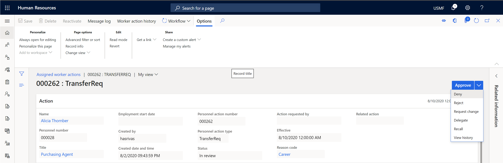

---
# required metadata

title: What's new or changed in Dynamics 365 Human Resources (September 16, 2020)
description: This topic describes features that are either new or changed in Microsoft Dynamics 365 Human Resources for September 16, 2020.
author: jcart1106
ms.date: 09/16/2020
ms.topic: article
ms.prod: 
ms.technology: 

# optional metadata

ms.search.form: 
# ROBOTS: 
audience: Application User
# ms.devlang: 
ms.search.scope: Human Resources
# ms.tgt_pltfrm: 
ms.custom: 
ms.assetid: 
ms.search.region: Global
# ms.search.industry: 
ms.author: jcart
ms.search.validFrom: 2020-09-16
ms.dyn365.ops.version: Human Resources

---

# What's new or changed in Dynamics 365 Human Resources (September 16, 2020)

[!include [Applies to Human Resources](../includes/applies-to-hr.md)]

This topic describes features that are either new or changed in Dynamics 365 Human Resources. Changes apply to build number 8.1.3557. The numbers in parentheses next to some features refer to Lifecycle Services (LCS) support numbers for reference.

## Included in this release

-  [Saved views - general availability](/dynamics365-release-plan/2020wave2/finance-operations/finance-operations-crossapp-capabilities/saved-views--general-availability) - For more information, see 
[Saved views](../fin-ops-core/fin-ops/get-started/saved-views.md). 

- The **Position actions** form has an updated dimensions grid and new dialogue (469495).

- If you set **Restrict access to worker information** to yes in **Advanced access** in **Human Resources Shared parameters**, benefits forms now show only the appropriate workers (393384).

- New calendar generation options in the **WorkCalendar** entity (477055): - Default ending time -	Default starting time -	Is Friday working day -	Is Monday working day -	Is Saturday working day - Is Sunday working day - Is Thursday working day - Is Tuesday working day - Is Wednesday working day - Work calendar holiday ID

- The **LeaveBankTransactionV1** entity now includes the reason code (477823).

- You can now save task recordings (492923).

- Data is now published successfully from **HCMWorkerContactEntity** (427620).

- The **Compensation** fast tab now displays for the contractor worker type in the **Worker actions** form (482494).

- The **Level** and **Plan** fields are now mandatory if you set **Fixed compensation**. An error message displays if you leave these fields blank (482497).

- The **Plan type** field in **Benefits** is now a dropdown list (488768).

- System administrators now receive a notification if a custom field is deleted from Human Resources (481408).

- During the terminate employee process, Human Resources behaves as expected and doesn't change the selected company after appearing to lock (479877). 

- Managers can no longer add a number column through personalization (485317).

- Managers can no longer remove the data range filter from identification numbers expiring (485321).

- When the **Reports to** field is empty, position details still display when hovering over the position (433328).

- Employees can now view benefit plan information in Employee self service (481676).

- Employees can now see all registered courses (429048).

- You can now restrict viewing options for the **Professional certificates** page. You can restrict viewing options to the current legal entity, by worker status, and by worker type (451501). 

## In Preview

### Human Resources app in Teams

Employees can view and request time away from work within Microsoft Teams. They can interact with a bot to create leave requests. For more information, see:

- [Employee leave and absence experience in Microsoft Teams](/dynamics365-release-plan/2020wave1/dynamics365-human-resources/employee-leave-absence-experience-teams) in the Dynamics 365 2020 release wave 1 plan
- [Human Resources app in Teams](./hr-admin-teams-leave-app.md) in Human Resources documentation

### Human Resources app in Teams preview features
 
-  **Notifications**: Submitters and approvers of time-off requests will be notified in the Human Resources app in Teams. Approvers can approve or deny time-off requests. Submitters will be notified if the request was approved or denied. For more information, see:
   - [Employee leave and absence experience in Microsoft Teams](/dynamics365-release-plan/2020wave2/human-resources/dynamics365-human-resources/employee-leave-absence-experience-teams) in the Dynamics 365 2020 release wave 2 plan
   - [Enable notifications for the Human Resources app in Teams](./hr-admin-teams-leave-app.md#enable-notifications-for-the-human-resources-app-in-teams) in Human Resources documentation
   - [Turn Teams notifications on or off for individual users](./hr-admin-teams-leave-app.md#turn-teams-notifications-on-or-off-for-individual-users) in Human Resources documentation
   - [Teams notifications](./hr-teams-leave-app.md#respond-to-teams-notifications) in Human Resources documentation
   - [View your team's leave calendar](./hr-teams-leave-app.md#view-your-teams-leave-calendar) in Human Resources documentation
 
- **Manager time-off calendar**: Managers can see approved and pending time off for their direct reports in a calendar view. This view provides an easy understanding of when their team members are away from work. For more information, see:
   - [Employee leave and absence experience in Microsoft Teams](/dynamics365-release-plan/2020wave2/human-resources/dynamics365-human-resources/employee-leave-absence-experience-teams) in the Dynamics 365 2020 release wave 2 plan
   - [View your team's leave calendar](./hr-teams-leave-app.md#view-your-teams-leave-calendar) in Human Resources documentation

### Configuration option to position Work items assigned to me list (477004)

A new option is now available to position the **Work items assigned to me** list in the right-hand column of the dashboard. With this change, all work items and to do lists display in the same area. Enable this functionality by turning on **Preview - Workflow experience enhancements** in Feature management. For more information about turning on preview features, see [Manage features](hr-admin-manage-features.md).

This feature also promotes the workflow options that appear in the personnel actions forms. Workflow options also appear above the action fast tab for quick access. For more information, see: 

- [Organization and personnel management workflow experience enhancements](/dynamics365-release-plan/2020wave2/human-resources/dynamics365-human-resources/organization-personnel-management-workflow-experience-enhancements) in the Dynamics 365 2020 release wave 2 plan

### Leave and absence calendar

This release includes additional calendar options for leave and absence calendars. For more information, see [View team and company calendars](./hr-employee-self-service-calendar.md).

## Coming Soon

### Checklist entities included in Dataverse

Checklist entities for Onboarding, Offboarding, Transfers, and Business processes will be available soon in Dataverse.

### Benefits management reason codes

Benefits management reason codes will soon be combined with existing reason codes in Human Resources. If you created reason codes in Benefits management that are over 15 characters, you must change the name of the reason code in the Benefits management **Reason codes** form to be 15 characters or less. After you update the name, the reason code will appear under the existing reason code form in Personnel management. This change will be available in the future and won't affect existing functionality.

## See also

[What's new or changed in Human Resources](hr-admin-whats-new.md) 
[Overview of Dynamics 365 Human Resources 2019 release wave 2](/dynamics365-release-plan/2019wave2/dynamics365-human-resources/) 
[Update process](hr-admin-setup-update-process.md) 
[Manage features](hr-admin-manage-features.md)

[!INCLUDE[footer-include](../includes/footer-banner.md)]
