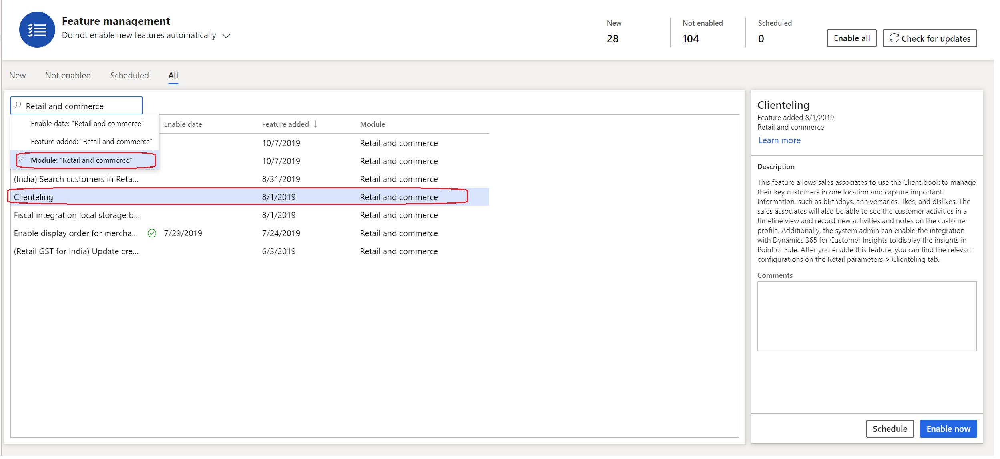
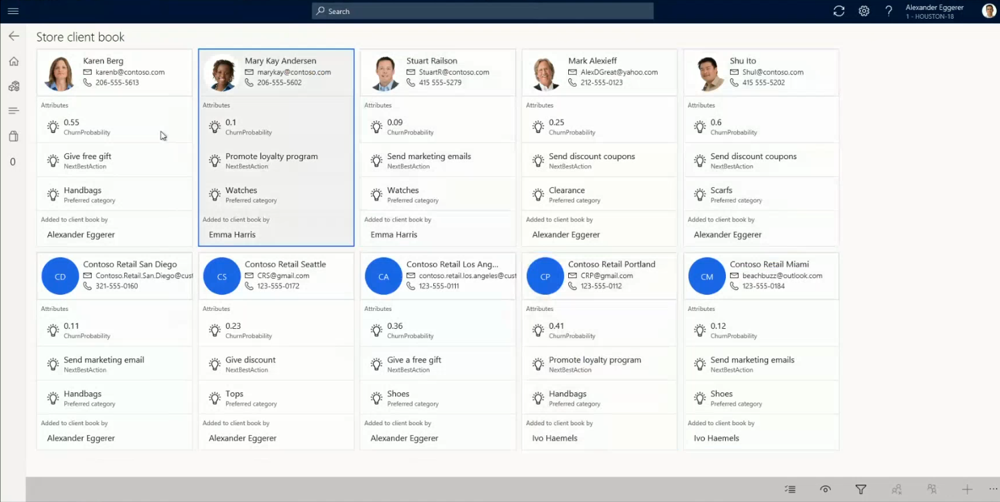

---
# required metadata

title: Clienteling overview
description: This topic provides an overview of new clienteling capabilities available in the retail store application.
author: bebeale
manager: AnnBe
ms.date: 10/17/19
ms.topic: article
ms.prod: 
ms.service: dynamics-365-retail
ms.technology: 

# optional metadata

ms.search.form: 
# ROBOTS: 
audience: Application User
# ms.devlang: 
ms.reviewer: josaw
ms.search.scope: Core, Operations, Retail
# ms.tgt_pltfrm: 
ms.custom: 260624
ms.assetid: a4f9d315-9951-451c-8ee6-37f9b3b15ef0
ms.search.region: global
ms.search.industry: Retail
ms.author: shajain
ms.search.validFrom: 2018-10-01
ms.dyn365.ops.version: Version 10.0.7

---

# Clienteling overview

[!include [banner](includes/banner.md)]

Many retailers, especially high-end specialty retailers, want their sales associates to form long term relationships with their key customers. The sales associates are expected to know about their customer's likes and dislikes, purchase history, product preferences, important dates such as anniversary, birthday etc. The associates need a place to capture such information and easily find the information when needed. Once this information is available in a single view, then the associates can easily target the customers that meet certain criteria for e.g. find all the customers that prefer to shop for Handbags, find customers for whom an important live event such as birthday, anniversary, graduation etc. is approaching. 

## Client book
Retailers can now leverage the Client book feature to enable their store associates to form long term relationships with the key customers. Each store associate can have one Client book per legal entity, and they can add one or more customers to their client book. With the first release, a customer can only be added to a single client book, but we do foresee a need for adding a customer to multiple client books and thus this restriction would be relaxed in future. The information captured for the customers, managed in a client book, is generally much richer than the regular customers. Thus, to capture such information, the retailers can create new attributes and group them together. These new attributes, along with the standard customer attributes, will only be visible for the customers present in a client book. For all other customers, the standard customer attributes will be displayed on the customer details page of Point of Sale (POS).
The customer card on the Client book shows the contact information of the customer along with three additional properties. The retailer can decide what are the three most important things that the sales associate should know about the customer. These three things can be configured from the HQ. For e.g. a jewelry retailer might want to include important date events as the information to show on the customer card as, generally, these are the occasions when people buy jewelry. Similarly, a fashion retailer might want to display the preferred category and preferred brands on the customer card. The client book also enables the sale associates to filter the list to show the customers that meet certain criteria. For e.g. if a new collection of shoes have arrived in the store and store associate wants to communicate with customers that prefer to buy shoes, then the associate can filter the client book to such customers and then take further action.
The sales associates, with right permissions, can optionally remove customers from their client book for cases when the customer, for any reason, is not considered a key customer and thus should not be managed closely.   
For retailers who do not want to manage customers at the sales associate level and rather would want to manage a list of key customers at the store level, then they can use the operation “View customers from store client books”. This operation displays the customers from the client books of all the store associates whose address book matches the address book of the current store. Thus, if an associate works in multiple stores of the legal entity, then the client book would display the customers from all the stores where the sales associate works. This operation supports additional capabilities such as reassigning customers from one sales associate to another. This is helpful for scenarios when a sales associate is transferred or leaves the company.

> [!NOTE]
> Unlike the customer search, the client book does not filter out customers based on store’s address books. 

# Activities and Notes
Online channels today can understand customer preferences without customers explicitly providing this information. However, when customers interact with the sales associates in the store, they provide this information explicitly, but it gets lost after the sale is over. This information, if recorded, can help the retailers better understand the customer, provide better recommendations and provide better shopping experience. Thus, to capture this critical information, the sales associates can not only use the client book attributes, but also use the Activities and Notes to capture such interactions with the customer. The retailers can configure the activity types using which the associates can capture the activities. Some examples of activity types can be Store visit, Email, Phone, Appointment, etc. The activities created by the sales associates can be viewed in a timeline format on POS and by navigating to the All customers > General > Activities tab in HQ. The sales associates can also use Notes to capture generic customer information which could be easily referenced before every customer interaction. These notes are saved in HQ and can be easily viewed on the customer profile by navigating to the attachments for the customer. These are also displayed on the customer details page on call center.

> [!NOTE]
> With the first release, all the notes and activities are visible all the sales associates of the legal entity who can view the customer details page. In other words, the information is not restricted to the associates who have added the customer to the client book. 

# Integration with Dynamics 365 Customer Insights
By using the Dynamics 365 Customer Insights application, retailers can easily aggregate their data from various systems by which their customers interact with the retailer’s brand and use this data to generate a single view of the customer and derive insights. With the integration of this system with Dynamics 365 Retail, the retailers can now choose one or more measures to display on the customer card of the client book. For e.g. retailers can use the data in the Customer Insights application to calculate the Churn probability for each customer and define the Next best action for the customers. If these values are defined as measures, then these can be displayed on the customer card of the client book. Thus, providing crucial information at your sales associate’s fingertips. You can learn more about the Dynamics 365 Customer Insights here: https://docs.microsoft.com/en-us/dynamics365/ai/customer-insights/overview and know more about the Measures here: https://docs.microsoft.com/en-us/dynamics365/ai/customer-insights/pm-measures

# Setup
To enable these new Clienteling capabilities in your environment follow the below steps:
- Navigate to the Feature management workspace and filter the features by “Retail and commerce” module (refer the image “Enable_clienteling” below)

. 

- Navigate to the Number sequence tab under Retail Parameters and assign a number sequence to the “Client book identifier”. This is used by the system to assign a client book ID.
- Create a new attribute group containing the attributes that you want to capture for the customers managed within the client book. Mark the required attributes as “Can be refined” so that the sales associates can filter the client book based on these attributes. Additionally, set the display order for these attributes. This display order will be used to determine which attributes should be displayed on the customer card of the client book. The display order 1 is considered higher than display order 2, so the attribute with display order 1 will be displayed prior to the attribute with display order 2. To know more about the attributes and attribute groups refer the article https://docs.microsoft.com/en-us/dynamics365/retail/attribute-attributegroups-lifecycle

> [!NOTE]
> The Dynamics 365 Customer Insights can also be enabled from the above form, but it requires creation of an Azure Application ID and Secret for authentication purposes. This is covered at the end of this article. If Dynamics 365 Customer Insights is enabled and you choose one or more measures to display on the customer card, then these measures will be displayed first, followed by the client book attribute groups based on the display order. For e.g. if you choose two measures from the Customer Insights, then one client book attribute with the highest display order will be displayed on the customer card.

- Associate the newly created attribute group to the “Client book attribute group” property under “Retail parameters > Clienteling”. Refer the image “Client_book_attributes” below. 
. 

- To capture the activities in POS, you can define the activity types. Navigate to the Retail > Customers > Activity types form. 
Note: The activity types are pulled by the retail server by making a real time call for the first time and then is cached for a few hours. So, if you make a change to the Activity types, either wait for the cache to invalidate or, for non-production environments, restart the Retail server service 
- Add two new buttons to the appropriate POS Screen layout to enable sales associate to view their client book and view the client book for the store i.e. clients from all the client books of the associates that share an address book with the store. These operations are named “View customers in client book” and “View customers from store client books” respectively. You will find three more new operations related to client book which govern which sales associates can Add/Remove/Reassign customers from the client book. These operations are named “Add customer to client book”, “Remove customers from client book” & “Reassign customers to a client book” respectively.
- Run the distribution schedule jobs numbered, 1040, 1150, 1110, and 1090. 
Now, the sales associates can navigate to the customer details page on POS and add customers to their client book, view and capture activities/notes for the customers, and target customers by filtering the client book based on customer and client book attributes (refer the image “Client_book” below).

# Set up for enabling integration of Dynamics 365 Customer Insights with Dynamics 365 Retail
To enable the integration with Dynamics 365 Customer Insights you must ensure you have an active instance of Dynamics 365 Customer Insights in the tenant where the Dynamics 365 Retail is provisioned and you need to have an AAD user account which has an Azure subscription.
Follow the below steps to complete the setup: 
1.	Register an app in Azure portal – This is the Application that will be used to authenticate with the Dynamics 365 Customer Insights. Refer the App registration documentation here: https://docs.microsoft.com/en-us/azure/active-directory/develop/quickstart-register-app. You also need to generate a secret for this application and note it for later use. You will also need to select expiration duration for the secret. Please take the necessary steps to remember to change the secret before expiration to avoid the integration to stop unexpectedly.
2.	Create an Azure key vault and save the App secret– Refer the Azure Key Vault documentation here: https://docs.microsoft.com/en-us/azure/key-vault/quick-create-portal
3.	Enable access to Key Vault from Dynamics 365 Retail – To enable Dynamics 365 Retail to access the secret from the Azure key vault you need an application ID and secret. This application can be the same application that was created in step 1 or it could be a new application. In other words, you can either use the application created in step 1 for both Azure Key Vault access and Customer Insights service access, or create unique applications for Customer Insights service access and accessing Azure Key Vault. To enable an application to access Azure Key Vault refer the documentation here: https://docs.microsoft.com/en-us/azure-stack/user/azure-stack-key-vault-store-credentials?view=azs-1908#create-a-service-principal
4.	Navigate to the Key Vault parameters form in HQ under System Administration > Setup and provide the required information of the created Key Vault and set the application ID used in step 3 as the Key Vault Client so that the Dynamics 365 Retail can access the secrets in the Key Vault; 
5.	To whitelist the application created in step 1 navigate to the Dynamics 365 Customer Insights application and provide “View” access to the App – Refer the documentation here: https://docs.microsoft.com/en-us/dynamics365/ai/customer-insights/pm-permissions
6.	Navigate to the Retail parameters > Clienteling tab and the next steps will be done on this screen:
a.	Set the application ID used in step 1 as the Application ID and choose the name of the Key Vault secret created in step 4 as the Secret name
b.	Set the configuration “Enable Customer Insights” to Yes. If the setup fails for any reason, then an error message will be displayed, and the Enable Customer Insights configuration will be set to No.
c.	You might have multiple environments in Dynamics 365 for Customer Insights e.g. Test, Prod etc. Select the right environment as the “Environment instance ID”
d.	In the Alternate customer ID field you need to select the property of the Dynamics 365 Customer Insights which is mapped to the Customer Account number i.e. customer ID of Dynamics 365 Retail
e.	The remaining three properties are the measures which will be displayed on the Customer card of the client book. You can choose zero or more measures to show on the customer card. As mentioned in the document above, the system first shows these values followed by the attributes of the client book attribute group.

