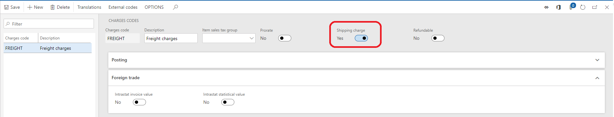

---
# required metadata

title: Loyalty overview
description: This topic describes the shipping discount capabilities within Microsoft Dynamics 365 for Retail and the corresponding setup steps required to start using these discounts.
author: scott-tucker
manager: AnnBe
ms.date: 03/13/2019
ms.topic: article
ms.prod: 
ms.service: dynamics-365-retail
ms.technology: 

# optional metadata

ms.search.form: RetailShippingThresholdDiscounts, RetailPriceDiscGroup
# ROBOTS: 
audience: IT pro/system admin
# ms.devlang: 
ms.reviewer: josaw
ms.search.scope: Core, Operations, Retail
# ms.tgt_pltfrm: 
ms.custom: 16201
ms.assetid: f79559d2-bc2d-4f0b-a938-e7a61524ed80
ms.search.region: global
ms.search.industry: Retail
ms.author: scotttuc
ms.search.validFrom: 2019-01-31
ms.dyn365.ops.version: AX 7.0.0, Retail July 2017 update

---

# Shipping discount overview

[!include [banner](includes/banner.md)]

This topic provides an overview of the shipping promotion capability available within Microsoft Dynamics 365 for Retail. Free or discounted shipping is one of the highly influencing factors driving the customers’ online purchase decisions. Many retailers also leverage the free shipping benefit to motivate the customers to increase their basket size, thus increasing the revenue per transaction.  With the 10.0 release of Microsoft Dynamics 365 for Retail, retailers can use “Retail shipping threshold discount” to define the thresholds, which once met, will qualify the customers for discounted or free shipping. For example, spend $50 or more to get free ‘Overnight shipping’ or sign up for the loyalty program and get free 'Two day shipping' etc. 

This feature leverages the advanced auto charges capability which was available in the call center and e-Commerce modules but has now been made available in POS as well. Refer to [Omni-channel advanced auto charges](https://docs.microsoft.com/en-us/dynamics365/unified-operations/retail/omni-auto-charges). These advanced auto charges need to be enabled for shipping promotion to work. These can be enabled by turning on the "Use advanced auto-charges" configuration present on the **Retail parameters** > **Customer orders** tab. Retailers can use the advanced auto charges feature to set various types of charges such as handling, installation, disposal etc. however, the shipping discount is only applied to the shipping charges. Thus, the retailer needs to specify which of the charges are shipping charges. To specify a charge as Shipping charge, navigate to **Retail** > **Retail IT** > **Channel setup** > **Charges** > **Charge codes** form and turn on the "Shipping charge" checkbox on the desired charges. Refer the image below. This concludes the prerequisite for using the Retail shipping threshold discount. 

Next step would be to configure the shipping discount itself. To do so, navigate to the **Retail** > **Pricing and discounts** > **shipping discounts** > **Retail shipping threshold discount** form, define the thresholds, set the discount percent that should be applied once the thresholds are met and choose a mode of delivery for which this discount applies e.g. Standard overnight, Two day shipping etc. Refer the image below.

Like product discounts, this discount honors all the existing standard discount capabilities, such as allowing the retailer to restrict these discounts with the coupons so that only the customers with coupons can get these discounts. Also, these discounts leverage the Price groups capability to determine the eligibility of the discount. For example, the retailer can choose to run these promotions only in the online channels and/or across channels for certain customer groups such as loyalty customers. Lastly, to view the charges applied on the sales lines and the applied promotion, you need to add the operation “Manage charges” on the POS screen. Navigate to the “Screen layout” form to make those changes. Now run the job 1020, 1040, 1090 and 1110 to send the charges, shipping promotion and screen layout information to the channels. 

When the cashier creates a customer order on POS or customer places an order on e-Commerce website, the charges are calculated automatically. However, if the mode of delivery on the order meets the mode of delivery and the transaction amount meets the threshold set on the retail shipping threshold discount, then the shipping discount gets applied. Currently, the shipping discounts apply on the POS and e-Commerce orders only, but work is underway to bring these discounts to the call center orders as well by the 10.0.2 release of Dynamics 365 for Retail. 

> [!Note]
> Unlike product discounts such as quantity, simple, mix and match, and threshold discounts, the shipping discount does not create discount lines, rather edits the shipping charge directly and appends the name of the discount to the charge description. 
