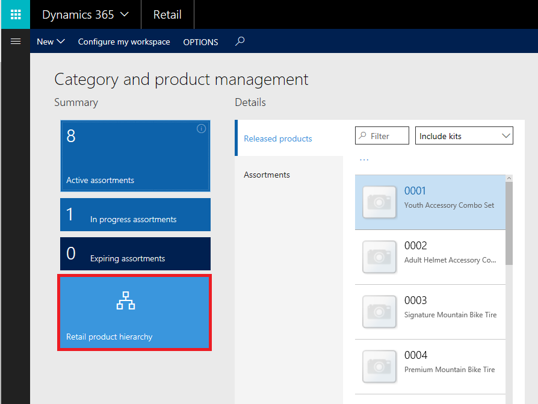
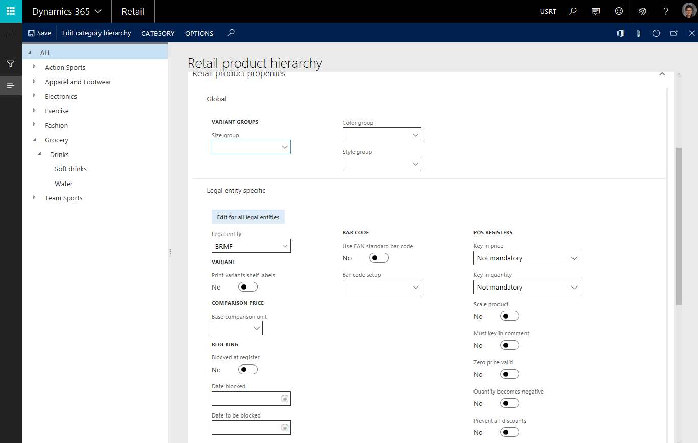
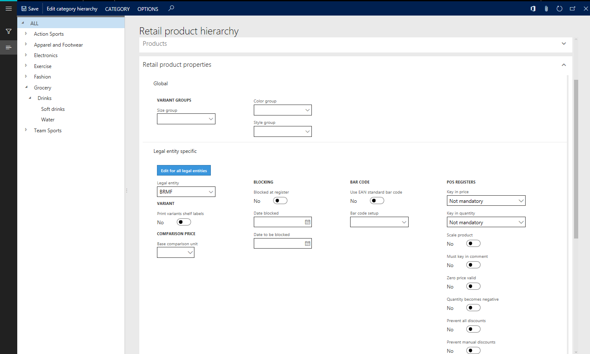
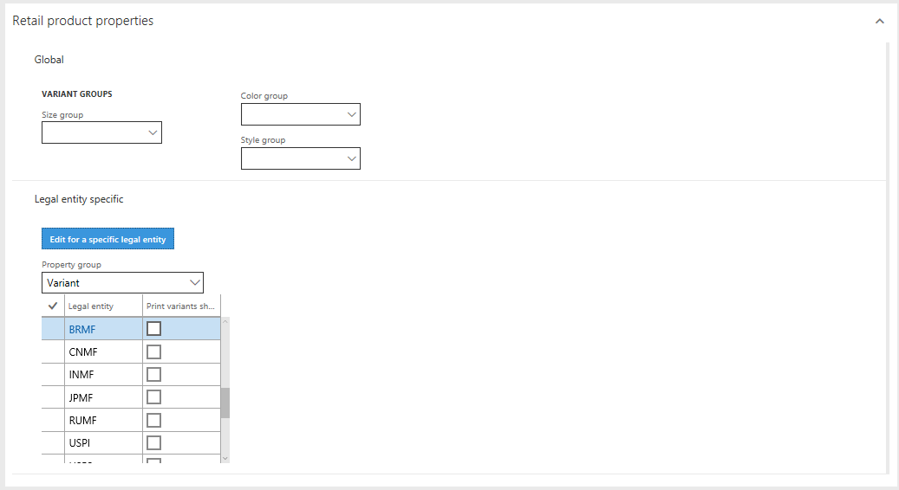
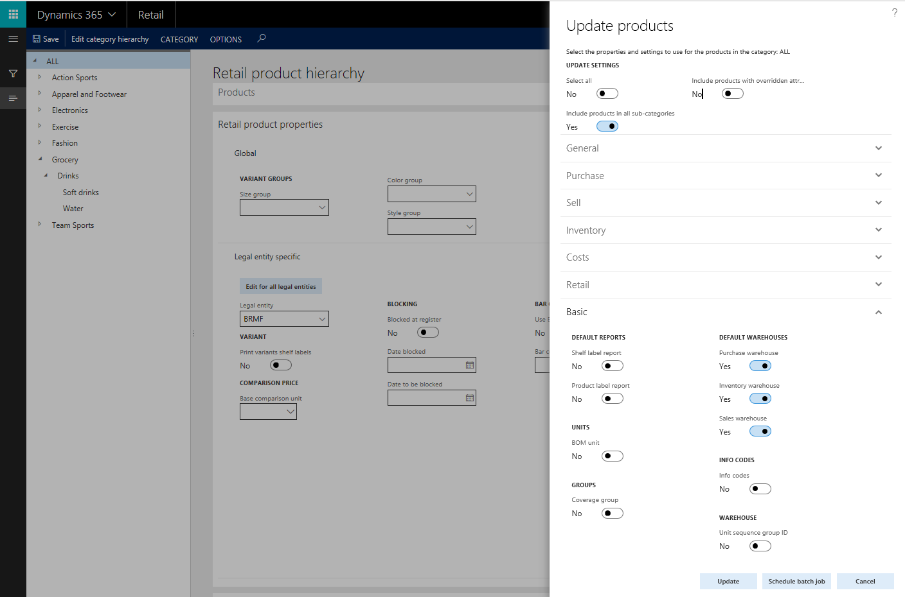

---
# required metadata

title: Product category management 
description: This topic describes how merchandising managers can use Retail product categories to manage relationships between Retail product hierarchy and released product details. 
author: ashishmsft
manager: AnnBe
ms.date: 10/23/2017
ms.topic: article
ms.prod: 
ms.service: dynamics-ax-applications
ms.technology: 

# optional metadata

# ms.search.form: 
# ROBOTS: 
audience: Application User
# ms.devlang: 
ms.reviewer: josaw
ms.search.scope: Core, AX 7.0.0, Operations, UnifiedOperations, Retail
# ms.tgt_pltfrm: 
ms.custom: 
ms.assetid: c7ed2ba5-87c6-4d99-9728-2a83e6d95ca9
ms.search.region: global
ms.search.industry: Retail
ms.author: asharchw
ms.search.validFrom: 2017-09-01
ms.dyn365.ops.version: AX 7.0.0, Retail July 2017 update
---

# Manage Retail product categories and products

[!include[banner](./includes/banner.md)]

This topic describes an enhanced way to manage Retail product categories and products in Dynamics 365 for Retail. These enhancements let merchandising managers view a common structure of product properties between Retail product hierarchy and released product details.

To learn more about managing Retail product categories, go to **Retail product hierarchy** from the **Category & product management** workspace, and note the enhanced structure of the **Retail product category** page.

In previous versions, product properties were divided into **Basic product properties** and **Retail product properties**, based on the scope of their applicability. **Retail product properties** were *global* by scope of applicability, which means that for a given **Retail product property**, the same value is shared across all legal entities. **Basic product properties** are *legal entity specific*. In other words, for a given **Basic product property** the value can differ across legal entities, based on individual business requirements.

In the enhanced Retail product category structure, product properties are logically separated based on their applicability within a group, to reflect the released product details form structure.

You can switch between managing legal-entity specific properties across all legal entities and managing them for a specific legal entity. To do this, select either **View/Edit for all legal entities** or **View/Edit for a specific legal entity**.

  

Compared to previous versions, in the new Retail product category structure a merchandising manager can also define default values for an additional set of product properties at an individual category level. At the time of product creation, these default product property values are inherited by a product, based on their association with an individual category from Retail product hierarchy. These inherited product properties can also be modified for each product, to meet individual business requirements.

## Select properties to update products from the Retail product category form 
 
You can use this new enhanced structure for product properties to select which updated product properties must be pushed to associated products. From the menu bar of the Retail Product Category Hierarchy, choose CATEGORY then Update products to land on this view below. 

 
