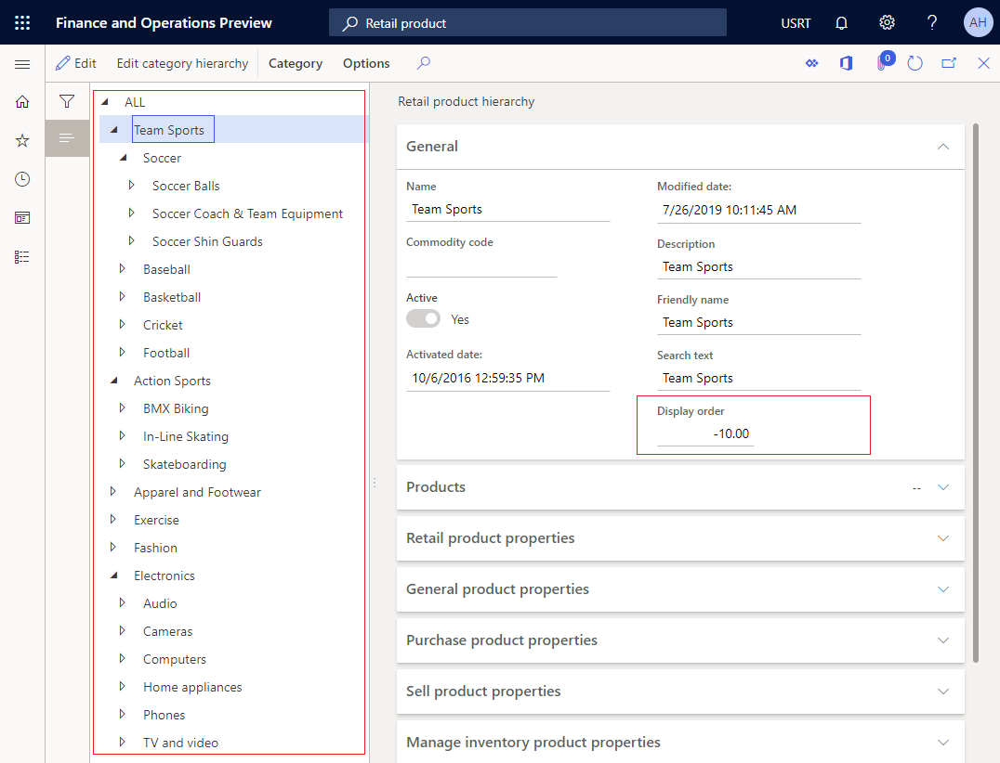
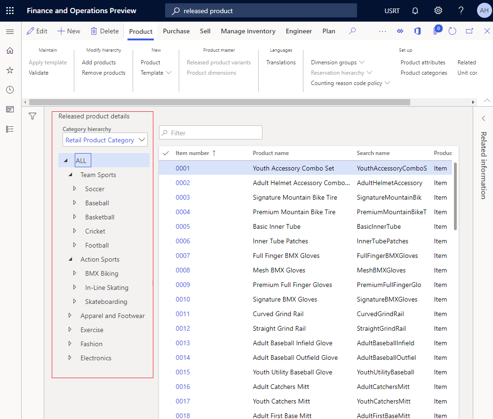
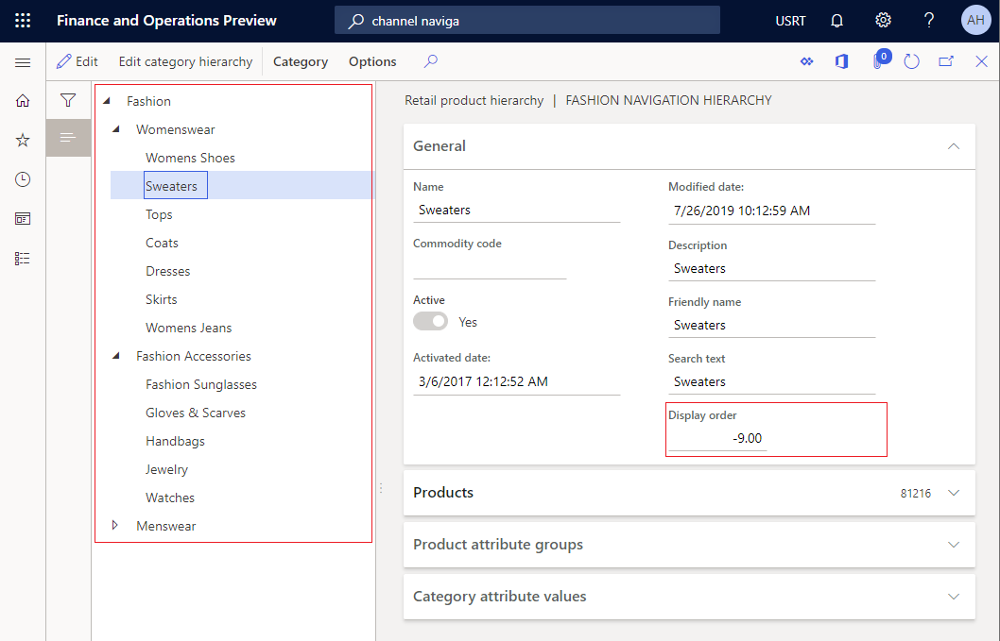
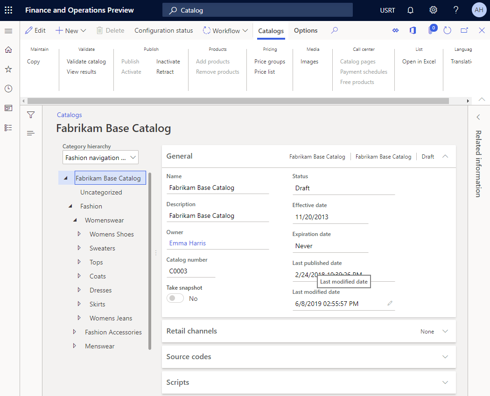
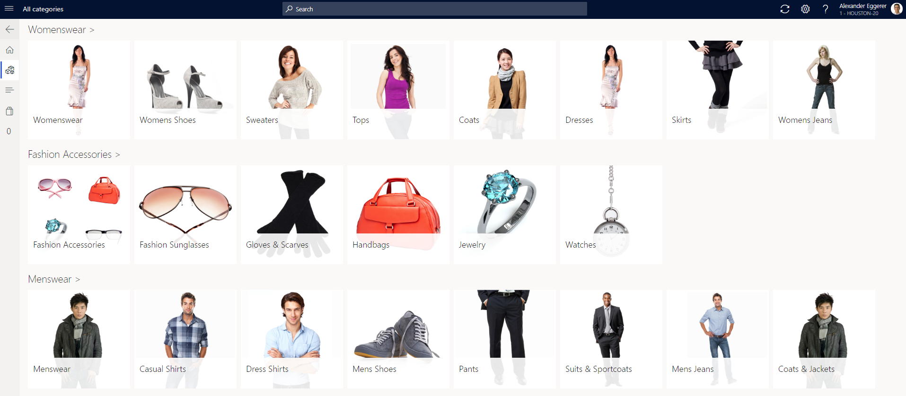

---
# required metadata

title: Change the sort order for merchandising entities
description: This topic explains the concepts that are related to configuring display order for various merchandising entities in Dynamics 365 for Retail.
author: ashishharchwani
manager: AnnBe
ms.date: 07/23/2019
ms.topic: article
ms.prod: 
ms.service: dynamics-365-retail
ms.technology: 

# optional metadata

ms.search.form: Category, Retail product hierarchy, Navigation hierarchy
# ROBOTS: 
audience: Application User
# ms.devlang: 
ms.reviewer: josaw
ms.search.scope: Core, Operations, Retail
# ms.tgt_pltfrm: 
ms.custom: 
ms.search.region: global
ms.search.industry: Retail
ms.author: rubendel
ms.search.validFrom: 2016-11-30
ms.dyn365.ops.version: Version 1611

---

# Change the sort order for merchandising entities

[!include [banner](includes/banner.md)]

Retailers consider product discovery as a primary tool for customer interaction across all retail channels. Product discoverability functionality includes browsing though categories, searching, and filtering, and is an easy way for customers to discover products. 

This topic explains the concepts that are related to controlling the display order for various merchandising entities, and how to change the sort order. 

## Overview
Support for sorting various merchandising-related entities was enhanced to better align with existing customer scenarios previously required extensions from implementation partners. 

In versions of Retail earlier than 10.0.5, the sort order for categories in the navigation hierarchy was alphabetical. 

The new custom sort order functionality empowers the merchandising manager to configure the sort order for various merchandising entities across all end-user clients, including headquarters (HQ) and call centers.

## Configure the display order for categories in Retail product hierarchy 

You must have demo data installed on your environment to do the following. 
1.	Go to **Retail > Products and categories > Retail product hierarchy**.
1.	Click **Edit category hierarchy**.
1.	Click **Edit**.
1.	In the tree, expand 'ALL\Action Sports'.
1.	In the tree, expand 'ALL\Team Sports'.
1.	In the **Display order field**, enter a number (the number can be a negative value).
1.  Repeat for any additional categories you want to change the order of. 

The display order for the channel navigation hierarchy is acknowleged in HQ for **Retail product hierarchy** and **Released products by category**.

### Configure the display order for categories in channel navigation hierarchy

You must have demo data installed on your environment to do the following. 
1.	Go to **Retail > Products and categories > Channel navigation categories**.
1.	In the list, find and select the 'Fashion navigation' hierarchy
1.	Click **Edit category hierarchy**.
1.	Click **Edit**.
1.	In the tree, select 'Fashion\Womenswear\Womens Shoes'.
1.	In the **Display order** field, enter a number.
1.	In the tree, select 'Fashion\Womenswear\Tops'.
1.	Likewise, you can define the sort order for the sub-categories. 
1.  In the tree, expand 'Fashion\Menswear'.
1.	In the tree, select 'Fashion\Menswear\Casual Shirts'.
1.	In the **Display order** field, enter a number.
1.	In the tree, select 'Fashion\Menswear\Coats & Jackets'.
1.	In the **Display order** field, enter a number.
1.  Repeat for any additional categories you want to change the order of. 

The display order for the channel navigation hierarchy is acknowleged in HQ, catalog, and Retail channels.

> [!NOTE]
> By default this feature is turned off. To learn how to turn this and other features on, see [Feature management](https://docs.microsoft.com/en-us/dynamics365/unified-operations/fin-and-ops/get-started/feature-management/feature-management-overview).
