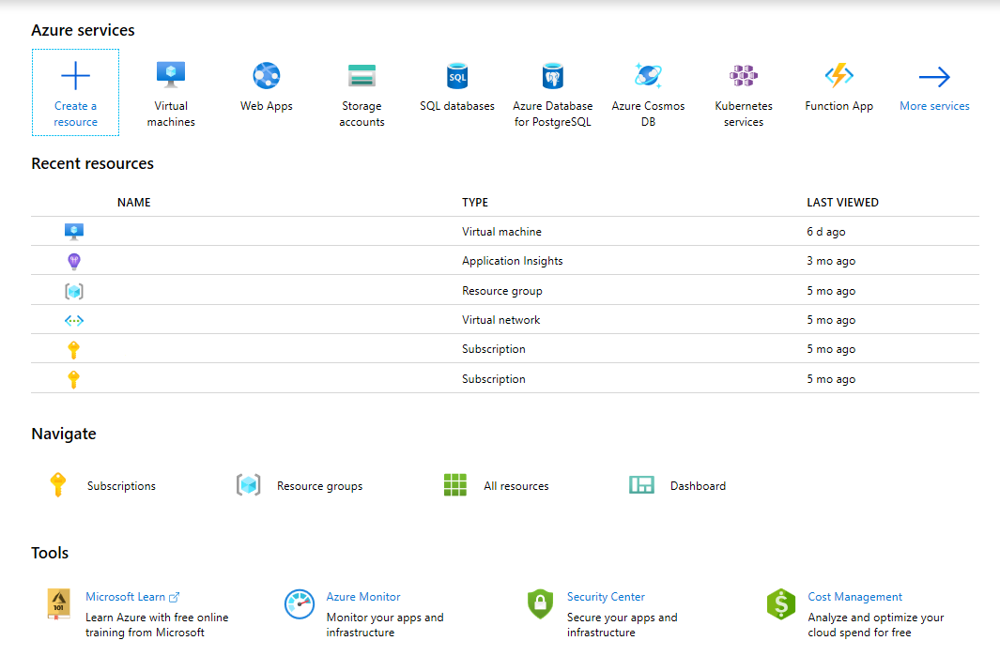
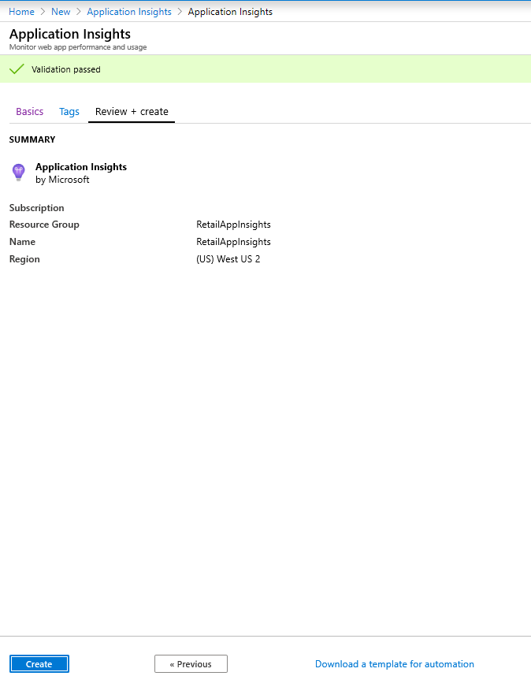
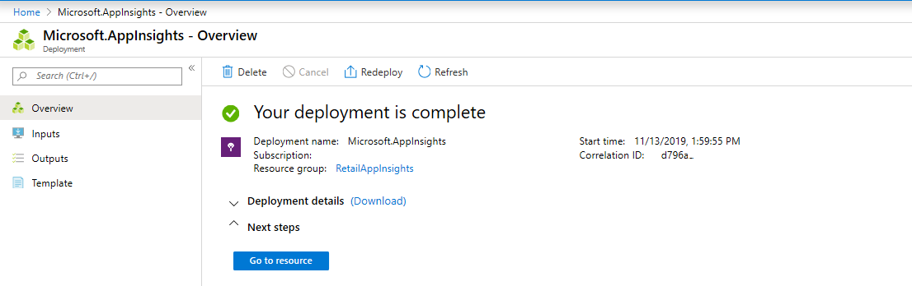
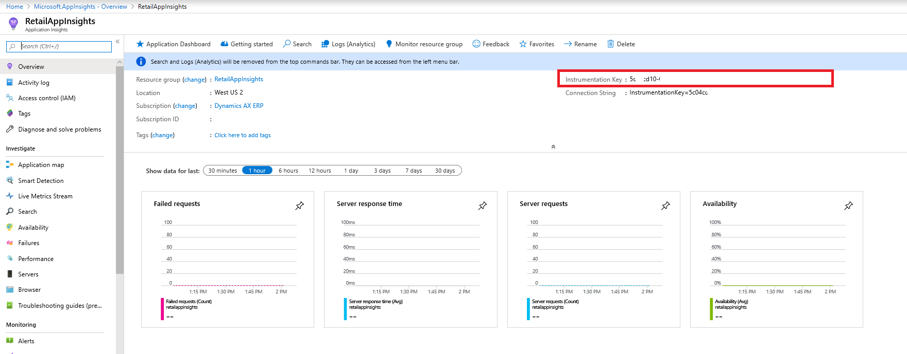

---
# required metadata

title: Log extension events to Application Insights
description: This document helps to understand how to log events to Customer Application Insights from Commerce runtime (CRT) extensions.
author: mugunthanm
manager: AnnBe
ms.date: 11/15/2019
ms.topic: article
ms.prod: 
ms.service: dynamics-365-retail
ms.technology: 

# optional metadata

# ms.search.form: 
# ROBOTS: 
audience: Developer
# ms.devlang: 
ms.reviewer: rhaertle
ms.search.scope: Operations, Retail
# ms.tgt_pltfrm: 
ms.custom: 28021
ms.assetid: 
ms.search.region: Global
# ms.search.industry: 
ms.author: mumani
ms.search.validFrom: 2019-08-2019
ms.dyn365.ops.version: AX 10.0.7

---

# Log extension events to Application Insights

[!include [banner](../includes/banner.md)]

This document helps to understand how to log events to Customer Application Insights from Commerce runtime (CRT) extensions. More details on Application Insights can be found [here](https://docs.microsoft.com/en-us/azure/azure-monitor/app/app-insights-overview).

**Follow the below steps on how to log event to Customer Application Insights.**

1.  Setup the Application Insights in Azure portal and generate the instrumentation key.

2.  Extend CRT to log events to the Application Insights using the instrumentation key generated during Application Insights creation.

Note: The RetailLogger class is not supported anymore, existing extension using this class must migrate to this new model.

**Setup and Configure Application Insights in Azure:**

1.  Go to <https://portal.azure.com> and log in using your Azure subscription credentials.
2.  Click on “Create a resource” .
    
3.  Search for “Application Insights.”
    > [!div class="mx-imgBorder"]
    > 
4.  Click the “Create” button and fill out the form (Subscription, Resource group, Name, Region).
    
    
5.  Click the “Review + create” button and then click the “Create” button and wait for the deployment to complete.
    
    
6.  Go to the resource and copy the Instrumentation Key.  This value will be used in the CRT code or CRT ext configuration file.
    

**Extend Commerce Runtime extension project to log events to the Application Insights:**

1.  Create a new C\# class library project and name is as Contoso.Diagnostic.
    
2.  Add reference to the below libraries:
-   Microsoft.ApplicationInsights
-   Netstandard
-   Microsoft.Dynamics.Commerce.Runtime.Framework

> **Note:** Please install the [Application Insights SDK for ASP.NET Core](https://nuget.org/packages/Microsoft.ApplicationInsights.AspNetCore) to get the Microsoft.ApplicationInsights assembly reference. Reference to Microsoft.Dynamics.Commerce.Runtime.Framework can be added from ..\\RetailSDK\\Reference folder.

3.  Add a new class file and name it as ContosoLogger. Inside the file copy paste the below code:

```C#
using Microsoft.ApplicationInsights;
using Microsoft.ApplicationInsights.Extensibility;
using Microsoft.Dynamics.Commerce.Runtime;
using Microsoft.Dynamics.Commerce.Runtime.Extensions;

namespace Contoso.Diagnostic
{
    public static class ContosoLogger
    {
        private static readonly object lockObject = new object();
        private static TelemetryClient client = null;
        public static TelemetryClient GetLogger(RequestContext context)
        {
            if (client == null)
            {
                lock (lockObject)
                {
                    if (client == null)
                    {
                        string key = context.Runtime.Configuration.GetSettingValue("ext.AppInsightsKey");
                        client = new TelemetryClient(new TelemetryConfiguration(key));
                    }
                }
            }
            return client;
        }
    }
}
```
4.  Build this project and copy the output library and Microsoft.ApplicationInsights.dll and paste it in ..\\RetailServer\\webroot\\bin\\Ext for manual deployment and testing.
5.  Open the the CommerceRuntime.Ext.config file form ..\\RetailServer\\webroot\\bin\\Ext and update the &lt;settings&gt; section with the Applications Insights instrumentation key generated earlier. For example:
```xml
 <add name="ext.AppInsightsKey" value="b32fa526-7155-4e42-ac48"/>;
```

6.  Restart your Retail Server.

**Consume the ContosoLogger in CRT extension:**

1.  To consume the ContosoLogger in the extension, add the ContosoDiagnostic and Microsoft.ApplicationInsights assembly reference to the extension project.
2.  To log events, use the TraceTelemetry class and create the traces. For example:
```C#
using Contoso.Diagnostic;
using Microsoft.ApplicationInsights.DataContracts;

var trace = new TraceTelemetry("CRT executing request", SeverityLevel.Information);
trace.Properties.Add("CustomDimensionColumn1", request.RequestContext.GetTerminalId().ToString());
trace.Properties.Add("CustomDimensionColumn2", "CRT demo - Save Cart request");
ContosoLogger.GetLogger(request.RequestContext).TrackTrace(trace);
```

**Note:** Trace properties are custom dimension, that can be added to query the traces easily.

**Validate the trace events:**

1.  Go to <https://portal.azure.com> and log in using your Azure subscription credentials
2.  Navigate to the Application Insights instance and select Logs (Analytics) under Monitoring which will open a new query editor.
    
3.  Under the Schema menu, double-click on “traces.”  This will add it to the query editor.  Note that the default Time range is “Last 24 hours.”
   
4.  Click on the Run button to execute the query, the logged event will show up in the results.
   

**Build the deployable package:**

Detailed information on building deployable can be found in the below link:

<https://docs.microsoft.com/en-us/dynamics365/retail/dev-itpro/retail-sdk/retail-sdk-packaging>

1.  Copy the Contoso.Diagnostic and Microsoft.ApplicationInsights assemblies to the …\\RetailSDK\\References folder.
2.  Update the BuildTools\\Customization.settings file and add the following entries in the &lt;ItemGroup&gt; section:

```xml
<ISV_CommerceRuntime_CustomizableFile Include="$(SdkReferencesPath)\\Contoso.Diagnostic.dll" />
<ISV_CommerceRuntime_CustomizableFile Include="$(SdkReferencesPath)\\Microsoft.ApplicationInsights.dll" />;
```

3.  Open an MSBuild Command Prompt for VS2015 and execute the build command in the root of your RetailSDK folder:
4.  Enter the following command to generate the RetailDeployablePackage: msbuild /t:rebuild
5.  Locate the Retail deployable package in the RetailSDK\\Packages\\RetailDeployablePackage folder.  Navigate the content.folder folder and make sure that your three files made it into the package:  Packages\\RetailDeployablePackage\\content.folder\\RetailServer\\Code\\bin\\ext

6.  Upload the deployable package to your LCS shared asset library.
7.  Go to your environment’s main page in LCS and click on Environment Features &gt; Retail &gt; Manage.
8.  Click on Apply Extension and select the extension from your library.
9.  After the extension has successfully deployed, open an instance of MPOS or CPOS that has been activated against that RCSU. 
10.  Execute the extension scenario created with custom Application Insights logging.
11.  Refresh the query in Application Insights to verify that the traces from the extension are logged correctly.
