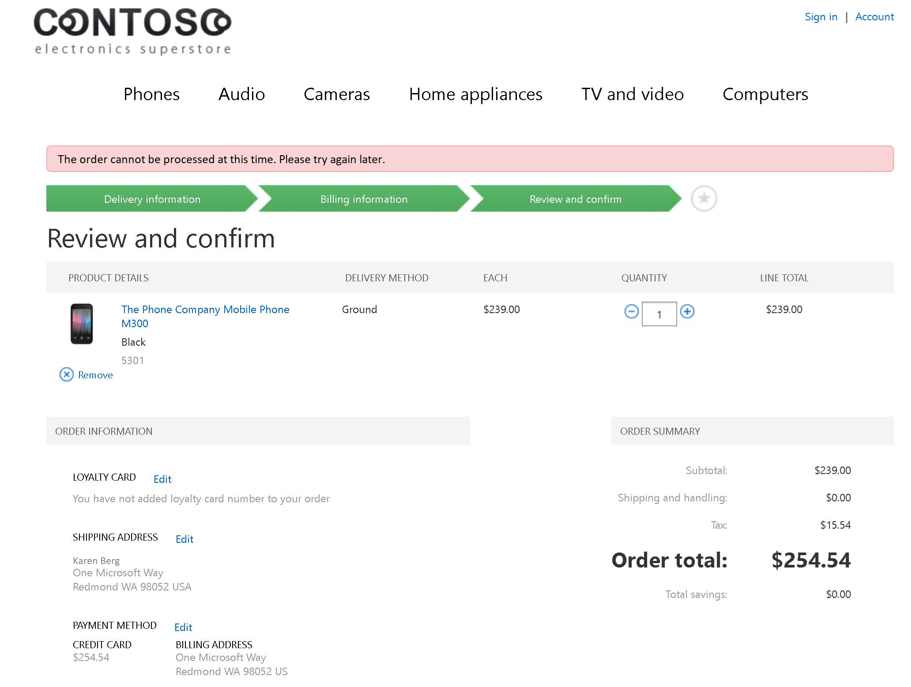
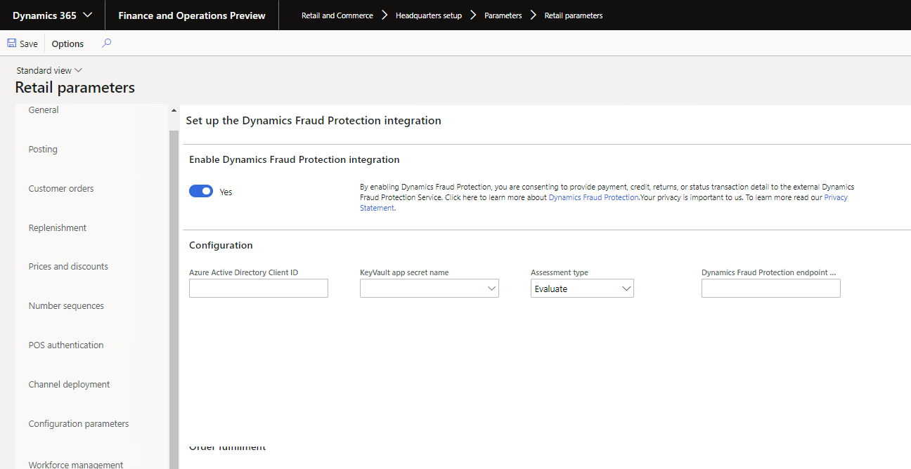

---
# required metadata

title: Dynamics 365 Fraud Protection integration
description: This topic describes out-of-box integrations available for Dynamics 365 Fraud Protection with Dynamics 365 Commerce. 
author: rubendel
manager: AnnBe
ms.date: 01/06/2020 
ms.topic: article
ms.prod: 
ms.service: dynamics-365-retail
ms.technology: 

# optional metadata

# ms.search.form: 
# ROBOTS: 
audience: IT Pro
# ms.devlang: 
ms.reviewer: 
ms.search.scope: Operations, Retail, Commerce
# ms.tgt_pltfrm: 
ms.custom: 141393
ms.assetid: e23e944c-15de-459d-bcc5-ea03615ebf4c
ms.search.region: Global
ms.search.industry: Retail
ms.author: rubendel
ms.search.validFrom: 2019-01-01
ms.dyn365.ops.version: 10.0.8

---

# Dynamics 365 Fraud Protection integration for Commerce
<!-----------I want marketing and Fraud protection to review this.-------------->
[!include [banner](../includes/preview-banner.md)]
[!include [banner](../includes/banner.md)]

This topic describes out-of-box integrations between Dynamics 365 Commerce and Dynamics 365 Fraud Protection.

## Key terms

| Term | Description |
|---|---|
| Purchase protection | The Fraud Protection module that analyzes purchases for fraud based on risk levels determined by the merchant. |
| Storefront | The e-commerce storefront provided out of box with Dynamics 365 Commerce. |

## Overview

Microsoft Dynamics 365 Fraud Protection is a service dedicated to offering fraud protection solutions that help retailers prevent fraudulent activity and identify where fraud may be going unnoticed. This article describes out-of-box integrations between Commerce and Fraud Protection. It will be updated as new integrations between the two services are shipped in future releases. For more information about Fraud Protection, including modules that aren't yet supported by an out-of-box integration with Commerce, please visit the Fraud Protection [landing page](https://dynamics.microsoft.com/en-us/ai/fraud-protection/). You many also [request a call back](https://dynamics.microsoft.com/en-us/get-started/?appname=fraudprotection) from a Dynamics 365 sales representative to discuss how Fraud Protection can help boost profitability, reduce operational expenses, and improve customer experiences.

## Purchase protection in Dynamics 365 Commerce

### Purchase protection overview

The first generally available offering from Fraud Protection is a purchase protection service. This offering allows merchants to log into the Fraud Protection dashboard for their organization and configure risk rules for online purchases. Based on the settings configured by the merchant in DFP, e-commerce transactions are can then be validated with DFP prior to being sent for payment authorization. When orders are sent to the Fraud Protection purchase protection module, Fraud Protection analyzes the purchase and provides a risk assessment based on merchant-configured fraud rules, AI driven insights, and consortium-based fraud analytics. If the fraud score returned for an order exceeds a merchant's risk tolerance, the DFP will instruct the storefront to reject the order. If an order is not rejected, Fraud Protection will return a fraud score that can be used by the storefront to determine the next steps in order fulfillment. Those steps might include placing the order on hold for manual review or follow-up with the customer who placed the order.

### Purchase protection integration supported capabilities

#### Purchase event
Upon general availability of Commerce, the purchase protection integration will support receiving a Fraud Protection risk assessment and terminating the order in the online storefront. 

The flow for such an event is as follows:

1. Storefront customer adds items to the basket and proceeds to checkout.
2. Customer fills in shipping and payment details.
3. Upon completion of prerequisites, customer clicks **Place order**.
4. Order details are sent to Fraud Protection for purchase protection assessment. 
5. If merchant rules defined in Fraud Protection determine the order should be rejected, a response is sent to the storefront and the order is terminated.

When an order is terminated as a result of Fraud Protection purchase protection, the user sees an error stating: "The order cannot be processed at this time. Please try again later."

Alternatively, if the order is deemed to be approved based on the rules configured by the merchant in the Fraud Protection portal, then the response from Fraud Protection to the storefront includes the risk score and reason code determined by Fraud Protection. For the initial integration, that Fraud Protection assessment is not used in any way and the response for both "Approve" and "Reject" scenarios is not saved in any way. 

Rejected orders are not sent to payment processors for authorization and do not go through the order creation process in the back office. 

#### Bank event

If an online order is approved based on Fraud Protection assessment, the next step is to authorize payments for that order, if applicable. The result of those payment authorizations are referenced back to Fraud Protection with a correlation ID for the purchase event previously assessed. Using AI insights, these post-authorization results can rapidly boost the quality of future fraud protection assessments.  

#### Purchase status event

Similar to bank events, once an order is created in the Commerce back office, a signal is sent to Fraud Protection indicating that the order was created successfully. Both the bank event and purchase status event are informational events, meaning there is no response expected from Fraud Protection. 

### Availability
As of Dynamics 365 Retail version 10.0.8, Retail includes the Fraud Protection integration back office setup. However, the full out-of-box integration requires requires the storefront included in Commerce, which is currently in public preview. When Commerce becomes generally available, existing Retail customers will be able to update to Commerce. For more details, visit the [Dynamics 365 Commerce landing page](https://dynamics.microsoft.com/en-us/commerce/overview/). 

#### Setup

Enabling the out-of-box purchase protection integration requires a Fraud Protection environment. To get set up with Fraud Protection, [request a call back](https://dynamics.microsoft.com/en-us/get-started/?appname=fraudprotection) from a Dynamics 365 sales representative.

Once the merchant's Fraud Protection environment is available and purchase protection settings have been configured, the setup can continue in the Commerce back office.

##### Key vault setup

Part of the integration setup requires that a secret is used when Commerce communicates with Fraud Protection to get a purchase protection result. That secret must be stored using an Azure Key Vault client. Details around setting up and Key Vault client can be found by visiting the [Setting up Azure Key Vault Client](https://support.microsoft.com/en-us/help/4040305/setting-up-azure-key-vault-client) support topics. 

To reference the Fraud Protection certificate stored in Key Vault, that certificate must be referenced by key vault parameters in the Commerce back office. To do so, navigate to **Retail and Commerce** > **Headquarters setup** > **Parameters** > **Key Vault parameters** in Commerce.

Next, select the Key Vault URL used to store the DFP secret and click **Add**. Then specify the name, description, and path for the Key Vault secret that is used to authenticate Commerce when it sends orders for purchase protection assessment. 

##### Retail parameters setup

1. Go to **Retail and Commerce** > **Headquarters setup** > **Parameters** > **Retail parameters**.

2. Select the **Dynamics Fraud Protection** tab.

3. Set **Enable Dynamics Fraud Protection integration** to **Yes**. 

4. Expand the **Configuration** FastTab and add the Azure Active Directory (AAD) Client ID, then select the **Key Vault secret name** that was set up during Key Vault configuration. 

By default, the **Assessment type** will be set to **Evaluate**. When the integration is configured with assessment type in evaluate mode, Fraud Protection will passively check orders for fraud without actively rejecting those orders. This mode is provided for merchants to be able to compare Fraud Protection fraud assessments with incumbent fraud tools to understand the impact of Fraud Protection. 

Alternatively, the **Protect** assessment type can be enabled. When **Protect** is enabled, Fraud Protection will return "Reject" assessments and fraudulent orders will be stopped before being sent for authorization or created in the back office. 

5. The **Dynamics Fraud Protection endpoint URL** must be specified. This URL is provided by Fraud Protection and will be different across UAT and production environments. 

> [!NOTE]
> The Key Vault and Fraud Protection settings are company specific. When enabling Fraud Protection for production environments, the AAD Client ID is not entered through the user interface. Instead, enabling Fraud Protection for production environments requires a [serivce request](https://docs.microsoft.com/dynamics365/fin-ops-core/dev-itpro/lifecycle-services/submit-request-dynamics-service-engineering-team). When creating a support request to enable Fraud Protection for production, clearly indicate in the title that the request is to configure Fraud Protection purchase protection for a production Commerce or Retail environment. 

## Privacy Notice

Enabling this feature results in sharing certain of your data such as payment, credit, returns, transaction status, or personal data with other Microsoft online services.  Fraud Protection’s purchase protection assessments are not stored by the Retail or Commerce online services.  Your privacy is important to us. To learn more, read our [Privacy Statement](https://go.microsoft.com/fwlink/?LinkId=521839).

## Related articles

- [Payments FAQ](https://docs.microsoft.com/dynamics365/unified-operations/retail/dev-itpro/payments-retail)
- [Dynamics 365 payment data use](https://docs.microsoft.com/dynamics365/retail/payment-connector-data-fields)
