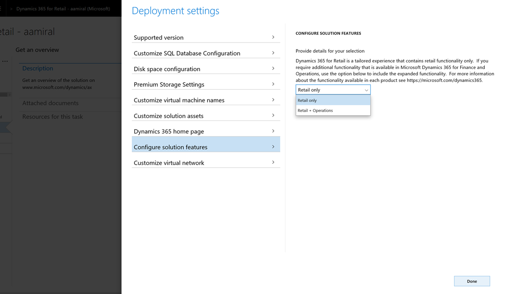

---
# required metadata

title: Deployment options
description: This topic explains the differences in the retail functionality between Dynamics 365 for Retail and Dynamics 365 for Finance and Operations.
author: ashishmsft 
manager: AnnBe
ms.date: 10/17/2017
ms.topic: article
ms.prod: 
ms.service: dynamics-ax-retail
ms.technology: 

# optional metadata

# ms.search.form:  [Operations AOT form name to tie this topic to]
audience: IT Pro
# ms.devlang: 
# ms.reviewer: sericks
ms.search.scope: Retail, Operations 
# ms.tgt_pltfrm: 
# ms.custom: [used by loc for topics migrated from the wiki]
ms.search.region: Global
# ms.search.industry: retail
ms.author: asharchw
ms.search.validFrom: 2017-06-30 
ms.dyn365.ops.version: Retail July 2017 update 
---

# Deployment options

Retail functionality is available in the following products:
 
- Dynamics 365 for Retail
- Dynamics 365 for Finance and Operations
 
Dynamics 365 for Retail contains core retail functionality that is typically used by most retailers. This tailored functionality improves productivity and helps to ease the on-boarding and training processes for your employees. 

With Dynamics 365 for Retail, you also have the option to enable additional functionality. This means that you could deploy a Dynamics 365 for Retail enviroment that has the same functional footprint as a Dynamics 365 for Finance and Operations environment.
 
The following table lists the key differences between Dynamics 365 for Retail and Dynamics 365 for Finance and Operations.

| Capability   |  Dynamics 365 for Retail   |  Dynamics 365 for Finance and Operations  |
|--------------|----------------------------|-------------------------------------------|
|Receive app model updates seamlessly. (App model updates do not need to be compiled or merged with your customizations.) | Yes | No|
|Receive retail channel component updates seamlessly. (Retail channel components updates do not need to be merged with your customizations.) | Yes | Yes |
|Deploy a solution that is scoped to provide retail funitonality only. | Yes  | No  |
|Optimize your financials and operations to drive growth and make real-time, data-driven decisions with an intelligent, modern enterprise business application.| No*  \* You can enable additional functionality with a Unified Operations license or P1 license. | Yes |

When you first visit Lifecycle Services (LCS) after acquiring the necessary licenses for your tenant, you will be prompted to choose an implementation project type, which is where you must select **Dynamics 365 for Retail** or **Dynamics 365 for Finance and Operations**. You can use the above considerations to choose the right product to deploy.
 
As indicated in the table above, if you choose to deploy Dynamics 365 for Retail--and you have the necessary licenses--you will have the option, at deployment time, to configure the solution: 

- If you want the solution scoped to retail functionality only, select **Retail only**. 
- If you want to enable additionaly functionality, select **Retail + Opertions**.
 

