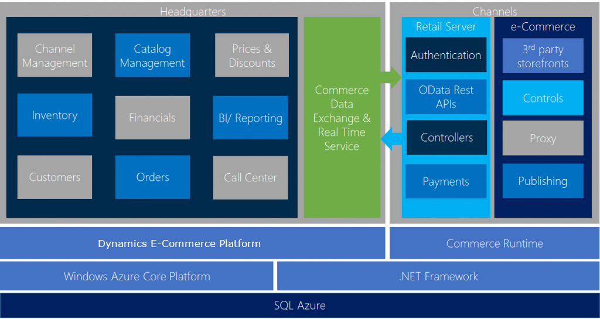

---
# required metadata

title: e-Commerce platform
description: This topic provides an overview of e-Commerce capabilities.
author: kfend
manager: AnnBe
ms.date: 02/19/2019
ms.topic: article
ms.prod: 
ms.service: dynamics-365-retail
ms.technology: 

# optional metadata

# ms.search.form: 
# ROBOTS: 
audience: Developer
# ms.devlang: 
ms.reviewer: rhaertle
ms.search.scope: Operations, Retail
# ms.tgt_pltfrm: 
ms.custom: 18511
ms.assetid: 032233a8-dbc7-4946-a0cb-26db1b3e7d3f
ms.search.region: Global
# ms.search.industry: 
ms.author: meeram
ms.search.validFrom: 2016-02-28
ms.dyn365.ops.version: AX 7.0.0, Retail July 2017 update

---

# e-Commerce platform

[!include [banner](../includes/banner.md)]

This topic provides an overview of e-Commerce capabilities.

Microsoft Dynamics 365 Retail includes a fully-integrated omni-channel e-Commerce platform that enables third-party online stores to easily plugin and create a full-featured e-commerce site. The platform includes a rich shopping cart and checkout features that support cross channel scenarios. In addition, the platform can create a single customer identity and enable managing the customer account, order history, wish lists, and loyalty through the online store. The e-Commerce experience is integrated with a highly-scalable Retail server that exposes all required customer experiences. The platform supports integrated payments and Open ID integration to provide seamless user authentication. By using this suite of e-Commerce features, you can centrally manage products, merchandizing, and order fulfillment for all aspects of your online sales channel. The following image shows how an external online store can integrate with the Dynamics E-Commerce platform. 

 

The following table describes each component.

| **Component**          | **Function**                                                                                                                                                                                                                                                                                                                                                                                                                                        |
|------------------------|-----------------------------------------------------------------------------------------------------------------------------------------------------------------------------------------------------------------------------------------------------------------------------------------------------------------------------------------------------------------------------------------------------------------------------------------------------|
| Retail headquarters    | Centrally manage and configure the online store, products, merchandizing, and order fulfillment in the Retail headquarters. The headquarters provides a single place to create, configure and manage the online store. For more information, see [Retail overview](https://docs.microsoft.com/dynamics365/unified-operations/retail/index).                                                                                                                                                                                                                             |
| Commerce Data Exchange | Commerce Data Exchange includes several components that are used to exchange data between Microsoft Dynamics 365 Retail and the online store. This supports a distributed architecture. For more information, see [Commerce Data Exchange and retail channel communications](https://docs.microsoft.com/dynamics365/unified-operations/retail/dev-itpro/define-retail-channel-communications-cdx).                                                                                                                                                                                                                                                    |
| Retail Server          | Retail Server is a set of OData Web API over the commerce runtime that supports all customer services required for e-Commerce. This includes Shopping cart, order management, shipping prices, taxes, wish lists, customer account management, and loyalty. The Retail Server also supports integration with Open ID connect providers for customer authentication. Payment integration is supported to both out-of-the-box and external providers. For more information, see [Retail Server architecture](https://docs.microsoft.com/dynamics365/unified-operations/retail/dev-itpro/retail-server-architecture).   |
| Publishing             | The Dynamics e-Commerce platform supports exporting the data into an external online- specific data store that supports advanced capabilities for search as needed by the online store. This is supported as publishing API that can be integrated into a publisher that can run periodically in the CMS. This supports both delta and full publish. For more information, see [Retail online store publishing architecture](https://docs.microsoft.com/dynamics365/unified-operations/retail/dev-itpro/retail-online-store-publishing-architecture).                                                                |
| Proxy                  | The Proxy is auto-generated in C\# and is used by the e-Commerce platform to communicate to the Retail Server. For more information, see [Retail proxy](https://docs.microsoft.com/dynamics365/unified-operations/retail/dev-itpro/typescript-proxy-retail-pos).                                                                                                                                                                                                                                                                                                                                        |
| Controls               | A set of ASP.NET MVC controls are available for checkout, shopping cart, mini shopping cart, delivery picker, and order confirmation. Controls are also available for customer login and order history. ASP.NET online stores can directly embed these controls. Online stores implemented using other technologies can integrate with the controllers layer available in the e-Commerce SDK.                                                       |
| 3rd party storefront   | A sample ASP.NET online store is available on both demo and developer topologies and is part of the SDK. This shows how third-party storefronts can integrate to the platform.                                                                                                                                                                                                                                                                      |

