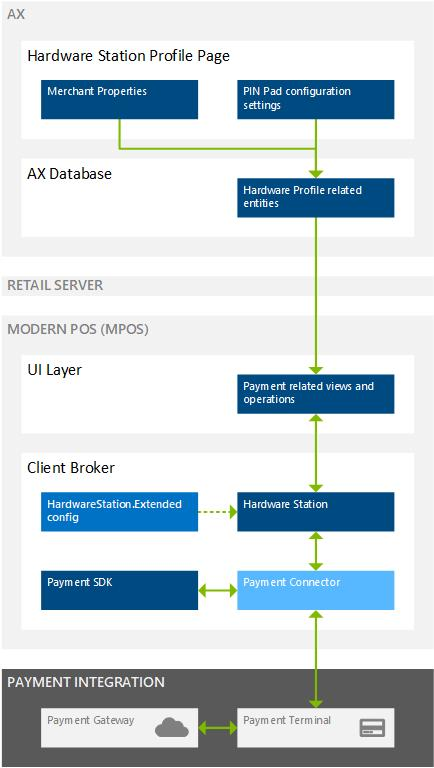
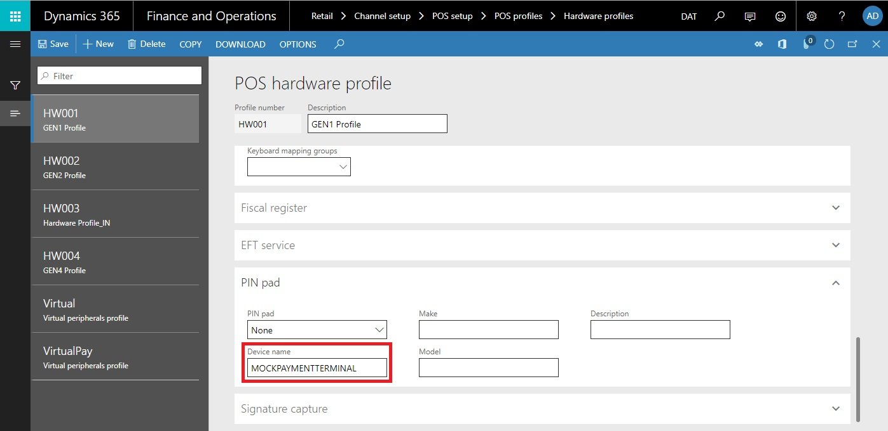
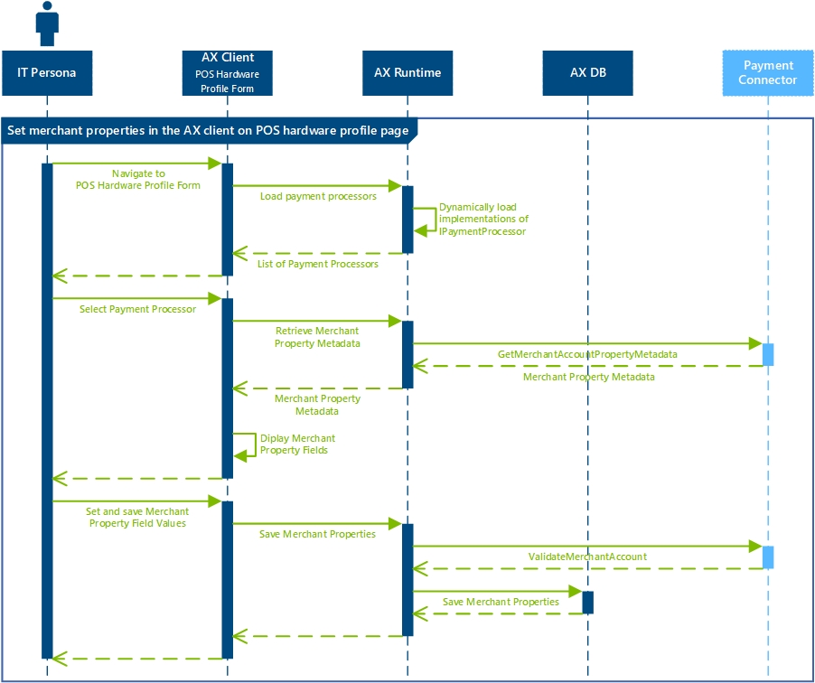
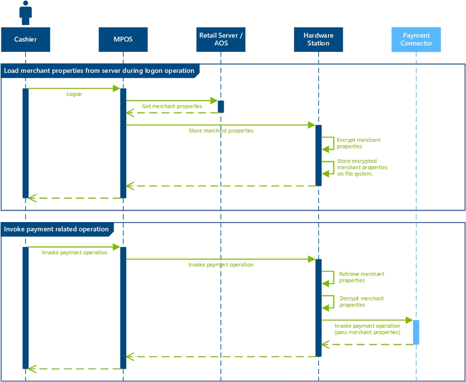

---
# required metadata

title: Create an end-to-end payment extension
description: 
author: 
manager: AnnBe
ms.date: 02/21/2018
ms.topic: article
ms.prod: 
ms.service: dynamics-365-retail
ms.technology: 

# optional metadata

# ms.search.form: 
# ROBOTS: 
audience: Developer
# ms.devlang: 
ms.reviewer: josaw
ms.search.scope: Operations, Retail
# ms.tgt_pltfrm: 
ms.custom: 
ms.search.region: Global
ms.search.industry: Retail
ms.author: rassadi
ms.search.validFrom: 2018-02-28
ms.dyn365.ops.version: AX 7.0.0, Retail July 2017 update

---

# Payment integration with payment terminal
This topic describes how to write a payment integration for the Dynamics 365 for Retail Modern POS (MPOS) for a payment terminal that can directly communicate with the payment gateway.

## Key Terms
| Term | Description |
| --- | --- |
| Payment Connector | Extension library written to integrate the MPOS with a payment terminal. |
| Payment Processor | Extension library written to retrieve merchant propeties used by the payment connector. |

## Overview
The diagram below provides a high level overview of the payment terminal integration through the MPOS. Note, the diagram assumes that a local Hardware Station is used to communicate with the payment terminal but the same patterns apply to the shared Hardware Station as well.



This article describes the following steps that are required to create an end-to-end payment integration for a payment terminal:
- **Write a payment connector**: The payment connector is the main integration point between the MPOS and the payment terminal. This section describes how to implement and configure a new payment connector that can relay payment requests (e.g. authorize, refund, void) to the payment terminal. 
- **Write a payment processor**: The payment processor is used to define the merchant properties used as part of the payment integration. This section describes how to implement a new payment processor, including interfaces to implement and patterns to follow.

## Write a payment connector
This section describes how to write a new payment connector.

### Understanding the payment flows
The following diagram illustrates a high level overview of several payment flows (i.e. Begin Transaction, Update Cart Lines, Authorize, Capture, End Transaction) across the MPOS, Hardware Station, and payment connector.


### Implement a payment connector
The section below describes how to implement a new payment connector. The examples shown below can be found in the `PaymentDeviceSample` class located under `SampleExtensions\HardwareStation\Extension.PaymentSample` folder in the Retail SDK.

#### Implement the INamedRequestHandler interface
All MPOS payment related flows are handled through request/response patterns in the Hardware Station. The first step in writing a new payment connector is to create a class that implements the `INamedRequestHandler` interface defined in the `Microsoft.Dynamics.Commerce.Runtime.Framework` library.

``` csharp
namespace Contoso.Commerce.HardwareStation.PaymentSample 
{ 
    public class PaymentDeviceSample : INamedRequestHandler
    {
        private const string PaymentTerminalDevice = "MOCKPAYMENTTERMINAL";
    
        /// <summary>
        /// Gets the specify the name of the request handler.
        /// </summary>
        public string HandlerName
        {
              get
            {
                return PaymentDeviceSample.PaymentTerminalDevice;
            }
        }
    }
}
```

The `HandlerName` is used to configure the payment connector used on a given MPOS register through the AX client (desccribed below).

#### Implement supported payment requests
In order to process payment related flows the payment connector has to define the `SupportedRequestTypes` that it can handle. Additionally, the `Execute` method has to be implemented to route each of the requests supported by the connector to a given method. The example below shows the complete list of `SupportedRequestTypes` and an example of a specific request (i.e. `Authorize`).

``` csharp
namespace Contoso.Commerce.HardwareStation.PaymentSample 
{ 
    /// <summary>
    /// <c>Simulator</c> manager payment device class.
    /// </summary>
    public class PaymentDeviceSample : INamedRequestHandler
    {
        /// <summary>
        /// Gets the collection of supported request types by this handler.
        /// </summary>
        public IEnumerable<Type> SupportedRequestTypes
        {
            get
            {
                return new[]
                {
                    typeof(OpenPaymentTerminalDeviceRequest),
                    typeof(BeginTransactionPaymentTerminalDeviceRequest),
                    typeof(UpdateLineItemsPaymentTerminalDeviceRequest),
                    typeof(CancelOperationPaymentTerminalDeviceRequest),
                    typeof(AuthorizePaymentTerminalDeviceRequest),
                    typeof(CapturePaymentTerminalDeviceRequest),
                    typeof(VoidPaymentTerminalDeviceRequest),
                    typeof(RefundPaymentTerminalDeviceRequest),
                    typeof(FetchTokenPaymentTerminalDeviceRequest),
                    typeof(EndTransactionPaymentTerminalDeviceRequest),
                    typeof(ClosePaymentTerminalDeviceRequest),
                    typeof(ActivateGiftCardPaymentTerminalRequest),
                    typeof(AddBalanceToGiftCardPaymentTerminalRequest),
                    typeof(GetGiftCardBalancePaymentTerminalRequest),
                    typeof(GetPrivateTenderPaymentTerminalDeviceRequest)
                };
            }
        }
        
        /// <summary>
        /// Executes the payment device simulator operation based on the incoming request type.
        /// </summary>
        /// <param name="request">The payment terminal device simulator request message.</param>
        /// <returns>Returns the payment terminal device simulator response.</returns>
        public Response Execute(Microsoft.Dynamics.Commerce.Runtime.Messages.Request request)
        {
            ThrowIf.Null(request, "request");
    
            Type requestType = request.GetType();
    
            if (requestType == typeof(AuthorizePaymentTerminalDeviceRequest))
            {
                return this.AuthorizePayment((AuthorizePaymentTerminalDeviceRequest)request);
            }
            else if (...)
            {
                ...
            }
    
            return new NullResponse();
        }
    
        /// <summary>
        /// Authorize payment.
        /// </summary>
        /// <param name="request">The authorize payment request.</param>
        /// <returns>The authorize payment response.</returns>
        public AuthorizePaymentTerminalDeviceResponse AuthorizePayment(AuthorizePaymentTerminalDeviceRequest request)
        {
            ThrowIf.Null(request, "request");
    
            PaymentInfo paymentInfo = Utilities.WaitAsyncTask(() => this.AuthorizePaymentAsync(request.Amount, request.Currency, request.VoiceAuthorization, request.IsManualEntry, request.ExtensionTransactionProperties));
    
            return new AuthorizePaymentTerminalDeviceResponse(paymentInfo);
        }
    }
}
```

#### Full list of supported requests
The list below descibes all supported requests types that a payment connector can implement.

| Request Class | Description |
| --- | --- |
| **OpenPaymentTerminalDeviceRequest** | Called before a sales transaction is initiated to establish a connection to the payment terminal. | 
| **BeginTransactionPaymentTerminalDeviceRequest** | Called when a new sales transaction is initiated to handle any initialization on the payment terminal (e.g. initializing transaction screen). | 
| **UpdateLineItemsPaymentTerminalDeviceRequest** | Called when line items on the cart are updated. | 
| **AuthorizePaymentTerminalDeviceRequest** | Called when a payment is initiated on the MPOS payment view. | 
| **CancelOperationPaymentTerminalDeviceRequest** | Called when a user hits the "cancel" button on the payment view dialog after the payment is initiated but before the payment is completed on the payment terminal. | 
| **CapturePaymentTerminalDeviceRequest** | Called for each payment line when the entire amount on the cart is paid and before the sales transaction is concluded. | 
| **VoidPaymentTerminalDeviceRequest** | Called when a payment line is voided on the cart. | 
| **RefundPaymentTerminalDeviceRequest** | Called when a refund is issued. | 
| **FetchTokenPaymentTerminalDeviceRequest** | Called to fetch a payment token to support deferred payments for customer orders. | 
| **EndTransactionPaymentTerminalDeviceRequest** | Called when the sales transaction is concluded and all payments have been captured. | 
| **ClosePaymentTerminalDeviceRequest** | Called after the sales transaction is concluded to close the connection to the payment terminal. | 
| **ActivateGiftCardPaymentTerminalRequest** | Called when an external gift card is being activated through the MPOS. | 
| **AddBalanceToGiftCardPaymentTerminalRequest** | Called when a balance is being added to an external gift card. | 
| **GetGiftCardBalancePaymentTerminalRequest** | Called to when the balance on the gift card is being retrieved. | 
| **GetPrivateTenderPaymentTerminalDeviceRequest** | TODO (add more details). | 

#### State in the payment connector
The payment connector can be either hosted as part of the `dllhost.exe` process when hosted through the in-proc Hardware Station inside the MPOS or as a `w3wp.exe` process when hosted in the IIS based Hardware Station. In either scenario there are circumstances under which each of these processes can be terminated or crash in between or in the middle of payment flows. As a result, it is recommended that payment connectors do not have state dependencies and can recover if terminated at any point in time during the payment flow related requests described above.

### Configure the payment connector in the Hardware Station config
In order to ensure that the payment connector is loaded by the Hardware Station the corresonding assembly reference has to be set on the `HardwareStation.Extension.config` found in the `Assets` folder in the Retail SDK.

``` xml
<?xml version="1.0" encoding="utf-8"?>
<hardwareStationExtension>
  <composition>
    <!-- 
    Register your own assemblies or types here.
    The the following example registers NewPeripheralDevice (and all its request handlers). Any other services are not being overridden:
    <add source="type" value="Contoso.Commerce.HardwareStation.NewPeripheralDevice, Contoso.Commerce.HardwareStation.NewPeripheralDevice" />
    <add source="assembly" value="Contoso.Commerce.HardwareStation.NewPeripheralDevice” />
    -->
    <add source="assembly" value="Contoso.Commerce.HardwareStation.PaymentSample" />
  </composition>
</hardwareStationExtension>
```

### Configure the payment connector on the AX client POS hardware profile form
In order to determine the right payment connector to load on the MPOS the value of the `PaymentTerminalDevice` property has to be set on the `Device` field in the `PIN Pad` section on the AX client POS hardware profile form as shown below.



## Write a payment processor
Payment processes are usually used only if a direct connection to a payment gateway is established as it is most commonly the case in card-not-present sales transactions or more involved card-present scenarios. Additionally, the payment processor is also used to process the merchant properties configured through the `POS hardware profile` form in the AX client. 

    > [!NOTE]
    > The payment processor is required today even if all payment requests are handled directly through the payment terminal and no merchant properties need to be set through the MPOS. 
    
### Understanding the merchant properties flows
The sections below describe how the merchant properties are set on the AX client POS hardware profile page and how they are passed to the payment connector during payment flows on the MPOS.

#### Set merchant properties in AX client POS hardware profile form
The diagram below illustrates how the merchant properties are set through the AX client POS hardware profile form. In order to enable the merchant properties to be set the `IPaymentProcessor` interface defined in the `Microsoft.Dynamics.Retail.PaymentSDK` library has to be implemented. The two required interface methods are `GetMerchantAccountPropertyMetadata` and `ValidateMerchantAccount`. 



#### Set merchant properties on payment connector during MPOS sales transaction
The diagram below illustrates how the merchant properties are retrieved from the AX DB through the Retail Server and passed to the payment connector during the `BeginTransactionPaymentTerminalDeviceRequest`.



### Implement the IPaymentProcessor interface
In order to handle merchant properties related payment flows the `IPaymentProcessor` interface defiend in the `Microsoft.Dynamics.Retail.PaymentSDK` library has to be implemented. The example below shows how to implement the two required interface methods `GetMerchantAccountPropertyMetadata` and `ValidateMerchantAccount`. Other interface methods can be left blak (e.g. return `FeatureNotSupportedException`).

``` charp
/// <summary>
/// SampleConnector class (Portable Class Library version).
/// </summary>
public class SampleConnector : IPaymentProcessor
{
     /// <summary>
     /// GetMerchantAccountPropertyMetadata returns the merchant account properties need by the payment provider.
     /// </summary>
     /// <param name="request">Request object.</param>
     /// <returns>
     /// Response object.
     /// </returns>
     public Response GetMerchantAccountPropertyMetadata(Request request)
     {
         string methodName = "GetMerchantAccountPropertyMetadata";

         // Check null request
         List<PaymentError> errors = new List<PaymentError>();
         if (request == null)
         {
             errors.Add(new PaymentError(ErrorCode.InvalidRequest, "Request is null."));
             return PaymentUtilities.CreateAndLogResponseForReturn(methodName, this.Name, Platform, locale: null, properties: null, errors: errors);
         }

         // Prepare response
         List<PaymentProperty> properties = new List<PaymentProperty>();
         PaymentProperty property;
         property = new PaymentProperty(
             GenericNamespace.MerchantAccount,
             MerchantAccountProperties.AssemblyName,
             this.GetAssemblyName());
         property.SetMetadata("Assembly Name:", "The assembly name of the test provider", false, true, 0);
         properties.Add(property);
		 
         Response response = new Response();
         response.Locale = request.Locale;
         response.Properties = properties.ToArray();
         if (errors.Count > 0)
         {
             response.Errors = errors.ToArray();
         }

         PaymentUtilities.LogResponseBeforeReturn(methodName, this.Name, Platform, response);
         return response;
     }

     /// <summary>
     /// ValidateMerchantAccount the passed merchant account properties with the payment provider.
     /// </summary>
     /// <param name="request">Request object to validate.</param>
     /// <returns>
     /// Response object.
     /// </returns>
     public Response ValidateMerchantAccount(Request request)
     {
         string methodName = "ValidateMerchantAccount";

         // Convert request
         ValidateMerchantAccountRequest validateRequest = null;
         try
         {
             validateRequest = ValidateMerchantAccountRequest.ConvertFrom(request);
         }
         catch (SampleException ex)
         {
             return PaymentUtilities.CreateAndLogResponseForReturn(methodName, this.Name, Platform, locale: request == null ? null : request.Locale, properties: null, errors: ex.Errors);
         }

         // Validate merchant account
         List<PaymentError> errors = new List<PaymentError>();
         ValidateMerchantProperties(validateRequest, errors);
         if (errors.Count > 0)
         {
             return PaymentUtilities.CreateAndLogResponseForReturn(methodName, this.Name, Platform, validateRequest.Locale, errors);
         }

         // Create response
         var validateResponse = new ValidateMerchantAccountResponse(validateRequest.Locale, validateRequest.ServiceAccountId, this.Name);

         // Convert response and return
         Response response = ValidateMerchantAccountResponse.ConvertTo(validateResponse);
         PaymentUtilities.LogResponseBeforeReturn(methodName, this.Name, Platform, response);
         return response;
     }
}
```

#### Required merchant property fields
The following table illustrates the required merchant property fields that have to be set as part of the `GetMerchantAccountPropertyMetadata` method.

| Merchant Property Field | Description |
| --- | --- |
| TODO | TODO |
