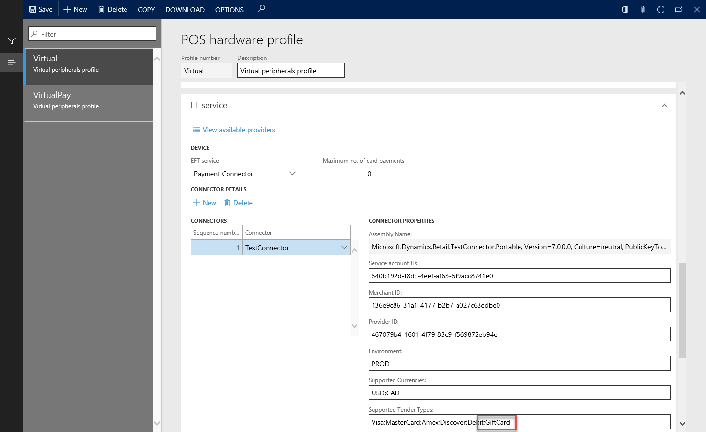
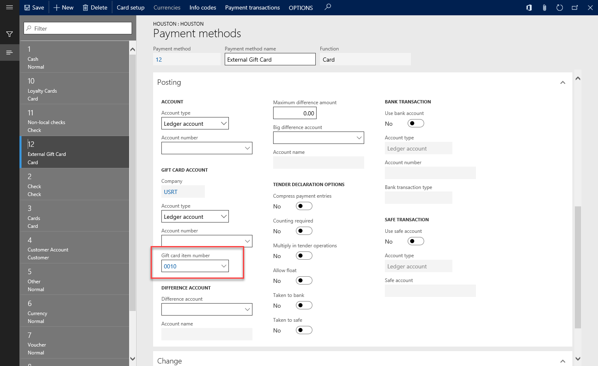
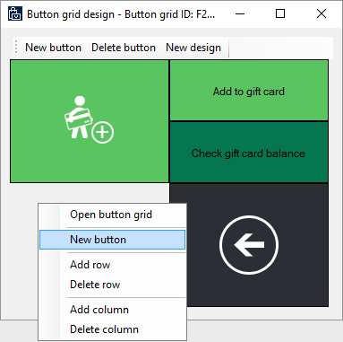
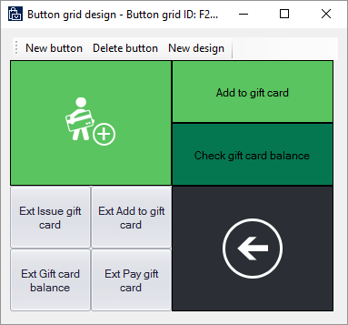

---
# required metadata

title: External gift card support
description: This topic provides information about the support for external gift cards that is now available in Microsoft Dynamics 365 for Retail.
author: 
manager: AnnBe
ms.date: 10/10/2017
ms.topic: article
ms.prod:
ms.service: dynamics-365-retail
ms.technology: 

# optional metadata

# ms.search.form: 
 # ROBOTS: 
audience: Developer
ms.devlang: 
ms.reviewer: robinr
ms.search.scope: Operations, Retail
# ms.tgt_pltfrm: 
ms.custom: 
ms.assetid: 
ms.search.region: Global
# ms.search.industry: retailms.author: ivanvms.search.validFrom: 2017-10-02
ms.dyn365.ops.version: Application update 4

---

# External gift card support

To provide a seamless experience for their customers, retailers want to be able to accept a wide variety of payment methods. Gift cards are one of the most frequently used payment methods after cash and credit cards. An important requirement for many retailers is the ability to accept various types of gift cards, from various providers, at the point of sale (POS).

Microsoft Dynamics 365 for Retail now supports external gift cards. Therefore, retailers can accept third-party gift cards from gift card providers such GiveX by using the POS. To take advantage of this functionality, you must have an account with an external gift card service provider. This functionality differs from the out-of-box gift card support that the solution offered.

The out-of-box Verifone Payment connector has also been updated so that it supports the functionality for external gift cards. The initial update enables integration with GiveX.

The external gift card must be configured for both the Retail headquarters and the POS. Before the gift card can be configured, the retailer must have an account with an external gift card service provider.

## Retail headquarters configuration

1. Search for **hardware profile** to open the **POS hardware profile** page.
2. On the **POS hardware profile** page, follow these steps:

    1. On the navigation bar on the left side of the page, select **Virtual**.
    2. Select **Edit**.
    3. On the **ETF service** FastTab, in the **Connectors** grid, select the first entry, **TestConnector**.
    4. In the **Supported Tender Types** field, add **GiftCard**.

        

    5. Select **Save**.

    > [!NOTE]
    > You can also use the **New** button to create multiple payment connectors. In this way, you can take advantage of the support for multiple connectors that has been added to the solution. You can then have different payment connectors for different payment methods. For example, all credit cards can be processed through one connector, but the gift card can be processed through a different connector.

3. Search for **payment methods** to open the **Payment methods** page.
4. Select **New**, and then follow these steps:

    1. In the **Payment method** field, enter **12**.
    2. In the **Payment method name** field, enter **External Gift Card**.
    3. In the **Default function** field, select **Card**.
    4. Select **Save**.

5. Open the **All retail stores** page.
6. In the list, select the **Houston** store.
7. On the Action Pane, select **Set up** &gt; **Payment methods**.
8. Select **New**.
9. In the **Payment method** field, enter **12**. The **Payment method name** and **Function** fields should then be set automatically.
10. On the **General** FastTab, set the following fields:

    - Set the **Operation name** field to **Pay gift card**.
    - Set the **Connector name** field to **TestConnector**.

11. On the **Posting** FastTab, set the **Gift card item number** field to **0010**.

    

12. Select **Save**.
13. Open the **Button grid** page.
14. In the navigation bar on the left side of the page, search for **F2S1M**, and select the filtered option.
15. On the Action Pane, select **Designer** to download the button designer application.
16. When the grid designer appears, right-click on an empty (gray) area, and then select **New button**.

    

17. Right-click the new button, and then select **Button properties**.
18. Set the **Action**, **Payment type**, and **Text on button** properties according to the following matrix.

    | Action            | Payment type       | Text on button        |
    |-------------------|--------------------|-----------------------|
    | Issue gift card   | External Gift Card | Ext Issue gift card   |
    | Add to gift card  | External Gift Card | Ext Add to gift card  |
    | Gift card balance | External Gift Card | Ext Gift card balance |
    | Pay gift card     | External Gift Card | Ext Pay gift card     |

    When you've finished, your button layout should resemble the following illustration.

    

19. Close the designer.
20. Search for **Distribution Schedule**.
21. In the navigation bar on the left side of the page, search for **1090**, **1115**, and **1070**.
22. On the Action Pane, select **Run now**.
23. Check the status of the job by searching for **Download sessions**.
24. Wait until **Applied** appears next to all the jobs, and then close the browser.

## Reset IIS if you're using Retail Store Scale Unit

If you're using a Retail Store Scale Unit (RSSU) that is located in the store, open a Command Prompt window as an administrator, and enter **iisreset**. Otherwise, wait for the Retail Server to be updated.

## Update merchant properties

1. In File Explorer, go to **C:\\Program Files (x86)\\Microsoft Dynamics 365\\70\\Retail Hardware Station\\ConfigurationUtility**.
2. Run the **HardwareStationConfigurationUtility** executable program.
3. Configure the utility by entering the correct Retail Server URL, and then select **Install**.
4. To verify that the download was successful, go to **C:\\ProgramData\\Microsoft Dynamics AX\\Retail Hardware Station**, and look at the timestamp of the **MerchantInformation.xml** file. It should be very recent.

## Configure and test Retail Modern POS

1. Start the Retail Modern POS (MPOS) application.
2. Sign in by using the standard credentials.
3. When you're prompted, select **Perform a non-drawer operation**.
4. On the main screen, select **Select hardware station**.
5. On the bar on the right side of the page, select **Manage**.
6. Turn on **Virtual Peripherals**, and then select **OK**.
7. In the **Available paired stations** field, select **Virtual Peripherals**.
8. You're prompted to either open a new shift or perform non-drawer operations. You can now open a new shift.
9. On the main screen, select **Current transaction**.
10. Select **Gift cards**.
11. Select **Ext Issue gift card**.
12. Enter a number that starts with **9**, and then provide an amount.
13. After items are added to the cart, you can pay by using cash or a card.

## Troubleshooting 

### Issue: An error occurs when you start the HardwareStationConfigurationUtility program

1. From an elevated command prompt, open the **HardwareStationConfigurationUtility.exe.config** file in Notepad.
2. In the file, follow these steps:

    1. Replace the **DataServiceUrl** value with the correct Retail Server URL.
    2. Verify that the **AADLogonUrl** value is correct.

3. Save and close the file.
4. Restart the utility.

### Issue: A token error occurs when you try to pair virtual peripherals

1. Exit MPOS.
2. Go to **C:\\Program Files (x86)\\Microsoft Dynamics 365\\70\\Retail Hardware Station\\Package**.
3. From an elevated command prompt, open the **Web.config** file in Notepad.
4. Replace the **RetailServer** value with the correct Retail Server value.
5. Save and close the file.
6. Restart MPOS.
7. If the issue persists, exit MPOS, use Task Manager to end any instances of dllhost.exe that are running, and then do another reset of Internet Information Services (IIS).
