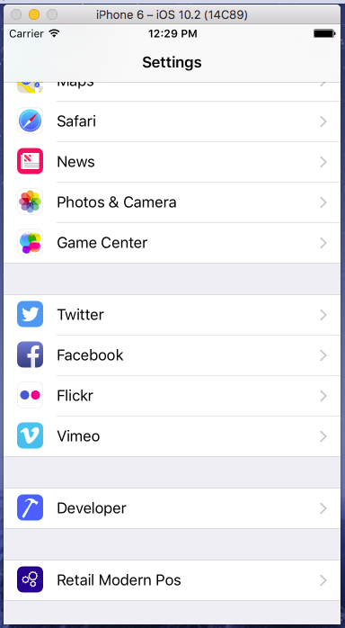
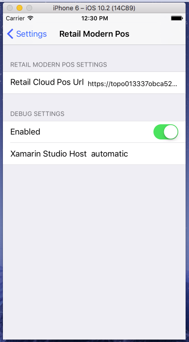

---
# required metadata

title: Set up POS Hybrid app on Android and iOS
description: This topic shows how to set up the POS Hybrid app on Android and iOS.
author: mugunthanm 
manager: AnnBe
ms.date: 11/14/2018
ms.topic: article
ms.prod: 
ms.service: dynamics-365-retail
ms.technology: 

# optional metadata

# ms.search.form: 
# ROBOTS: 
audience: Developer
# ms.devlang: 
ms.reviewer: kfend
ms.search.scope: Operations, Retail 
# ms.tgt_pltfrm: 
ms.custom: 
ms.assetid: 
ms.search.region: global
ms.search.industry: Retail
ms.author: mumani
ms.search.validFrom: 2018-29-10
ms.dyn365.ops.version: AX 8.0, AX 8.1

---
# Set up POS Hybrid app on Android and iOS
[!include [banner](../includes/banner.md)]

This topic shows how to build and run the Retail POS hybrid app on Android and iOS devices. 

## Overview

Retail hybrid app is shell built using [Xamarin](https://docs.microsoft.com/en-us/xamarin/). Inside the shell is a Web view controller that loads the cloud POS, which is based on the Retail server URL specified in the settings of this app. This is a Retail hybrid app shell for Android and iOS which will internally load the Cloud POS. For more information, see [Cloud POS](https://docs.microsoft.com/en-us/dynamics365/unified-operations/retail/mpos-or-cpos).

## Development tools
The Retail hybrid app supports the Android and iOS phone platforms. The app is built by using Xamarin, which means that you must install Xamarin on your development computer. To build the iOS app, you must have a Mac that has Xamarin installed. Although you can do development for both Android and iOS on a computer that runs Microsoft Windows, you must use a Mac to complete the build for the iOS platform. If your Mac is a shared team resource, you might want to use a Mac just for the build process. You must copy the Retail software development kit (Retail SDK) on all the computers that you use for development. The Retail SDK is available in all developer VMs that are provisioned for using [Microsoft Dynamics Lifecycle Services (LCS)](https://lcs.dynamics.com/).

For more information about Xamarin, see the [Xamarin documentation](https://docs.microsoft.com/en-us/xamarin/).

## Set up and install Xamarin on Windows

To set up and install Xamarin on Windows, go to <https://docs.microsoft.com/en-us/xamarin/android/get-started/installation/windows>.

### Update Xamarin

After you've installed Xamarin, you must update it to the latest stable version.

-   **Windows** - In Microsoft Visual Studio, click **Tools** &gt; **Options** &gt;**Environment** &gt; **Xamarin** &gt; **Other**.
-   **Mac** - In Xamarin Studio, click **Check for Updates** &gt; **Update channel**. For more information about this step, see [https://developer.xamarin.com/recipes/cross-platform/ide/change\_updates\_channel/](https://developer.xamarin.com/recipes/cross-platform/ide/change_updates_channel/).

### Build the Android Retail hybrid app

1. When installation is complete, launch Visual Studio and sign in with your Microsoft account (this is the same account that you use with Windows). Check for Xamarin updates by clicking **Tools > Options > Xamarin** or **Tools > Options > Xamarin > Other**. Here you’ll find a **Check Now** link. If you do not see an option for Xamarin in **Tools > Options**, review your installation, or try restarting Visual Studio. You can also search for Xamarin in the **Options** dialog box. If needed, download and install the latest version.
      
2.  In the Retail SDK folder, open SampleExtensions\HybridApp\Android\solution. Build and deploy using the emulator and verify that everything appears as it should.
  
3.  Using the [Visual Studio Emulator for Android](https://visualstudio.microsoft.com/vs/msft-android-emulator/ "Visual Studio Emulator for Android") or any emulator for Android, launch the POS hybrid app and enter the Retail Server URL and save.
  
4.  You should be able to sign in and activate the device.

### Build the iOS Retail hybrid app

### Connecting to a Mac

If you're developing on Windows and using the Mac just for building the iOS app then you must connect the computer that runs Windows and the Mac. For instructions, see [Connecting to the Mac](https://developer.xamarin.com/guides/ios/getting_started/installation/windows/connecting-to-mac/).

 ## Set up and install Xamarin on iOS

For more detailed steps on installing Xamarin on iOS, refer to [Xamarin.iOS installation](https://docs.microsoft.com/en-us/xamarin/ios/get-started/installation/).

  1.  Download and install Xcode from <https://developer.apple.com/xcode/>. Add your Apple ID using the instructions described in [Adding your account to Xcode](https://developer.apple.com/library/content/documentation/IDEs/Conceptual/AppStoreDistributionTutorial/AddingYourAccounttoXcode/AddingYourAccounttoXcode.html#//apple_ref/doc/uid/TP40013839-CH40-SW1) (apple.com).
  
  2.  Download and install Xamarin by following the instructions in [Installing and configuring Xamarin.iOS](http://developer.xamarin.com/guides/ios/getting_started/installation/mac/) (xamarin.com).
  
  3.  When you have completed installing Xamarin on both the Windows and Mac computers, follow the instructions in [Connecting to the Mac](http://developer.xamarin.com/guides/ios/getting_started/installation/windows/xamarin-mac-agent/) (xamarin.com). After you do this, you can work with iOS and Mac from Visual Studio on the Windows computer.
  
  ### Build the iOS Retail hybrid app
  
  1.  In the Retail SDK folder, open SampleExtensions\HybridApp\iOS\solution.
      After connecting to the Mac and building the application in Visual Studio, select the iOS device type and deploy the app on the selected device.
      
         
      
  2.  Using the Emulator, go to **Settings > RetailMPOS**. Enter the Retail Server URL.
      
         
      
         
      
  3.  Launch the MPOS app. You should be able to sign in and activate the device.
